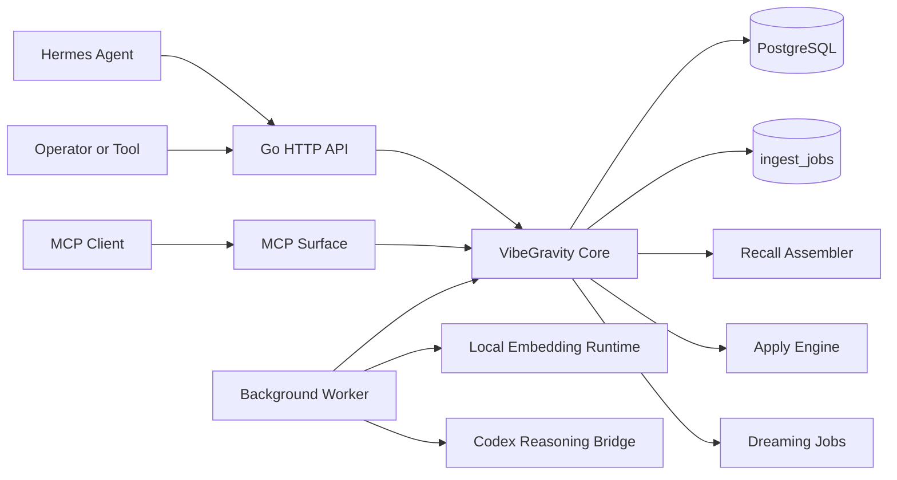
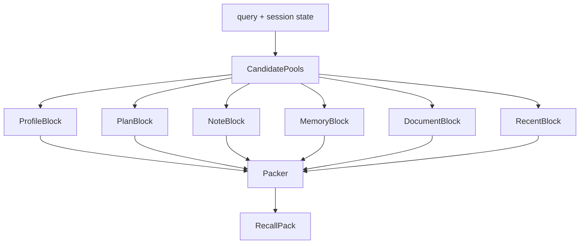
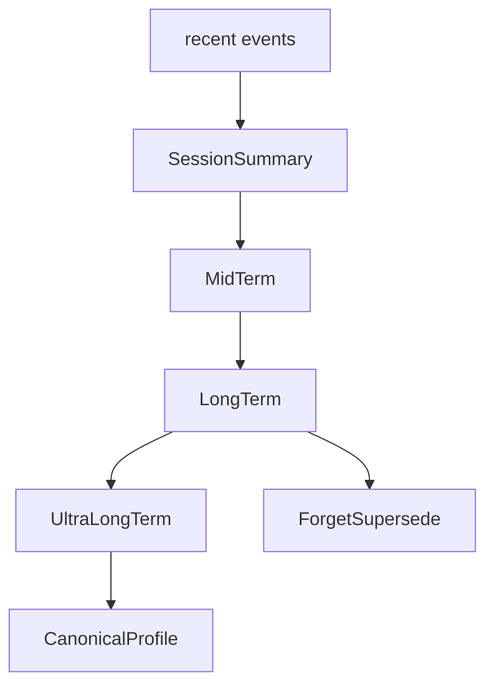
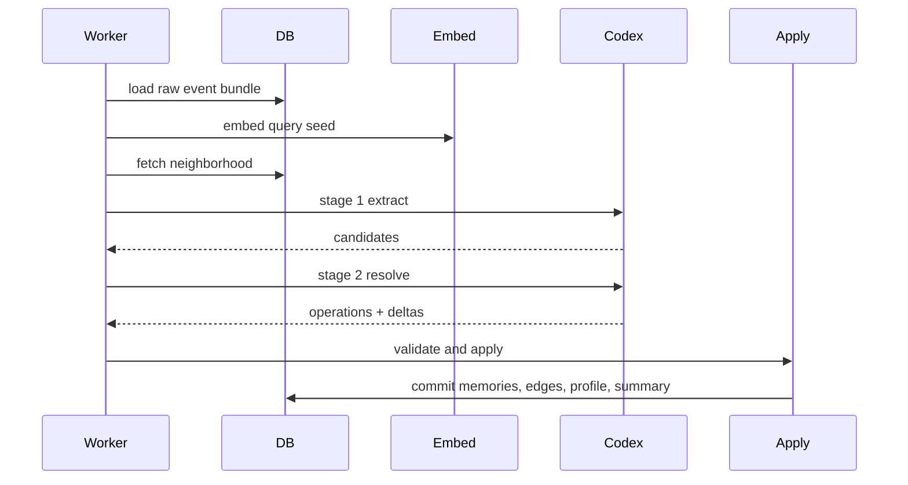

# 08 Gpt Pro Docs Plans Adrs Review Packets

Generated: 2026-04-25

This file is part of the GPT-Pro review material bundle for VibeGravity.

## Included Sources

- `docs/adr-001-migration-versioning.md`
- `docs/adr-002-embedding-dimension-policy.md`
- `docs/adr-003-session-scratch-storage.md`
- `docs/adr-004-memory-semantic-retrieval.md`
- `docs/adr-005-artifact-class-timing.md`
- `docs/adr-006-db-driver.md`
- `docs/adr-007-http-router.md`
- `docs/adr-008-package-layout.md`
- `docs/adr-009-updates-edge-lineage-guard.md`
- `docs/code-header-policy.md`
- `docs/open-source-code-policy.md`
- `docs/review-packets/00-workpack-03-review-index.md`
- `docs/review-packets/agent-a-blocked-job-recovery.md`
- `docs/review-packets/agent-b-stage2-store-sources.md`
- `docs/review-packets/agent-c-update-memory-lineage-spec.md`
- `docs/review-packets/agent-d-contract-gates.md`
- `docs/review-packets/codex-bridge-two-stage-boundary.md`
- `docs/review-packets/codex-json-bridge-boundary.md`
- `docs/review-packets/correctmemory-review-and-gettimeline-prep.md`
- `docs/review-packets/current-state-and-next-agent-handoff.md`
- `docs/review-packets/explain-memory-scope-guard.md`
- `docs/review-packets/explain-memory-visibility-guard.md`
- `docs/review-packets/hermes-memory-demo-eval.md`
- `docs/review-packets/hermes-memory-trust-loop-product-pivot.md`
- `docs/review-packets/hermes-provider-tool-dispatch.md`
- `docs/review-packets/mcp-tool-input-schemas.md`
- `docs/review-packets/mcp-trust-surface-delegation-tests.md`
- `docs/review-packets/mock-codex-bridge-worker-wiring.md`
- `docs/review-packets/next-agent-integration-fixes.md`
- `docs/review-packets/next-agent-scope-safe-stage2-sources.md`
- `docs/review-packets/operator-visible-degraded-recall-freshness.md`
- `docs/review-packets/recall-preview-metadata-eval.md`
- `docs/review-packets/recall-preview-trust-metadata.md`
- `docs/review-packets/stage2-actor-bundle-validation.md`
- `docs/review-packets/team-1-graph-apply.md`
- `docs/review-packets/team-2-reasoning-envelope.md`
- `docs/review-packets/team-3-worker-reliability.md`
- `docs/review-packets/team-coordination-log.md`
- `plans/00_read-this-first_for-building-agents.md`
- `plans/01_rfp_vibegravity_hermes-first.md`
- `plans/02_product-contract_and_direction.md`
- `plans/03_target-architecture_codex-first.md`
- `plans/04_memory-scopes_dreaming_ontology-lite.md`
- `plans/05_runtime-contracts_ingest-recall-apply.md`
- `plans/06_data-model_and_storage-invariants.md`
- `plans/07_workpack_foundation-and-repo-setup.md`
- `plans/08_workpack_ingest-and-recall.md`
- `plans/09_workpack_memory-graph-and-dreaming.md`
- `plans/10_workpack_hermes-provider-and-external-surfaces.md`
- `plans/11_workpack_quality-ops-and-evals.md`
- `plans/12_agent-coding_playbook_codex-claude.md`
- `plans/13_handoff-prompts_and_response-templates.md`
- `plans/14_source-notes.md`
- `plans/README.md`
- `plans/templates/AGENTS.md`
- `plans/templates/CLAUDE.md`
- `plans/templates/PLANS.md`
- `plans/templates/RFP_RESPONSE_TEMPLATE.md`
- `plans/templates/SKILL_contract-check.md`
- `plans/templates/SKILL_eval-regression.md`
- `plans/templates/SKILL_plan-implement-verify.md`
- `plans/templates/code-header-devlog-go.md`
- `plans/templates/code-header-minimal-go.md`
- `plans/templates/code-header-narrative-go.md`

## Source Contents


<!-- Source: docs/adr-001-migration-versioning.md | bytes=1605 | lines=39 | sha16=6f61350b399be039 -->

```md
# ADR-001: Migration Versioning Policy

## Status

Accepted

## Context

VibeGravity는 golang-migrate를 migration 도구로 사용한다.
팀 규모가 10명이고 병렬 작업이 많아질 수 있다.
순차 번호(000001)는 초기 부트스트랩에서 직관적이지만, 다수가 동시에 migration을 만들면 번호 충돌이 발생한다.

## Decision

1. **초기 부트스트랩(Work Pack 01)**: `000001_name.up.sql` / `000001_name.down.sql` 순차 번호를 사용한다.
2. **부트스트랩 이후(Work Pack 02~)**: Unix timestamp 기반 버전으로 전환한다. 형식은 `{unix_timestamp}_name.up.sql`이다. 예: `1714000000_add_memory_embedding.up.sql`
3. Timestamp 전환 시점은 `000001_create_core_tables` migration이 production에 적용된 이후로 한다.
4. Migration 생성은 `migrate create -ext sql -dir migrations -seq` 대신 `migrate create -ext sql -dir migrations` (timestamp default)를 사용한다.

## Options Considered

### Option A: Timestamp 전환 (선택됨)
- 장점: 병렬 작업 시 충돌 불가, 도구 기본값과 일치
- 단점: 순서가 직관적이지 않음

### Option B: Migration owner 1명 지정
- 장점: 중앙 관리로 품질 통제
- 단점: 병목, owner 부재 시 작업 차단

## Consequences

- 부트스트랩 migration은 번호가 깔끔하게 유지된다.
- 이후 migration은 timestamp로 자동 정렬되어 충돌이 없다.
- PR review 시 migration 파일의 timestamp를 확인해 순서를 검증한다.

## Impact on Hermes-first Roadmap

없음. 내부 도구 결정이며 제품 의미에 영향 없음.

```


<!-- Source: docs/adr-002-embedding-dimension-policy.md | bytes=2088 | lines=39 | sha16=0c358225fbf5a301 -->

```md
# ADR-002: Embedding Dimension Policy

## Status

Accepted (dimension value pending model selection)

## Context

VibeGravity v1부터 pgvector를 도입하여 semantic retrieval을 기준 구조로 잡는다.
BYTEA로 시작하고 나중에 vector로 전환하면 migration 비용이 더 크다.
그러나 embedding 차원은 모델에 따라 다르다 (예: 768, 1024, 1536, 3072).
v1의 embedding 모델이 아직 최종 확정되지 않았을 수 있다.

## Decision

1. **pgvector v1 즉시 도입**: `CREATE EXTENSION IF NOT EXISTS vector`는 별도 migration으로 분리한다.
2. **차원 하드코딩 금지**: `vector(768)` 같은 숫자를 migration에 직접 쓰지 않는다.
3. **모델과 차원을 함께 저장**: 설정에 `embedding_model`과 `embedding_dims`를 두고, migration에서는 이 값을 기반으로 컬럼을 생성한다.
4. **Migration 분리 순서**:
   - Migration A: `CREATE EXTENSION IF NOT EXISTS vector`
   - Migration B: vector column 생성 (exact search로 시작)
   - Migration C (후속): HNSW approximate index 추가 (데이터 축적 후)
5. **v1 기본 모델 후보**: 아래 중 하나를 ADR-002b에서 최종 확정한다.
   - `nomic-embed-text` (768d, 로컬 실행 가능)
   - `text-embedding-3-small` (1536d, OpenAI API)
   - `mxbai-embed-large` (1024d, 로컬 실행 가능)
6. 모델 확정 전까지 config에 `embedding_model: "pending"`, `embedding_dims: 0`을 두고, 첫 부트 시 doctor command가 경고를 출력한다.

## Consequences

- pgvector 의존성이 v1부터 들어간다. PostgreSQL에 pgvector extension이 필수다.
- 차원 변경 시 migration으로 컬럼을 재생성해야 한다. 이는 `06_data-model` §13의 "vector 차원 변경은 ADR 대상"과 일치한다.
- exact search로 시작하므로 초기 성능은 데이터 규모에 비례한다. HNSW는 10만 건 이상 축적 후 도입한다.

## Impact on Hermes-first Roadmap

Hermes의 `prefetch()` 경로에서 semantic retrieval이 가능해진다.
embedding model이 미확정이어도 config 기반으로 진행할 수 있다.

```


<!-- Source: docs/adr-003-session-scratch-storage.md | bytes=1383 | lines=30 | sha16=4e71afaebe507022 -->

```md
# ADR-003: session_scratch Storage Policy

## Status

Accepted

## Context

`session_scratch`는 짧은 수명의 작업 문맥이다.
Redis나 in-memory로 분리하면 저장 경계가 나뉘어 replay 가능성이 줄어든다.
v1에서는 저장 일관성과 replay 가능성이 최적화보다 중요하다.

## Decision

1. **v1에서는 Postgres 안에서 scope로 관리한다.** `memories` 테이블에서 `scope = 'session_scratch'`로 구분한다.
2. **수명 관리**: `expires_at` 필드를 사용한다. `memories` 테이블에 이미 `valid_to` (nullable)가 있으므로 이를 활용한다.
3. **정리 방식**: `maintenance` job kind로 expired session_scratch를 주기적으로 archived 상태로 전환한다. Hard delete는 하지 않는다.
4. **v1.5 이후 최적화 옵션**: 데이터 규모가 커지면 session_scratch를 별도 파티션이나 TTL 테이블로 분리하는 것을 검토한다.

## Consequences

- 모든 scope의 memory가 단일 테이블에 있어 쿼리와 replay가 단순하다.
- session_scratch가 많이 쌓이면 테이블이 커질 수 있지만, maintenance job이 정리한다.
- Postgres 트랜잭션 안에서 모든 scope를 함께 다룰 수 있다.

## Impact on Hermes-first Roadmap

Hermes의 session lifecycle과 자연스럽게 맞는다.
session 종료 시 scratch를 정리하는 dreaming hint와 연결된다.

```


<!-- Source: docs/adr-004-memory-semantic-retrieval.md | bytes=1784 | lines=39 | sha16=697e3c4148948c7e -->

```md
# ADR-004: Memory Semantic Retrieval Scope

## Status

Accepted

## Context

VibeGravity는 "문서 검색 + 대화 저장"이 아니라 Hermes-first shared memory kernel이다.
`prefetch()`는 session summary, profile, memory neighborhood, documents, notes, plans를 조합한다.
worker 파이프라인도 local embedding → neighborhood retrieval → Codex reasoning으로 진행한다.
따라서 memory 자체가 semantic retrieval 대상이어야 한다.

document chunk만 embedding을 가지면 recall이 RAG 쪽으로 기울고, memory graph는 검색보다 후처리 자료처럼 밀린다.

## Decision

`memories.embedding`은 v1 schema에 포함한다.

단, HNSW 같은 approximate index는 v1 bootstrap에 바로 넣지 않는다.
v1에서는 `memories.embedding` 컬럼과 exact vector search 경로를 먼저 둔다.
데이터가 쌓이고 recall benchmark가 생긴 뒤 후속 migration으로 HNSW index를 추가한다.

`document_chunks.embedding`과 `memories.embedding`은 같은 embedding model과 dimension 정책을 공유한다.
각 row에는 `embedding_model`, `embedding_dims`, `embedding_updated_at`도 함께 둔다.
embedding model 교체나 backfill을 추적하기 위해서다.

## Consequences

- memories 테이블에 vector 컬럼이 추가되어 row 크기가 커진다.
- memory 생성 시 worker가 embedding을 계산하여 저장해야 한다.
- `prefetch()`에서 query embedding으로 memory를 직접 검색할 수 있다.
- embedding model 교체 시 row 단위로 backfill 상태를 추적할 수 있다.

## Impact on Hermes-first Roadmap

memory semantic retrieval이 있어야 `prefetch()`가 진정한 의미의 "relevant memory"를 돌려줄 수 있다.
없으면 keyword match나 최근 시간순 정렬에만 의존하게 된다.

```


<!-- Source: docs/adr-005-artifact-class-timing.md | bytes=2281 | lines=55 | sha16=3dafe428274498a0 -->

```md
# ADR-005: artifact_class 도입 시점

## Status

Accepted

## Context

memory를 더 구조적으로 분류하기 위한 상위 분류 체계가 필요하다.
`MemoryKind` (fact, preference, trait, ...)는 자세한 의미 타입이다.
`artifact_class`는 retrieval lane과 token packing을 위한 더 큰 묶음이다.

지금 넣지 않으면 Work Pack 02에서 recall block, ranking, token packing을 만들 때 다시 도메인 타입과 migration을 건드리게 된다.
Foundation 단계에서 enum과 column만 넣어 두면 비용이 작다.
기능 구현은 미뤄도 된다. 하지만 구조는 지금 박아야 한다.

## Decision

`artifact_class`는 Foundation에 포함한다.
이 값은 무거운 온톨로지가 아니다.
retrieval lane과 token packing을 위한 상위 분류다.

Foundation에서는 Go enum, Memory domain type, DB column, DTO field, search filter까지만 넣는다.
실제 class-aware ranking과 token packing은 Work Pack 02에서 구현한다.

기본 값은 네 가지로 시작한다.

| artifact_class | 의미 |
|---|---|
| `context` | 현재 세션과 짧은 작업 문맥 |
| `knowledge` | 사실, 선호, 규칙, 절차, 문서 기반 지식 |
| `timeline` | 사건, 결정, 정정, 변화 기록 |
| `plan` | 목표, 작업 상태, 다음 행동 |

`MemoryKind`는 그대로 유지한다.
`artifact_class`는 더 큰 묶음이고, `MemoryKind`는 더 자세한 의미 타입이다.

### 적용 범위

`artifact_class`를 모든 테이블에 억지로 넣지 않는다.
Foundation에서는 `memories` 테이블과 recall DTO 중심이면 충분하다.
`documents`, `notes`, `plans`는 이미 테이블 자체가 class 역할을 한다.
나중에 unified artifact search가 필요해지면 그때 view를 만든다.

## Consequences

- `memories` 테이블에 `artifact_class` 컬럼이 추가된다 (default: `knowledge`).
- recall assembler가 class 기반으로 retrieval lane을 라우팅할 수 있는 기반이 생긴다.
- Work Pack 02에서 migration 추가 없이 class-aware ranking을 구현할 수 있다.

## Impact on Hermes-first Roadmap

class-aware retrieval이 도입되면 Hermes의 `prefetch()` 품질이 향상된다.
Foundation 단계에서 구조만 넣으므로 Hermes 연결 자체에는 영향 없다.

```


<!-- Source: docs/adr-006-db-driver.md | bytes=1347 | lines=31 | sha16=ef907812581b4077 -->

```md
# ADR-006: Database Driver Policy

## Status

Accepted

## Context

VibeGravity v1부터 `pgvector`를 쓰고, `memories.embedding`과 `document_chunks.embedding`을 다룰 예정이다.
Go 표준 라이브러리인 `database/sql`과 `github.com/lib/pq` 조합보다 PostgreSQL 전용 기능을 더 잘 지원하는 드라이버가 필요하다.

## Decision

VibeGravity v1은 DB driver로 `github.com/jackc/pgx/v5`를 사용한다.
런타임 연결은 `pgxpool`을 기본으로 한다.
pgvector 연동은 `pgvector-go`의 pgx adapter(`github.com/pgvector/pgvector-go/pgx`)를 사용한다.

Migration은 기존 결정(ADR-001)대로 `golang-migrate`를 유지하되, 가능하면 `pgx5` database driver를 사용한다.

앱 런타임에서는 server, worker, cli doctor 모두 같은 DB connection factory(`internal/db/pool.go`)를 공유한다.

## Consequences

- DB access는 `github.com/jackc/pgx/v5/pgxpool`을 기본으로 사용한다. `database/sql + lib/pq`는 v1 기본 경로에서 사용하지 않는다.
- Postgres store 구현체는 `internal/store/postgres`에 두고, 생성자는 `*pgxpool.Pool`을 받는다.
- Core service는 pgx를 직접 import하지 않는다.

## Impact on Hermes-first Roadmap

pgvector와의 원활한 통합을 통해 Hermes의 semantic retrieval(`prefetch()`) 성능과 안정성을 극대화한다.

```


<!-- Source: docs/adr-007-http-router.md | bytes=1230 | lines=29 | sha16=23cdf0ad466505ef -->

```md
# ADR-007: HTTP Router Policy

## Status

Accepted

## Context

VibeGravity API 서버는 HTTP 요청을 받아 core service로 전달하는 역할을 한다.
복잡한 웹 프레임워크보다는 Go 표준에 가깝고 가벼우며 유지보수가 용이한 라우터가 필요하다.

## Decision

VibeGravity v1은 HTTP router로 `github.com/go-chi/chi/v5`를 사용한다.

chi는 `net/http`에 가깝고 가볍다. VibeGravity의 API server는 transport adapter일 뿐이므로 무거운 웹 프레임워크가 필요하지 않다. 라우팅, middleware, health check, graceful shutdown 정도만 담당하게 한다.

API layer는 thin transport adapter로 유지한다.
제품 규칙은 handler가 아니라 core service에 둔다. 즉, handler는 request를 DTO로 바꾸고 core service를 호출한 뒤 response를 반환하는 얇은 계층이어야 한다.

## Consequences

- 라우터 및 HTTP 핸들러 코드는 `internal/httpapi` 패키지에 위치한다.
- `chi.NewRouter()`를 사용하여 라우팅 트리를 구성한다.

## Impact on Hermes-first Roadmap

API 서버의 계층을 얇게 유지함으로써 비즈니스 로직(Hermes 연동 핵심 로직)을 core 패키지에 집중할 수 있게 한다.

```


<!-- Source: docs/adr-008-package-layout.md | bytes=3754 | lines=79 | sha16=f334d48142abbce7 -->

````md
# ADR-008: Product Package Layout

## Status

Accepted

## Context

VibeGravity is a Hermes-first shared memory kernel. The product documents define
three runtime promises:

- `sync_turn()` records quickly on the API hot path.
- background workers derive, resolve, and apply memory changes.
- `prefetch()` returns a short, budget-aware recall pack before the next turn.

The repository must make those responsibilities visible without splitting into
premature microservices. The package layout should also keep Hermes, MCP, and
HTTP surfaces on the same core semantics.

## Decision

Use a Go-first monorepo with small internal packages organized by product
responsibility:

| Path | Responsibility |
|---|---|
| `cmd/server` | HTTP API process entrypoint only |
| `cmd/worker` | background worker process entrypoint only |
| `cmd/cli` | local operator CLI and doctor entrypoint |
| `internal/core` | v1 service contract, DTOs, and domain records |
| `internal/kernel` | concrete `core.VibeGravityService` composition over ingest and recall |
| `internal/ingest` | `sync_turn()` normalization, validation, idempotent raw event writes, and job enqueueing |
| `internal/recall` | `prefetch()` typed block assembly, ranking, suppression, and token budgeting |
| `internal/worker` | background job claiming, dispatch, retry handoff, and process-level orchestration |
| `internal/graph` | apply engine, memory edges, profile merge, summaries, corrections, and dreaming rules |
| `internal/reasoning` | Codex stage 1 extract and stage 2 resolve bridge contracts |
| `internal/embed` | local embedding client and lexical/vector retrieval helpers |
| `internal/hermes` | Hermes provider adapter semantics and lifecycle mapping |
| `internal/mcp` | MCP tool surface that calls the same core semantics |
| `internal/httpapi` | thin HTTP transport adapter from routes to core requests |
| `internal/store` | storage interfaces that preserve idempotency, provenance, and scope separation |
| `internal/store/postgres` | PostgreSQL implementation of storage contracts |
| `internal/db` | PostgreSQL pool construction and pgvector registration |
| `internal/config` | environment and file-backed runtime configuration |
| `migrations` | PostgreSQL schema migrations |
| `tests` | cross-package smoke, integration, and replay tests |
| `tools` | repository maintenance tools such as header checks |
| `.agents` | Codex skills and shared agent assets |
| `pkg` | reserved for stable reusable packages only; keep empty until an API is proven |

Package dependencies should flow inward:

```text
cmd/* -> transport/adapters -> kernel -> ingest/recall -> store
cmd/worker -> internal/worker -> reasoning/graph/embed -> store
httpapi/hermes/mcp -> core service contract -> kernel
```

Handlers and adapters must stay thin. Product rules belong in core services and
their domain-specific packages, not in `cmd/*` or transport handlers.

## Consequences

- Empty product packages get package documentation now, so future work lands in
  the intended boundary instead of growing inside entrypoints.
- `pkg` remains intentionally empty until VibeGravity has a stable public
  library surface.
- New architecture packages require an ADR when they change the runtime model,
  scope model, queue model, or reasoning/apply boundary.
- Transport packages must not redefine memory semantics for Hermes, MCP, or
  HTTP independently.

## Impact on Hermes-first Roadmap

This layout lets Hermes use `prefetch()` and `sync_turn()` first while keeping
MCP and future clients aligned with the same core contract. It also leaves room
for degraded modes: recall can use existing profile, notes, plans, lexical
search, and previous memory even when Codex or local embeddings are unavailable.

````


<!-- Source: docs/adr-009-updates-edge-lineage-guard.md | bytes=2670 | lines=72 | sha16=3a7e868ad1ef86ca -->

````md
# ADR-009: Updates Edge Lineage Guard

## Status

Accepted

## Context

`update_memory` is still intentionally unsupported in the write-capable apply
engine. Before enabling it, the edge direction and latest invariant need to be
unambiguous.

VibeGravity stores lineage edges from the newly written memory to the prior
memory. For an `updates` edge:

- `from_memory_id` is the new memory created by the update operation.
- `to_memory_id` is the prior memory being superseded.

The initial migration had a partial unique index for `updates` on
`from_memory_id`. That only guaranteed that one new memory could not update
multiple targets. It did not prevent two new memories from both updating the
same prior memory.

## Decision

The direct edge-level guard for `updates` belongs on `to_memory_id`.

`migrations/000002_create_core_tables.up.sql` now defines
`memory_edges_single_updates_target_idx` as a partial unique index on
`to_memory_id WHERE edge_kind = 'updates'`.

This is only the direct-target guard. The full latest invariant must still be
handled by the future `update_memory` store transaction:

1. Lock and verify the target memory is still active/latest.
2. Write the new memory and mandatory `memory_trace`.
3. Write the `updates` edge from new memory to target memory.
4. Mark the target memory `superseded` and `latest_flag=false`.
5. Commit all changes atomically.

That transaction now exists in the store-backed apply path. It locks and verifies
the target memory as active/latest, writes the replacement memory and mandatory
trace, writes the `updates` edge from replacement to prior memory, supersedes the
prior memory, and commits those changes together. A deterministic retry of an
already completed update is accepted only when the replacement memory, trace, and
edge are all present and match the same target.

## Rollout Note

For a database that already applied the old index, add a timestamped follow-up
migration before enabling `update_memory`:

```sql
DROP INDEX IF EXISTS memory_edges_single_updates_target_idx;

CREATE UNIQUE INDEX memory_edges_single_updates_target_idx
    ON memory_edges (to_memory_id)
    WHERE edge_kind = 'updates';
```

Fresh bootstrap databases receive the corrected index from
`000002_create_core_tables.up.sql`.

## Consequences

- Direct forks where two new memories both update the same prior memory are
  rejected at the database edge layer.
- The database still does not infer a complete lineage root. Latest state must
  remain an explicit transaction rule, not a side effect of the edge table.
- `extend_memory` behavior is unchanged because the partial index only applies
  to `edge_kind = 'updates'`.

````


<!-- Source: docs/code-header-policy.md | bytes=2161 | lines=74 | sha16=49b48ba23e15880f -->

````md
# Code Header Policy

This policy turns `/Users/parker/Downloads/code_header_templates.md` into the
repo-local rule for VibeGravity source files.

## Default

Use the minimal structured header for Go files. It is compact, easy for agents
to parse, and enough to rebuild file responsibility and dependency maps from a
file list.

Use the narrative header only for modules where architectural rationale is more
important than the type list. Use the development-log header only for files that
are intentionally audited across repeated agent edits.

## Required Go Header

Every non-generated Go file must start with a header containing these fields:

- `FILE`
- `PURPOSE`
- `LAYER`
- `STATUS`
- `EXPORTS`
- `DEPENDS`
- `USED_BY`
- `AGENT_NOTE`

Run this before handing off a change:

```bash
make check-headers
```

## Layer Values

Use one of these values:

- `domain`: core business contracts and domain records
- `application`: service orchestration and use-case level code
- `interface`: HTTP, CLI, MCP, Hermes, or other external surface adapters
- `infra`: database, config, embedding clients, migrations, runtime plumbing
- `util`: reusable tools and low-level helpers
- `test`: tests and test fixtures

## Status Values

Use one of these values:

- `draft`: incomplete or newly introduced
- `active`: current default path
- `experimental`: intentionally unstable surface
- `deprecated`: kept only for compatibility or migration

## Field Guidance

`PURPOSE` should be one sentence explaining why the file exists.

`EXPORTS` should name public symbols when practical. Use a grouped phrase only
when a file exports many closely related DTOs or constants.

`DEPENDS` should list the most important local files or external packages that
an agent should inspect before editing. Keep it short.

`USED_BY` should list the main consumers. If the file is a leaf executable or
test, name the command or package-level purpose.

`AGENT_NOTE` should name the one rule most likely to prevent a bad edit.

## Rename Rule

When a file moves, update the `FILE`, `DEPENDS`, and `USED_BY` fields in the
same change. A rename is not complete until `make check-headers` passes.

````


<!-- Source: docs/open-source-code-policy.md | bytes=1477 | lines=37 | sha16=df4be8bfa6c27e81 -->

````md
# Open-Source Code Policy

VibeGravity is intended for open-source development. Code must be original to
this repo or derived only from commercially usable permissive patterns.

## Rules

1. Do not reference or closely reproduce code under GPL, AGPL, LGPL, SSPL,
   Elastic License, or related license families.
2. Use MIT, BSD, Apache-2.0, official documentation, or first-principles design
   as the acceptable reference boundary.
3. Do not copy an external project's function names, file structure, comments,
   or distinctive implementation shape.
4. If code may be substantially similar to external open-source code, stop and
   warn before implementing it.
5. Treat structured external snippets of 10 or more consecutive lines as risky
   and rewrite them from first principles.
6. For code-bearing handoffs, include a source review block with estimated
   source, suspected license, similarity risk, and review requirement.

## Source Review Template

```text
Source Review:
- Estimated source: first-principles VibeGravity plans / official docs / permissive pattern / unknown
- Suspected license: none / MIT / BSD / Apache-2.0 / unknown
- Similarity risk: low / medium / high
- Review required: no / yes
- Notes: short rationale
```

## Default For This Repo

Default to first-principles implementation from the VibeGravity plans. Use
external docs for API behavior and dependency usage only. When in doubt, choose
a simpler original implementation and request review.

````


<!-- Source: docs/review-packets/00-workpack-03-review-index.md | bytes=1058 | lines=21 | sha16=134e77657bfee80d -->

```md
# Work Pack 03 Review Index

Central packet index for the three-team Work Pack 03 integration review.

## Team packets

- [Team 1 — Graph apply](team-1-graph-apply.md)
- [Team 2 — Reasoning envelope](team-2-reasoning-envelope.md)
- [Team 3 — Worker reliability](team-3-worker-reliability.md)
- [Team coordination log](team-coordination-log.md)
- [Next agent integration fixes](next-agent-integration-fixes.md)
- [Current state and next agent handoff](current-state-and-next-agent-handoff.md)
- [CorrectMemory review and GetTimeline prep](correctmemory-review-and-gettimeline-prep.md)

## Integration review focus

- Confirm Team 1 graph/apply semantics still reject unsupported writes before any partial graph mutation.
- Confirm Team 2 reasoning envelopes continue to produce schema-first Stage 2 output only.
- Confirm Team 3 worker failures are recorded, retry-safe, and observable without implementing extraction or changing graph semantics.
- Confirm raw event bundles remain immutable source input and derived memories remain apply-owned output.

```


<!-- Source: docs/review-packets/agent-a-blocked-job-recovery.md | bytes=3425 | lines=52 | sha16=2900ffe9c062222b -->

```md
# Agent A — Blocked Job Recovery

## Summary

Implemented an operator-facing recovery path for jobs that were moved to `blocked` after deterministic unsupported apply work. The path lets an operator inspect blocked jobs and manually requeue a specific blocked job after the unsupported operation has landed or after an operator has otherwise decided replay is safe.

This does not change worker retry behavior. Transient failures still use `FailJob` and retry scheduling, while blocked jobs remain out of the queued worker pool until an explicit CLI requeue command is run.

## Files changed

- `internal/store/postgres/jobs.go`
- `internal/store/postgres/jobs_test.go`
- `cmd/cli/main.go`
- `cmd/cli/main_test.go`
- `docs/review-packets/agent-a-blocked-job-recovery.md`

## Behavior added

- Added concrete PostgreSQL job recovery methods:
  - `ListBlockedJobs(ctx, limit)` lists newest blocked jobs with job metadata and `last_error` preserved for inspection.
  - `RequeueBlockedJob(ctx, jobID)` manually changes exactly one currently blocked job back to `queued`.
- Requeue is guarded by `WHERE id = $1 AND status = 'blocked'`, so complete/running/queued jobs are not accidentally touched.
- Manual requeue does not increment `attempts`, does not use the 30-second retry interval, and does not alter transient `FailJob` semantics.
- Added operator CLI surface:
  - `cli jobs blocked [--limit N]`
  - `cli jobs requeue-blocked <job_id>`
- CLI tests use an injected fake store and never open a real database.

## Tests run

- `go test ./internal/store/postgres ./cmd/cli` — red phase first failed on missing `ListBlockedJobs`, `RequeueBlockedJob`, and CLI command functions.
- `gofmt -w internal/store/postgres/jobs.go internal/store/postgres/jobs_test.go cmd/cli/main.go cmd/cli/main_test.go`
- `go test ./internal/store/postgres ./cmd/cli` — passed.
- `go test ./...` — passed after moving the requeue helper outside the source span used by the existing blocked-vs-retryable contract test.
- `gofmt -w internal/store/postgres/jobs.go internal/store/postgres/jobs_test.go cmd/cli/main.go cmd/cli/main_test.go && go test ./... && make lint && make check-headers && git diff --check` — passed.
- Independent review — approved with no critical or important issues; minor note about tenant/workspace filters and audit trail is reflected in remaining risks.

## Remaining risks

- `ListBlockedJobs` currently lists all blocked jobs globally with a limit; tenant/workspace filters may be needed before multi-tenant operations.
- Requeue is intentionally manual and immediate; operators need to know that the previously unsupported apply work is now implemented before replay.
- The CLI output is plain tab-separated text, not JSON; automation may later need `--json`.
- The current job status model still has no separate audit table for who requeued a blocked job or why.

## Source Review

- Estimated source: project-local VibeGravity contracts, existing queue code, and in-repo review packet guidance.
- External sources used: none.
- Suspected license exposure: none beyond Go standard library and existing pgx usage already present in the repo.
- Similarity risk: low; SQL helpers, CLI parsing, and tests were written from first principles for this repository.
- Human review required: recommended before relying on this for production recovery because operator requeue policy and audit requirements may evolve.

```


<!-- Source: docs/review-packets/agent-b-stage2-store-sources.md | bytes=5549 | lines=115 | sha16=c3a967ea4e0d099f -->

````md
# Agent B Review Packet: Stage 2 Store-Backed Sources

## Summary

Agent B wired real store-backed source adapters behind `Stage2InputPreparer` for the worker path.

The worker now constructs its Stage 2 envelope with a preparer backed by the PostgreSQL store for:

- existing profile snapshots
- memory search results
- document chunk search results
- active plans
- pinned notes

The implementation does not perform local extraction and does not call real Codex. It preserves the existing `reasoning.Stage2InputPreparer` source interfaces and keeps `RequiredOutputSchema` populated through the preparer.

## Adapter design

Added `internal/worker/stage2_sources.go` with `Stage2SourceStores`, `NewStoreBackedStage2InputPreparer`, and `NewStoreBackedStage2InputSources`.

The adapters intentionally sit in `internal/worker` so the reasoning package remains interface-driven and store-agnostic.

Design details:

- `Profiles`
  - Uses `store.ProfileStore.GetProfile`.
  - Looks up the first raw event actor as `agent_private` profile.
  - Falls back to `workspace:<workspace_id>` as `workspace_shared` profile.
  - Treats `core.ErrNotFound` as no profile rather than a job failure.
- `Memories`
  - Uses `store.MemoryStore.SearchMemories`.
  - Uses existing visible scopes: `agent_private`, `workspace_shared`, `session_scratch`.
  - Uses artifact classes: `context`, `knowledge`, `timeline`, `plan`.
  - Search query is built only from structured Stage 1 output hints/candidates if present. It does not parse raw event payload text.
  - With the current stub reasoner path, Stage 1 is empty, so query is empty and the existing store search returns recent active/latest rows.
- `Documents`
  - Uses `store.DocumentStore.SearchDocuments` with the same structured Stage 1 query string.
- `Plans`
  - Uses `store.PlanStore.GetActivePlans` with the same visible scopes.
- `Notes`
  - Uses `store.NoteStore.ListPinnedNotes` with the same visible scopes.

All adapters convert `core.ErrNotFound` into empty context and propagate other store errors so transient store failures still fail the worker job normally.

`cmd/worker/main.go` now injects a store-backed preparer using the single PostgreSQL store instance. The reasoner remains `reasoning.NewStubOrchestrator()`, so there is still no real Codex call.

## Files changed

- `internal/worker/stage2_sources.go`
  - New store-backed Stage 2 source adapters.
- `internal/worker/stage2_sources_test.go`
  - New tests for all source adapters, profile fallback, no raw payload extraction, required schema preservation, and error propagation.
- `cmd/worker/main.go`
  - Injects a store-backed `Stage2InputPreparer` into the worker processor.
- `cmd/cli/main.go`
  - Verification-only repair: stripped accidental embedded line-number prefixes from the working-tree copy so `go test ./...` could parse the existing CLI recovery implementation. This was not part of the Stage 2 adapter design.
- `docs/review-packets/agent-b-stage2-store-sources.md`
  - This review packet.

## Tests run

Targeted RED check before implementation:

```bash
go test ./internal/worker -run TestStoreBackedStage2InputPreparer -count=1
```

Result: failed as expected because `NewStoreBackedStage2InputPreparer` and `Stage2SourceStores` did not exist.

Targeted GREEN checks after implementation:

```bash
gofmt -w internal/worker/stage2_sources.go internal/worker/stage2_sources_test.go cmd/worker/main.go
go test ./internal/worker -run TestStoreBackedStage2InputPreparer -count=1
go test ./internal/worker ./cmd/worker -count=1
go test ./internal/worker -count=1
```

Result: passed.

Full-suite check run before this packet:

```bash
go test ./...
```

Result: passed after the working tree stabilized from concurrent edits in nearby job/CLI integration files.

Final required verification:

```bash
gofmt -w internal/worker/stage2_sources.go internal/worker/stage2_sources_test.go cmd/worker/main.go cmd/cli/main.go
go test ./...
make lint
make check-headers
git diff --check
```

Result: passed.

## Remaining risks

- Current worker architecture still uses the combined `Reasoner.ProcessTurn` stub. Stage 2 preparation therefore happens before a real Stage 1 Codex pass exists. The adapters are ready to consume Stage 1 output once the bridge is split or the orchestrator fills it, but today the query is usually empty.
- Memory/document retrieval is limited to existing store search interfaces and the current lexical fallback behavior. No embeddings or neighborhood expansion are wired here.
- `agent_private` memory search still depends on current store search scope filtering; the store search interface does not accept an owner/entity filter yet. This packet did not change shared store contracts.
- `group_shared` is intentionally not included because membership-aware source filtering is not implemented in the available store/search contract.
- Profile input remains singular because `Stage2Input` currently accepts one `ExistingProfile`; the adapter prefers actor private profile and falls back to workspace profile.

## Source Review

- Estimated source: first-principles implementation from VibeGravity in-repo plans, existing review packets, and existing store/reasoning contracts.
- Suspected license: project-internal original work.
- Similarity risk: low; no external project code or long structured snippets were used.
- Human review required: normal integration review recommended, especially around empty-query retrieval volume and the lack of owner filtering in `SearchMemories` for `agent_private` scope.

````


<!-- Source: docs/review-packets/agent-c-update-memory-lineage-spec.md | bytes=16550 | lines=261 | sha16=29607cc8e203e92b -->

```md
# Agent C Review Packet: `update_memory` Lineage and Latest Specification

## Summary

This packet defines the required lineage, latest-state, provenance, idempotency, and rollback rules that must be satisfied before any `update_memory` write implementation is enabled.

`update_memory` remains a future write path. This document is specification-only and does not authorize weakening `NoopApplyEngine` validation or allowing `StoreBackedApplyEngine` to write update operations before the transaction and tests below exist.

The core model is:

- An `update_memory` operation writes a **new derived memory row**.
- The new memory **supersedes exactly one prior latest memory**.
- The lineage edge direction is always **new memory -> prior memory**.
- The prior memory is made non-latest in the same transaction.
- The new memory and its `memory_trace` must commit atomically with the `updates` edge and prior-memory status change.

Explicit edge interpretation:

- `from_memory_id` = the newly-created memory produced by this `update_memory` operation.
- `to_memory_id` = the existing target memory being superseded.

This follows ADR-009 and the storage invariant that the direct `updates` target guard belongs on `memory_edges(to_memory_id) WHERE edge_kind = 'updates'`.

## Proposed invariant

### Invariant: one latest memory per direct update lineage head

For any `update_memory` operation:

1. The operation must target exactly one existing memory.
2. The target memory must be in the same `tenant_id` and `workspace_id` as the job.
3. The target memory must be `status = active` and `latest_flag = true` at the time the transaction locks it.
4. The newly created memory must be inserted as `status = active` and `latest_flag = true`.
5. The target memory must be updated to `status = superseded` and `latest_flag = false` in the same transaction.
6. The `updates` edge must be inserted as:
   - `from_memory_id = new_memory.id`
   - `to_memory_id = target_memory.id`
   - `edge_kind = updates`
7. The direct target uniqueness guard must prevent two different new memories from both directly updating the same target memory.
8. No memory row may be considered successfully written unless its `memory_trace` row is also written.

### Invariant: update is replacement, not mutation-in-place

`update_memory` must never rewrite the target memory text in place. It creates a new memory row and records lineage through `memory_edges`. This preserves provenance, rollback clarity, and timeline/explainability.

### Invariant: update is not extend

`update_memory` means the new memory supersedes the prior one and should become the latest recall candidate. `extend_memory` means additive detail and does not unset the prior memory. Therefore:

- `update_memory` requires an `updates` edge.
- `extend_memory` requires an `extends` edge.
- An `update_memory` operation with an `extends`, `supports`, `contradicts`, or missing edge is invalid.
- An `extend_memory` operation must not perform latest/supersession behavior.

## Transaction rules

The future write implementation must execute each `update_memory` operation inside one database transaction. If multiple operations in one Stage 2 result are applied together, either the whole apply request should be one transaction, or each operation must have explicit idempotency/resume behavior. The safer first implementation is one transaction for the entire apply request.

### Pre-transaction validation

Before opening the write transaction or before mutating rows, the apply engine must retain the existing validation floor:

- operation kind is supported and non-empty
- operation id is present
- operation raw event IDs are inside the apply request raw event bundle
- `profile_delta`, `plan_delta`, trace metadata, operation metadata, and memory metadata are JSON objects where required
- memory payload has kind, artifact class, scope, owner, text, and confidence
- group-shared payload has `group_id`
- `update_memory` payload has a target memory ID
- `update_memory` edge is present and has `edge_kind = updates`
- operation tenant/workspace context is not allowed to cross boundaries

This spec does not weaken `NoopApplyEngine`; `NoopApplyEngine` should continue to validate shape only and not perform writes.

### Required transaction order

For a single `update_memory` operation, execute in this order:

1. **Begin transaction.**
2. **Idempotency check by operation identity.**
   - Look for an already-applied operation for the same `reasoning_job_id` + `operation_id`.
   - If already applied with the same target and new memory identity, return success without writing duplicates.
   - If the same `reasoning_job_id` + `operation_id` exists but points to different payload/target, fail as an idempotency conflict.
   - If there is no durable operation table yet, derive the check from `memory_trace.reasoning_job_id` plus `applied_operations_json.operation_id` and document that this is a temporary query shape.
3. **Lock the target latest memory.**
   - Select target memory by ID, tenant, and workspace using a row lock (`FOR UPDATE` on PostgreSQL).
   - Verify the locked row is still `status = active` and `latest_flag = true`.
   - If the target is missing, cross-tenant, cross-workspace, superseded, archived, deleted, or not latest, reject the operation and roll back.
4. **Validate direct update edge target against the locked target.**
   - `edge.to_memory_id` must equal `memory.target_id` / operation target.
   - `edge.from_memory_id`, if supplied by Stage 2, must either be empty or equal the deterministic new memory ID that the apply engine will insert.
   - The apply engine should prefer generating/confirming the new memory ID, not trusting a hallucinated ID blindly.
5. **Compute/confirm the new memory ID and fingerprint.**
   - The new memory fingerprint should be based on the new memory payload, not the target memory payload.
   - If deterministic IDs are used, they must include `reasoning_job_id` + `operation_id` or an equivalent idempotency key.
6. **Insert the new memory row.**
   - `status = active`
   - `latest_flag = true`
   - explicit `scope`, `owner_entity_id`, `kind`, `artifact_class`, `text`, `confidence`
   - same tenant/workspace as the job
   - same `group_id` rules as `create_memory`
7. **Insert the mandatory memory trace for the new memory.**
   - `memory_id = new_memory.id`
   - `raw_event_ids = operation.raw_event_ids`
   - `reasoning_job_id = apply_request.job_id`
   - `reasoning_stage = resolve`
   - `candidate_snapshot_json = Stage 1 output used to produce the operation`
   - `applied_operations_json = the exact structured operation or operation subset applied for this memory`
   - `operator_correction_flag = true` only when the source operation is an explicit human correction path; otherwise false
   - `related_document_ids` populated from Stage 2 document references when available, otherwise empty
8. **Insert the `updates` edge.**
   - `from_memory_id = new_memory.id`
   - `to_memory_id = target_memory.id`
   - `edge_kind = updates`
   - `confidence = operation.edge.confidence` or a validated default policy
   - `created_by_job_id = apply_request.job_id`
   - The database partial unique index on `to_memory_id WHERE edge_kind = 'updates'` must reject a second direct update to the same target.
9. **Supersede the target memory.**
   - Set `status = superseded`.
   - Set `latest_flag = false`.
   - Set `valid_to` to the new memory `valid_from` or transaction timestamp, using one consistent policy.
   - Update `updated_at`.
10. **Optionally update profile/session/plan only after memory/trace/edge succeed.**
    - For the first `update_memory` write slice, profile/session/plan deltas may remain rejected as in the current store-backed apply slice.
11. **Commit.**
12. **Return written IDs.**
    - Include the new memory ID, target memory ID, and edge identity in the apply result/logging path.

### Locking and concurrency rules

- The target latest row lock is mandatory. Do not rely only on the unique edge index.
- The row lock protects the semantic latest check before supersession.
- The unique edge index protects the direct lineage target from race-created forks.
- If two transactions attempt to update the same target:
  - one may acquire the lock first and commit;
  - the second must re-check after waiting and then reject because the target is no longer `active/latest`, or fail on the unique edge guard;
  - the second must not create a dangling memory or trace.
- A target memory that is already `superseded`, `archived`, or `deleted` is not valid for `update_memory`.
- Cross-scope updates should be rejected unless a future ADR explicitly permits them. The default rule is that the new memory keeps the same scope and group boundary as the target unless the operation is a validated correction flow with an explicit scope policy.

### Failure rollback rules

Any failure before commit must roll back all side effects for that operation/apply transaction:

- If new memory insert succeeds but trace insert fails, roll back the new memory.
- If memory and trace insert succeed but edge insert fails, roll back memory and trace.
- If edge insert succeeds but target supersession fails, roll back memory, trace, and edge.
- If target supersession succeeds but commit fails, transaction rollback semantics must leave no partial latest change.
- If idempotency conflict is detected, roll back and return a deterministic validation/apply error.
- If the operation is unsupported by the current write slice, return `core.ErrNotImplemented` so worker can block rather than retry forever.

### Idempotency rules

`update_memory` must be safe under worker retry and job replay.

Required behavior:

1. Replaying the same job and same `operation_id` after a successful commit must not create another new memory, trace, or edge.
2. Replaying after a transaction rollback should perform the write exactly once.
3. Replaying the same `operation_id` with different payload, target, edge kind, or raw event IDs must fail as an idempotency conflict.
4. The idempotency check must happen before locking/writing when possible, and must be repeated or protected inside the transaction to avoid races.
5. The trace must contain enough structured operation evidence to explain replay behavior.

Suggested first-slice implementation strategy:

- Use deterministic new memory IDs from `job_id + operation_id` for update-created memories, or add a durable operation-applied table before enabling updates.
- If deterministic IDs are not acceptable, define a unique operation application key before implementation begins. Do not rely on random memory IDs plus best-effort trace search alone for long-term correctness.

### Recall/latest behavior after commit

After a successful update:

- Default recall should suppress the superseded target memory because it is no longer `active/latest`.
- Timeline/explain endpoints should still be able to show the superseded target through trace and `updates` edge lineage.
- The new memory becomes the default latest candidate.
- The old memory remains stored for provenance and correction/explainability.

## Required tests for future implementation

The implementation team should add tests before writing production code. Minimum required test set:

### Validation-floor tests

1. Reject `update_memory` with missing target.
2. Reject `update_memory` with missing edge.
3. Reject `update_memory` with edge kind other than `updates`.
4. Reject `update_memory` whose raw event IDs are outside the apply bundle.
5. Reject `update_memory` with missing memory kind/artifact class/scope/owner/text/confidence.
6. Reject `group_shared` update without `group_id`.
7. Confirm `NoopApplyEngine` validation behavior is not weakened.

### Transaction success tests

1. Updating an active/latest target creates one new active/latest memory.
2. The prior target becomes `status = superseded` and `latest_flag = false`.
3. An `updates` edge is written from the new memory to the prior memory.
4. A `memory_trace` row is written for the new memory.
5. The operation uses the apply request job ID as `created_by_job_id` / `reasoning_job_id`.
6. The new memory and prior memory remain in the same tenant/workspace.

### Edge direction tests

1. Assert `memory_edges.from_memory_id` equals the new memory ID.
2. Assert `memory_edges.to_memory_id` equals the superseded target memory ID.
3. Assert the direct unique guard rejects a second `updates` edge to the same `to_memory_id`.
4. Assert two different targets can each be updated once.

### Latest/concurrency tests

1. Reject update when target is already `superseded`.
2. Reject update when target is `active` but `latest_flag = false`.
3. Reject update when target is `archived` or `deleted`.
4. Simulate two concurrent updates of the same target; exactly one commits and no dangling memory/trace remains from the loser.
5. Verify target row is locked/rechecked before supersession.

Current live-Postgres coverage:

- `internal/store/postgres/concurrency_integration_test.go` adds `TestPostgresConcurrentUpdateMemoryAllowsOneWinnerNoDanglingWrites`.
- The test is skipped unless `VIBEGRAVITY_DB_URL` is set because it verifies real PostgreSQL row-lock and unique-index behavior.
- It launches 16 concurrent update attempts against one active/latest target and asserts exactly one active/latest successor, one `updates` edge with trace, the target marked superseded/non-latest, and zero dangling losing memory/trace rows.
- This is a load smoke test, not a benchmark. Keep adding heavier replay/benchmark coverage before claiming high-load production readiness.

### Idempotency/retry tests

1. Apply the same job and operation twice; the second run returns success/no-op without duplicate memory, trace, or edge.
2. Replay same `operation_id` with different payload; fail as idempotency conflict.
3. Replay after injected failure before commit; retry writes exactly once.
4. Replay after edge unique violation caused by already-applied operation; resolve as idempotent only if operation evidence matches, otherwise fail.

### Rollback tests

1. Inject trace insert failure; assert no new memory remains.
2. Inject edge insert failure; assert no new memory/trace remains.
3. Inject target supersession failure; assert new memory/trace/edge are rolled back and target remains active/latest.
4. Inject commit failure if the test harness supports it; assert no observable partial state.

### Recall/explain tests

1. Recall/search excludes the superseded target by default.
2. Recall/search includes the new latest memory.
3. Explain-memory lineage can traverse from new memory to prior memory through `updates` edge.
4. Memory trace for the new memory contains Stage 1 candidate snapshot and applied operation evidence.

## Open questions

1. Should the first write implementation use deterministic memory IDs derived from `job_id + operation_id`, or should it introduce a dedicated operation-application/idempotency table?
2. Should `valid_to` on the target use the new memory `valid_from`, transaction timestamp, or source raw event `occurred_at`?
3. Are scope changes during `update_memory` ever valid, or should scope/group boundary always match the target in v1?
4. Should profile/session/plan deltas remain rejected for the first `update_memory` slice, matching the current narrow write-capable apply approach?
5. How should operator corrections be distinguished in Stage 2 operations so `operator_correction_flag` is set only for correction-derived updates?
6. Should update lineage eventually enforce one latest per transitive lineage root, or is direct-target latest plus target-row lock sufficient for v1?
7. Should an update to a target with existing `extends` children require special handling, or are `extends` children preserved as historical/additive context under the superseded target?

## Source Review

- Estimated source: project-internal requirements from `AGENTS.md`, ADR-009, Work Pack 03 notes, runtime contracts, storage invariants, and current review packet guidance.
- Suspected license: project-internal original specification.
- Similarity risk: low; no external project code or structured external snippets were used.
- Human review required: yes. This spec should be reviewed before any `update_memory` write implementation, migration, or store interface change begins.
- Notes: this packet intentionally avoids editing implementation, store, graph, worker, migration, coordination-log, or review-index files.

```


<!-- Source: docs/review-packets/agent-d-contract-gates.md | bytes=2897 | lines=67 | sha16=7f2d14ca3db8d200 -->

```md
# Agent D Contract Gates

## Summary

Added lightweight contract-gate tests for the Work Pack 03 integration fixes.
The gates are intentionally narrow and do not implement feature behavior,
call Codex, add local extraction, or enable `update_memory` writes.

## Gates added

- Migration contract gate:
  - `tests/migration_contract_test.go`
  - Verifies `memory_edges_single_updates_target_idx` targets
    `to_memory_id` for `edge_kind = 'updates'`.
  - Verifies the index does not regress back to `from_memory_id`.

- Job failure contract gate:
  - `tests/migration_contract_test.go`
  - Verifies retryable `FailJob` SQL keeps `status = 'queued'` and the
    30-second retry interval.
  - Verifies permanent unsupported `BlockJob` SQL keeps `status = 'blocked'`
    and does not schedule automatic retry.

- Reasoning envelope contract gate:
  - `internal/reasoning/orchestrator_test.go`
  - Verifies the stub orchestrator rejects Stage 2 envelopes without
    `RequiredOutputSchema`.
  - Verifies the prepared-schema path still returns structured resolve-stage
    output from the stub orchestrator.

## Files changed

- `tests/migration_contract_test.go`
- `internal/reasoning/orchestrator_test.go`
- `docs/review-packets/agent-d-contract-gates.md`

## Tests run

- `gofmt -w tests/migration_contract_test.go internal/reasoning/orchestrator_test.go` - passed.
- `go test ./internal/reasoning` - passed.
- `go test ./tests` - passed.
- `go test ./...` - blocked by concurrent recovery-lane changes:
  - `cmd/cli/main_test.go` references `runCLI`, `blockedJobStoreFactory`, and `blockedJobStore` before those symbols exist.
  - `internal/store/postgres/jobs_test.go` references `listBlockedJobsStatement`, `scanIngestJobRows`, and `requeueBlockedJob` before those symbols exist.
- `make lint` - blocked by the same concurrent compile/typecheck failures.
- `make check-headers` - passed.
- `git diff --check` - passed.

## Remaining risks

- The job failure contract gate is a static source contract because this lane
  avoids editing Agent A's blocked-job recovery implementation files. If Agent A
  refactors job SQL into constants or helpers, this gate may need a small update
  while preserving the same behavior assertions.
- Full repo verification currently depends on Agent A completing or removing
  its in-progress blocked-job recovery and CLI tests.
- These gates protect the current contract only; they do not replace future
  `update_memory` transaction tests.

## Source Review

- Estimated source: first-principles VibeGravity plans, ADR-009, and in-repo integration review packet.
- Suspected license: project-internal original work plus Go standard library usage.
- Similarity risk: low.
- Review required: normal integration review recommended after all four parallel lanes land.
- Notes: no external project code, GPL-family material, or structured external snippets were used.

```


<!-- Source: docs/review-packets/codex-bridge-two-stage-boundary.md | bytes=3207 | lines=74 | sha16=4044338da217923d -->

```md
# Codex Bridge Two-Stage Boundary

## Summary

This pass adds the next safe Codex bridge slice without enabling real Codex
calls. Reasoning now has explicit mockable Stage 1 and Stage 2 runner
interfaces, plus a pipeline orchestrator that runs Stage 1 before preparing the
Stage 2 input.

The production worker still uses stub runners, so no local extraction was added
and no test calls real Codex. The important integration fix is that store-backed
Stage 2 source retrieval now sits behind the reasoning orchestrator and receives
actual Stage 1 structured output when a real extractor is later plugged in.

## Slice fixed

- Added `Stage1Extractor` and `Stage2Resolver` interfaces in
  `internal/reasoning`.
- Added `PipelineOrchestrator`, which runs:
  Stage 1 extract -> Stage 2 input preparation -> Stage 2 resolve.
- Kept `StubOrchestrator` as a compatibility wrapper around stub Stage 1 and
  Stage 2 runners.
- Updated the worker envelope path so the worker validates/loads raw events and
  passes a schema-marked Stage 2 shell, but does not retrieve Stage 2 context
  before Stage 1.
- Updated `cmd/worker` to use the pipeline orchestrator with stub runners and
  the existing store-backed Stage 2 preparer.
- Added unit coverage proving Stage 2 sources receive Stage 1 output before the
  resolver runs and that Stage 2 is skipped when Stage 1 fails.

## Files changed

- `cmd/worker/main.go`
- `internal/reasoning/orchestrator.go`
- `internal/reasoning/orchestrator_test.go`
- `internal/worker/processor.go`
- `internal/worker/processor_test.go`
- `plans/05_runtime-contracts_ingest-recall-apply.md`
- `docs/review-packets/codex-bridge-two-stage-boundary.md`

## Tests run

- `gofmt -w cmd/worker/main.go internal/reasoning/orchestrator.go internal/reasoning/orchestrator_test.go internal/worker/processor.go internal/worker/processor_test.go` - passed.
- `go test ./internal/reasoning ./internal/worker` - passed.
- `go test ./internal/worker` - passed.
- `go test ./...` - passed.
- `make lint` - passed.
- `make check-headers` - passed.
- `git diff --check` - passed.

## Remaining risks

- Stage 1 and Stage 2 are still stubbed. This slice creates the bridge seam but
  does not add a Codex client, prompt builder, JSON schema validator, retry
  policy, or production configuration.
- The worker process now wires the pipeline with stub runners, so Stage 2 source
  retrieval still usually searches from empty Stage 1 output until a real Stage
  1 extractor lands.
- `group_shared` remains excluded from Stage 2 sources until membership-aware
  filtering exists.
- `update_memory`, profile delta, session summary, plan delta, and group-shared
  writes remain unsupported in store-backed apply.

## Source Review

- Estimated source: first-principles implementation from VibeGravity in-repo
  runtime contracts, AGENTS.md, and existing local reasoning/worker interfaces.
- Suspected license: project-internal original work plus Go standard library.
- Similarity risk: low.
- Review required: yes, normal integration review recommended before replacing
  stub runners with a real Codex client.
- Notes: no external project code, GPL-family material, or structured external
  snippets were used.

```


<!-- Source: docs/review-packets/codex-json-bridge-boundary.md | bytes=2859 | lines=67 | sha16=94df1f7d47441330 -->

```md
# Codex JSON Bridge Boundary

## Summary

This slice adds a real but disabled-by-default Codex bridge boundary for the
two-stage reasoning pipeline. It does not enable real Codex in production worker
wiring, does not add local extraction, and does not change graph apply writes.

The bridge now has mockable Stage 1 and Stage 2 Codex runner implementations
behind a narrow JSON client interface. Responses are strictly decoded and
validated before they can become `Stage1Output` or `Stage2Output`.

## Finding or slice fixed

- Added `CodexJSONClient`, schema-marked `CodexRequest` / `CodexResponse`, and
  disabled `CodexStage1Extractor` / `CodexStage2Resolver` runners.
- Added `Stage1ExtractOutputSchemaV0` and preserved the existing
  `Stage2ResolveOutputSchemaV0` / `RequiredOutputSchema` contract.
- Added strict JSON decoding with unknown-field and trailing-JSON rejection.
- Added validation that Stage 2 JSON object fields remain objects before apply.
- Added disabled-by-default config fields:
  `VIBEGRAVITY_CODEX_ENABLED`, `VIBEGRAVITY_CODEX_ENDPOINT`, and
  `VIBEGRAVITY_CODEX_MODEL`.
- Documented the explicit Codex enablement boundary in
  `plans/05_runtime-contracts_ingest-recall-apply.md`.

## Files changed

- `internal/reasoning/codex_bridge.go`
- `internal/reasoning/codex_bridge_test.go`
- `internal/config/config.go`
- `plans/05_runtime-contracts_ingest-recall-apply.md`
- `docs/review-packets/codex-json-bridge-boundary.md`

## Tests run

- `gofmt -w internal/reasoning/codex_bridge.go internal/reasoning/codex_bridge_test.go internal/config/config.go` - passed.
- `go test ./internal/reasoning` - passed.
- `go test ./internal/worker` - passed.
- `go test ./...` - passed.
- `make lint` - passed.
- `make check-headers` - passed.
- `git diff --check` - passed.

## Remaining risks

- Real Codex is still not enabled. The current worker remains wired to stub
  Stage 1 and Stage 2 runners.
- No HTTP/OpenAI client implementation, prompt builder, retry policy, or
  operator-facing runtime enablement path landed in this slice.
- Stage 2 semantic validation still relies on the apply layer for operation
  kind, scope, raw event, and lineage rules.
- `group_shared` remains excluded from Stage 2 retrieval until
  membership-aware filtering exists.
- `update_memory`, profile delta, session summary, plan delta, and group-shared
  writes remain unsupported in store-backed apply.

## Source Review

- Estimated source: first-principles implementation from VibeGravity in-repo
  runtime contracts, AGENTS.md, and existing reasoning interfaces.
- Suspected license: project-internal original work plus Go standard library.
- Similarity risk: low.
- Human review required: yes, normal integration review recommended before a
  real Codex client or production enablement is added.
- External code or restricted-license material used: none.

```


<!-- Source: docs/review-packets/correctmemory-review-and-gettimeline-prep.md | bytes=8990 | lines=236 | sha16=a6a1398b63b5ed3f -->

````md
# CorrectMemory Review and GetTimeline Prep

Date: 2026-04-24
Purpose: parallel-safe review and next-slice planning while another agent implements narrow `CorrectMemory` intake.
Status: completed as prep material; `CorrectMemory` and the first read-only
`GetTimeline` slice have both landed. Keep this packet as review evidence and
historical prompt material, not as the current next task.

## Parallel-Safe Boundary

This packet should not require edits to Go implementation files while the
`CorrectMemory` agent is working. Use it as a review checklist and as the
ready-to-send prompt for the next `GetTimeline` slice after the correction
intake diff lands.

Do not start `GetTimeline` implementation until the `CorrectMemory` diff has
been reviewed, because the timeline shape depends on the final correction
artifact/store contract.

## CorrectMemory Review Checklist

### Scope

- `kernel.Service.CorrectMemory` no longer returns `core.ErrNotImplemented`.
- The implementation only records correction intent.
- It does not implement `update_memory`.
- It does not archive, supersede, or mutate `latest_flag`.
- It does not introduce real Codex calls, Hermes provider behavior, or MCP tools.
- It preserves raw events, derived memories, and correction artifacts as separate records.

### Validation

- Rejects nil request.
- Requires `tenant_id`.
- Requires `workspace_id`.
- Requires `memory_id`.
- Requires `operator_id`.
- Requires `idempotency_key`.
- Requires non-empty `correction_text`.
- Returns `core.ErrNotFound` or equivalent service error when the target memory does not exist.
- Confirms the target memory belongs to the requested tenant/workspace before accepting correction.

### Persistence

- Writes a raw correction event through the raw event store.
- Raw correction event uses stable idempotency semantics.
- Raw correction event payload includes at least target memory ID, operator ID, correction text, and optional evidence JSON.
- Stores an operator-visible correction artifact, preferably append-safe such as `memory_corrections`.
- Does not overwrite the original target memory's `memory_trace`.
- If the implementation touches `memory_trace`, it must not destroy original reasoning provenance.
- If a new table is added, migration is tenant/workspace scoped and has a unique idempotency guard.

### Idempotency

- Retrying the same correction request with the same idempotency key does not create duplicate correction records.
- The response remains stable enough for clients to treat retries as accepted.
- Duplicate correction requests do not enqueue background graph work unless a later explicit reprocess contract is added.

### Tests

- Validation failure test covers at least one required field.
- Missing target memory test returns not found.
- Success test proves raw correction event is written.
- Success test proves correction artifact is written.
- Duplicate idempotency test proves correction state does not grow.
- Tests prove `update_memory`, archive, supersession, and `latest_flag` behavior are not opened.

### Docs

- If a correction table/store contract is added, update `plans/06_data-model_and_storage-invariants.md`.
- If public behavior changes, update `plans/05_runtime-contracts_ingest-recall-apply.md`.
- Update `PLANS.md` and this review packet only after the slice is complete.

### Red Flags

- Existing `memory_trace` is replaced with correction-only provenance.
- `memories.status`, `valid_to`, or `latest_flag` changes in this slice.
- `memory_edges` gains an `updates` edge in this slice.
- `CorrectMemory` calls the reasoning bridge.
- The correction write is not idempotent.
- The correction artifact cannot be surfaced by a later operator/timeline path.

### Review Commands

Run these before accepting the `CorrectMemory` diff:

```bash
go test ./...
make lint
make check-headers
git diff --check
git diff --stat
git status --short --branch
```

## After CorrectMemory Is Accepted

The next implementation slice should be `GetTimeline`. The reason to wait is
simple: timeline should expose the correction artifact shape that actually
landed, not an imagined one.

Minimum timeline behavior should be read-only. It should assemble existing
artifacts without creating graph mutations, Codex calls, or background jobs.

## GetTimeline Slice Shape

### Product Goal

Make `/v1/timeline` a truthful operator view over existing memory activity.
For v1, timeline is an inspection surface, not a mutation or dreaming surface.

### Recommended Initial Sources

- `memories` for derived memory items.
- `memory_trace` for provenance timestamps and raw event linkage.
- correction artifact table/store from the `CorrectMemory` slice, if added.
- raw correction events when they are the only correction artifact available.

Do not add notes, plans, documents, profiles, or session summaries to the first
timeline slice unless the implementation stays small and fully tested.

### Request Handling

The current HTTP handler only forwards `tenant_id`, `workspace_id`, and
`entity_id`. The `GetTimeline` slice should parse and validate:

- `tenant_id`
- `workspace_id`
- `entity_id`
- `scopes`
- `from`
- `to`
- `limit`

Default limit should be bounded. Reject invalid time ranges and invalid limits.

### Scope Rules

- `workspace_shared` can be returned within the same tenant/workspace.
- `session_scratch` can be returned within the same tenant/workspace.
- `agent_private` requires `entity_id` and must match `owner_entity_id`.
- `group_shared` should stay excluded until membership-aware filtering exists.
- Do not leak private memories through timeline just because it is an operator endpoint.

### Store Contract

Prefer a dedicated store method such as:

```go
GetTimeline(ctx context.Context, req *core.GetTimelineRequest) (*core.GetTimelineResponse, error)
```

Keep the query tenant/workspace scoped. Keep ordering deterministic:

1. newest `occurred_at` or provenance timestamp first
2. stable ID tie-breaker

### Output Rules

- Use `core.TimelineItem`.
- Set `ArtifactClassTimeline` for correction events.
- Keep memory-derived items typed with the existing memory kind/artifact class.
- Include `memory_id` for memory/correction-linked items.
- Include `raw_event_id` when a source raw event is available.
- Do not render giant raw payloads into `Text`; use short operator-readable text.

## Ready-To-Send GetTimeline Prompt

```md
You are continuing VibeGravity in `/Users/parker/Documents/VibeGravity`.

Read first:
- `AGENTS.md`
- `PLANS.md`
- `plans/00_read-this-first_for-building-agents.md`
- `plans/01_rfp_vibegravity_hermes-first.md`
- `plans/02_product-contract_and_direction.md`
- `plans/03_target-architecture_codex-first.md`
- `plans/05_runtime-contracts_ingest-recall-apply.md`
- `plans/06_data-model_and_storage-invariants.md`
- `docs/review-packets/current-state-and-next-agent-handoff.md`
- `docs/review-packets/correctmemory-review-and-gettimeline-prep.md`

Task:
Implement the first read-only `GetTimeline` slice.

Context:
- `CorrectMemory` narrow intake should already be implemented and reviewed.
- `/v1/timeline` currently delegates to `kernel.Service.GetTimeline`, but the service behavior is not implemented.
- Timeline is an operator inspection surface, not a graph mutation path.

Implement only this scope:
- Parse and validate `tenant_id`, `workspace_id`, `entity_id`, `scopes`, `from`, `to`, and `limit` in the HTTP handler.
- Implement service-level `GetTimeline`.
- Add a store-level timeline read path over existing memories/traces and the correction artifact that landed in the `CorrectMemory` slice.
- Preserve scope separation: `agent_private` requires owner/entity match; exclude `group_shared` until membership filtering exists.
- Return deterministic newest-first `core.TimelineItem` rows.
- Include correction events/artifacts in timeline when available.
- Add focused tests for query parsing, validation, scope filtering, correction visibility, and deterministic ordering.
- Update docs only if public behavior or store contract changes.

Do not do:
- Do not implement `update_memory`.
- Do not archive, supersede, or mutate `latest_flag`.
- Do not implement real Codex calls.
- Do not implement Hermes provider or MCP tools.
- Do not create dreaming/profile/session-summary behavior.
- Do not weaken source provenance, code header, or scope-separation rules.
- Do not revert unrelated dirty worktree changes.

Verification:
- `gofmt` on touched Go files
- `go test ./...`
- `make lint`
- `make check-headers`
- `git diff --check`

Return:
- Files changed
- Tests/checks run
- Remaining risks
- Whether docs were updated
- Source Review:
  - Estimated source
  - Suspected license
  - Similarity risk
  - Review required
```

## Source Review

- Estimated source: first-principles VibeGravity plans and current repo contracts.
- Suspected license: none.
- Similarity risk: low.
- Review required: yes, because follow-on implementation will touch correction and timeline semantics.

````


<!-- Source: docs/review-packets/current-state-and-next-agent-handoff.md | bytes=10917 | lines=230 | sha16=cee97e891517f9dd -->

````md
# Current State Review and Next Agent Handoff

Date: 2026-04-24
Scope: product planning docs, current Go implementation, Work Pack 03 review packets, and next executable slice.

## Executive Summary

VibeGravity is past the pure foundation stage but not yet V1-complete.

The product direction in `plans/` is coherent: VibeGravity is a Hermes-first shared memory kernel, not a chat UI or generic agent runtime. The implementation now matches that direction in its broad shape: Go-first server/worker/CLI, PostgreSQL store, schema-first reasoning boundary, idempotent ingest, typed recall, manual note/plan/document APIs, and a conservative graph apply path.

The main risk now is not product confusion. The main risk is widening semantics before the transactional write boundaries and operator-visible recovery paths are finished.

## Planning Doc Review

The durable product documents remain the right source of truth:

- `plans/00_read-this-first_for-building-agents.md`: product identity and implementation order.
- `plans/01_rfp_vibegravity_hermes-first.md`: acceptance criteria and Hermes-first obligations.
- `plans/02_product-contract_and_direction.md`: non-negotiable invariants.
- `plans/03_target-architecture_codex-first.md`: API/worker/Codex/local embedding split.
- `plans/05_runtime-contracts_ingest-recall-apply.md`: API, worker, Stage 1/2, apply, correction, and failure contracts.
- `plans/06_data-model_and_storage-invariants.md`: canonical PostgreSQL invariants.
- `plans/07` through `plans/11`: work pack sequencing.

One stale planning issue was fixed in this pass: root `PLANS.md` still said the current work pack was Work Pack 01 even though the repo now contains Work Pack 02/03 implementation slices. It now points to this review packet and the next concrete slice.

## Current Development State

Implemented or scaffolded:

- Core 11-method `VibeGravityService` contract.
- HTTP routes for the v1 surface.
- `sync_turn()` hot path: validate, write raw events, enqueue process job.
- `prefetch()` typed recall assembler with notes, plans, profiles, session summaries, memories, and documents in degraded mode.
- PostgreSQL store for raw events, jobs, memories, traces, edges, notes, plans, documents, profiles, and session summaries.
- Manual surfaces for memory search, document search, add note, create plan, update plan, add document, and explain memory.
- Atomic document ingestion: document row upsert and chunk replacement now share a single store transaction.
- `/healthz` returns 503 for a missing DB pool instead of panicking in embedded or test surfaces.
- Worker path with raw event bundle validation, blocked-job handling for deterministic unsupported apply work, and aggregate pass reporting.
- Schema-first reasoning interfaces with safe stub Stage 1 and Stage 2 runners.
- Disabled-by-default Codex JSON bridge boundary and strict JSON validation tests.
- Store-backed apply for `create_memory`, safe `extend_memory`, and
  `update_memory` with mandatory trace and updates-edge supersession.
- Human correction now records intent and applies operator-driven replacement
  memory supersession.
- Narrow eval coverage now replays `update_memory` and correction-shaped graph
  supersession through the store-backed apply engine, including deterministic
  retry/idempotency, mandatory trace/edge counts, later recall, and the current
  `group_shared` write stop-line.
- Narrow worker backlog eval coverage now runs mocked Stage 1/Stage 2 outage
  scenarios through the real worker processor and store-backed apply engine,
  proving retry without graph side effects, recovery/replay idempotency for
  memory/trace/edge rows, and blocked state for deterministic unsupported apply
  work.
- `cli jobs metrics [--window D] [--tenant ID] [--workspace ID]` now provides
  read-only operator visibility into total queued, ready queued, running,
  failed, blocked, and complete job counts, retryable queued attempts, oldest
  ready queued age, drain rate, and recovery ETA when calculable.
- Review packets for Work Pack 03 coordination.

Still intentionally incomplete:

- Real Codex execution.
- Group-shared membership-aware retrieval and writes.
- Profile merge, plan delta writes, and production dreaming quality.
- External Hermes provider registry packaging.
- Full session replay, Codex outage/backlog metrics, real Codex outage handling,
  and production-grade ops.

## Code Review Findings

### Fixed. Document add could leave partial state if chunk write failed

File: `internal/kernel/service.go`, lines 111-116.

`AddDocument` now delegates to `AddDocumentWithChunks`, and the PostgreSQL store writes the document row plus chunk replacement in one transaction. Regression coverage asserts service-level atomic delegation and the store transaction shape.

### P2. `PLANS.md` was stale against the implementation phase

File: `PLANS.md`, prior lines 3-37.

The file still identified Work Pack 01 as current even though the repo has Work Pack 02/03 slices. This was likely to mislead the next agent into redoing foundation work or avoiding the real current risk area. This pass updated it.

### Fixed. Health check assumed `DBPool` was always non-nil

File: `internal/httpapi/router.go`, lines 63-68.

`Healthz` now returns 503 with a database-unavailable response when `DBPool` is missing. This keeps embedded and test surfaces from panicking.

### Fixed. Timeline and correction routes were only thin exposure

File: `internal/httpapi/router.go`, lines 237-291.

The routes are now exposed and backed by core behavior. `CorrectMemory` records a raw event and append-safe correction artifact, then applies the correction text as a replacement memory with operator-correction trace, an `updates` edge, and target supersession. `GetTimeline` parses `scopes`, `from`, `to`, and `limit`, then returns a read-only timeline over memories, traces, and correction artifacts with `agent_private` owner filtering and `group_shared` exclusion until membership filtering exists.

## Big-Picture Development Plan

1. Stabilize current API/store boundaries.
   - Make opened write paths transactional.
   - Keep idempotency, provenance, and scope checks visible in tests.

2. Finish manual/operator control paths.
   - correction recall integration and operator timeline polish
   - blocked job list/requeue UX

3. Finish safe graph semantics.
   - Target preflight for `extend_memory`
   - archive/supersede suppression

4. Enable real reasoning behind explicit configuration.
   - Keep mocked client tests first.
   - No local extractor fallback.
   - Real Codex only after failure/degraded behavior is explicit.

5. Connect first customer surfaces.
   - Hermes provider lifecycle.
   - MCP tools with the same core semantics.

6. Add quality gates.
   - Replay harness.
   - Golden scenarios.
   - Metrics and operator docs.

## Immediate Next Task

Turn the mocked outage/backlog eval gate and read-only job metrics into
operator-facing degraded recall metadata before enabling real Codex execution.

Why this next:

- `update_memory` retry, correction-shaped supersession recall, mandatory
  trace/edge shape, and the `group_shared` write stop-line are now covered by
  deterministic local graph replay scenarios.
- The mocked worker behavior now has a deterministic local gate and read-only
  CLI metrics. The next risk is making Codex freshness/degraded recall state
  visible in prefetch metadata, then eventually wiring a real Codex client
  behind the same boundary.

Acceptance criteria:

- Add explicit degraded recall metadata for Codex/backlog freshness loss.
- Keep mocked Stage 1/Stage 2 outage evals and read-only job metrics passing
  while wiring recall visibility.
- Keep transient reasoning failures retryable and deterministic unsupported
  apply work blocked without graph side effects.
- Preserve replay idempotency for memory, trace, and edge rows.
- Keep scope separation and group membership constraints visible in eval data.
- Preserve `go test ./...`, `make lint`, `make check-headers`, and
  `git diff --check` as required gates.
- `go test ./...`, `make lint`, `make check-headers`, and `git diff --check` pass.

## Next Agent Prompt

```md
You are continuing VibeGravity in `/Users/parker/Documents/VibeGravity`.

Read first:
- `AGENTS.md`
- `PLANS.md`
- `plans/00_read-this-first_for-building-agents.md`
- `plans/01_rfp_vibegravity_hermes-first.md`
- `plans/02_product-contract_and_direction.md`
- `plans/03_target-architecture_codex-first.md`
- `plans/05_runtime-contracts_ingest-recall-apply.md`
- `plans/06_data-model_and_storage-invariants.md`
- `docs/review-packets/current-state-and-next-agent-handoff.md`
- `docs/review-packets/next-agent-integration-fixes.md`

Task:
Turn the deterministic mocked outage/backlog eval gate into operator-visible
Codex outage and worker backlog recovery reporting.

Context:
- `create_memory`, safe `extend_memory`, and `update_memory` have store-backed write paths.
- `CorrectMemory` records append-safe correction intent and applies operator correction supersession.
- `GetTimeline` provides read-only operator visibility over memory/correction activity.
- `internal/eval` now runs graph replay scenarios for `update_memory` retry,
  correction-shaped supersession recall, mandatory trace/edge counts, and the
  `group_shared` write stop-line.
- `internal/eval` now runs worker backlog scenarios for mocked Stage 1 outage,
  mocked Stage 2 outage, recovery replay idempotency, and blocked unsupported
  apply work.

Implement only this scope:
- Add operator-visible backlog counts and recovery metrics without changing
  retry/block semantics.
- Preserve existing deterministic outage/backlog eval gates.
- Preserve existing validation floor and reject unsupported profile/session/plan
  deltas.
- Update docs if worker, eval, CLI, or store behavior changes.

Do not do:
- Do not implement real Codex calls.
- Do not implement archive behavior beyond existing supersession.
- Do not implement real external Hermes packaging or MCP protocol serving.
- Do not weaken source provenance, code header, or scope-separation rules.

Verification:
- `gofmt` on touched Go files
- `go test ./...`
- `make eval`
- `make lint`
- `make check-headers`
- `git diff --check`

Return:
- Files changed
- Tests and checks run
- Any remaining risks
- Source review: estimated source, suspected license, similarity risk, review required
```

## Verification For This Review Pass

Commands run:

- `go test ./...` — passed.
- `make eval` — passed.
- `make lint` — passed.
- `make check-headers` — passed.
- `git diff --check` — passed.

## Source Review

- Estimated source: in-repo VibeGravity product contracts, current code, and review packets.
- Suspected license: project-internal original documentation.
- Similarity risk: low.
- Review required: yes, because the next slice touches graph update and supersession semantics.

````


<!-- Source: docs/review-packets/explain-memory-scope-guard.md | bytes=1599 | lines=47 | sha16=a89aaae40f689935 -->

```md
# ExplainMemory Scope Guard

Date: 2026-04-25
Scope: operator provenance lookup trust-boundary fix.

## Summary

`ExplainMemory` now scopes provenance lookup to the requested tenant and
workspace before returning trace evidence.

## Finding or slice fixed

The PostgreSQL `ExplainMemory` path accepted `tenant_id` and `workspace_id` at
the service boundary, but the storage query loaded `memory_trace` by
`memory_id` alone. A guessed memory id from another tenant or workspace could
return trace metadata and source evidence.

This slice makes the trace query join through `memories` and require matching
tenant/workspace. It also scopes raw-event and document provenance reads to the
same tenant/workspace.

## Files changed

- `internal/store/postgres/memories.go`
- `internal/store/postgres/memories_test.go`
- `docs/review-packets/explain-memory-scope-guard.md`

## Tests run

- `go test ./internal/store/postgres`

## Remaining risks

- This packet's original remaining risk around private-memory owner filtering
  was closed by `docs/review-packets/explain-memory-visibility-guard.md`.
- Edge rows are still loaded by connected memory id after the scoped trace
  check. That is acceptable for normal graph invariants, but a future hardening
  pass could scope edge expansion through tenant/workspace joins as well.

## Source Review

- Estimated source: in-repo VibeGravity storage contracts and current code.
- Suspected license: project-internal original code.
- Similarity risk: low.
- Human review required: recommended because this is an operator-visible
  provenance trust-boundary fix.

```


<!-- Source: docs/review-packets/explain-memory-visibility-guard.md | bytes=2627 | lines=70 | sha16=086817183748abf6 -->

```md
# ExplainMemory Visibility Guard

Date: 2026-04-25
Scope: operator provenance lookup owner and group visibility.

## Summary

`ExplainMemory` now carries actor visibility into the storage trace lookup.
Private memory explanations require the requesting actor to match
`owner_entity_id`, and group-shared explanations require the requested memory's
group id to be included in `visible_group_ids`.

## Finding or slice fixed

The prior scope guard fixed tenant/workspace isolation, but a caller inside the
same workspace could still explain a private memory by guessing its memory id.
That left the explain surface weaker than search, recall, and timeline.

This slice adds optional `entity_id` and `visible_group_ids` to
`ExplainMemoryRequest`, wires them through HTTP and MCP tool input schemas, and
enforces the visibility predicate in the PostgreSQL trace query.

## Files changed

- `internal/core/dto.go`
- `internal/store/postgres/memories.go`
- `internal/store/postgres/memories_test.go`
- `internal/kernel/service_test.go`
- `internal/httpapi/router.go`
- `internal/httpapi/router_test.go`
- `internal/mcp/protocol.go`
- `internal/mcp/protocol_test.go`
- `internal/mcp/surface_test.go`
- `plans/05_runtime-contracts_ingest-recall-apply.md`
- `plans/10_workpack_hermes-provider-and-external-surfaces.md`
- `docs/review-packets/explain-memory-scope-guard.md`
- `docs/review-packets/explain-memory-visibility-guard.md`

## Tests run

- `go test ./internal/store/postgres ./internal/kernel ./internal/httpapi ./internal/mcp`
- `make lint`
- `make check-headers`
- `git diff --check`

Attempted but blocked by the active `codex-main-demo-eval` lane:

- `go test ./...` failed in `cmd/cli` and `internal/eval` because the new
  Hermes Memory demo eval expected memory/profile ordering that no longer
  matched observed recall.
- `make eval` failed for the same `cli eval demo` expectation mismatch. The
  golden eval portion passed.

## Remaining risks

- Existing HTTP callers that omit `entity_id` can still explain
  `workspace_shared` memory, but not `agent_private` memory. That is intended
  for compatibility and safety.
- Edge rows are still returned after the requested memory passes visibility
  checks. They include IDs and edge kinds, not memory text, but a future
  hardening slice could scope edge expansion through memory joins too.

## Source Review

- Estimated source: in-repo VibeGravity contracts and implementation.
- Suspected license: project-internal original code.
- Similarity risk: low.
- Human review required: recommended because this changes operator-visible
  provenance authorization behavior.

```


<!-- Source: docs/review-packets/hermes-memory-demo-eval.md | bytes=2163 | lines=64 | sha16=31bc6d9644dcdde9 -->

```md
# Hermes Memory Demo Eval

Date: 2026-04-25
Scope: local-only V1 trust-loop demo gate.

## Summary

Added `cli eval demo`, a deterministic local eval that walks the 5-minute
Hermes Memory trust loop without real Hermes, Codex, PostgreSQL, or network
dependencies.

The demo gate proves:

- next-session recall returns a project rule, active plan, and memory with
  scope/source/freshness metadata;
- explain-memory provenance can show why a recalled memory exists;
- operator correction writes a replacement memory, trace, and `updates` edge;
- later recall includes the corrected memory and suppresses the old one;
- another actor's `agent_private` memory does not appear in Hermes recall.

## Finding or slice fixed

The quality plan described a 5-minute Hermes Memory demo, but the repo only had
separate golden, graph replay, and worker backlog gates. Those gates were useful
for implementation safety, but there was no single operator-shaped demo command
that exercised the trust-loop story end to end.

This slice adds that demo as a local eval and wires it into `make eval`.

## Files changed

- `internal/eval/demo.go`
- `internal/eval/demo_test.go`
- `internal/eval/graph_replay.go`
- `cmd/cli/main.go`
- `cmd/cli/main_test.go`
- `Makefile`
- `docs/review-packets/hermes-memory-demo-eval.md`

## Tests run

- `go test ./internal/eval` - passed.
- `go test ./cmd/cli` - passed.
- `go test ./...` - passed.
- `make eval` - passed.
- `make lint` - passed.
- `make check-headers` - passed.
- `git diff --check` - passed.

## Remaining risks

- This is still a local deterministic demo, not a real Hermes runtime roundtrip.
- The demo uses in-memory stores and mocked structured graph operations; it does
  not prove real Codex extraction or a production database session replay.
- `make eval` now runs both golden scenarios and the demo, so future demo drift
  will block the local eval gate.

## Source Review

- Estimated source: in-repo VibeGravity eval, recall, and graph apply code.
- Suspected license: project-internal original code and documentation.
- Similarity risk: low.
- Human review required: yes, because this adds a release-gate style demo.

```


<!-- Source: docs/review-packets/hermes-memory-trust-loop-product-pivot.md | bytes=2626 | lines=79 | sha16=723fde81f272022c -->

```md
# Hermes Memory Trust Loop Product Pivot

Date: 2026-04-25
Scope: product direction documents and V1 planning posture.

## Summary

V1 is now framed as **Hermes Memory, powered by VibeGravity**.

The VibeGravity name remains the engine and internal architecture name. The
first user-facing product story should no longer lead with "shared memory
kernel". The V1 promise is:

> Hermes remembers the right project context across sessions, shows why it
> remembered it, and lets the operator fix memory once.

This keeps the engine direction intact while making the first product wedge
clearer to a Hermes operator.

## Finding or slice fixed

The planning docs were too engine-first for the first product story. That was
technically accurate but weak as a user-facing V1 promise.

This pass fixes the product framing by moving the next work from broad
integration toward the **Hermes Memory trust loop**:

- recall preview
- visible scope
- explain/timeline provenance
- correction
- supersession
- degraded freshness metadata
- next relevant recall reflects the correction

Documents and rich dreaming remain engine capabilities, but they are no longer
the V1 headline.

## Files changed

- `PLANS.md`
- `plans/02_product-contract_and_direction.md`
- `plans/05_runtime-contracts_ingest-recall-apply.md`
- `plans/06_data-model_and_storage-invariants.md`
- `plans/10_workpack_hermes-provider-and-external-surfaces.md`
- `plans/11_workpack_quality-ops-and-evals.md`
- `docs/review-packets/hermes-memory-trust-loop-product-pivot.md`

## Tests run

- `git diff --check` - passed for the documentation files touched by this slice.

Not run because this is a documentation-only product-direction change:

- `go test ./...`
- `make eval`
- `make lint`
- `make check-headers`

## Remaining risks

- The current code may not yet expose a polished `recall preview` command or
  Hermes-facing degraded status even though the product docs now require it.
- `internal/hermes.Provider` and `internal/mcp.Surface` should be reviewed next
  against the trust-loop surface list.
- Real Codex remains disabled by default until failure behavior and freshness
  state are operator-visible.
- A 5-minute Hermes Memory demo still needs to be scripted and verified against
  a real local workflow.

## Source Review

- Estimated source: in-repo VibeGravity planning docs, current consulting
  packet, and user-provided Product Owner consulting response.
- Suspected license: project-internal original material.
- Similarity risk: low.
- Human review required: yes, because the change updates product direction and
  V1 scope rather than only wording.

```


<!-- Source: docs/review-packets/hermes-provider-tool-dispatch.md | bytes=1827 | lines=52 | sha16=f9a215c401f359ab -->

```md
# Hermes Provider Tool Dispatch

## Summary

This pass turns the in-repo Hermes provider tool list into a thin executable
adapter for the core-backed trust-loop tools.

## Finding or slice fixed

`internal/hermes.Provider` already advertised `recall_preview`, memory search,
correction, explain, timeline, and degraded-status tools, but there was no
provider-level dispatch helper proving those tool names reached the shared core
service. `CallTool` now decodes JSON into the existing core DTOs and delegates
to the same service methods used by HTTP and MCP.

`degraded_status` intentionally calls `Prefetch` and returns only
`RecallMeta`, so Hermes-facing status stays tied to the actual recall freshness
signal. `show_plan` remains explicit `ErrNotImplemented` because the core
service does not yet expose a read-only plan-list API.

## Files changed

- `internal/hermes/provider.go`
- `internal/hermes/provider_test.go`
- `plans/10_workpack_hermes-provider-and-external-surfaces.md`
- `docs/review-packets/hermes-provider-tool-dispatch.md`

## Tests run

- `gofmt -w internal/hermes/provider.go internal/hermes/provider_test.go`
- `go test ./internal/hermes`
- `go test ./...`
- `make lint`
- `make check-headers`
- `make eval`
- `git diff --check`

## Remaining risks

- This is still an in-repo adapter test, not a real Hermes runtime roundtrip.
- `show_plan` needs a future read-only core API before it can be executable as
  a provider tool.

## Source Review

- Estimated source: original implementation based on existing VibeGravity DTOs
  and adapter patterns.
- Suspected license: project-owned VibeGravity code.
- Similarity risk: low; no external code or long snippets were used.
- Human review required: normal adapter review recommended before relying on
  provider tool dispatch outside the MCP bootstrap path.

```


<!-- Source: docs/review-packets/mcp-tool-input-schemas.md | bytes=1936 | lines=58 | sha16=82323ab45b145740 -->

```md
# MCP Tool Input Schemas

Date: 2026-04-25
Scope: MCP protocol tool discovery for the Hermes Memory trust loop.

## Summary

`internal/mcp.Server` now advertises concrete JSON input schemas from
`tools/list` instead of returning the same generic object schema for every
tool.

This keeps MCP clients aligned with the operator trust loop: recall preview,
correction, timeline, and explain-memory discovery now show the tenant,
workspace, actor, memory, correction, scope, and evidence fields needed to call
the tools safely.

## Finding or slice fixed

The stdio MCP server delegated tool calls correctly, but tool discovery did not
tell clients which inputs mattered. That made `recall_preview`,
`correct_memory`, `view_timeline`, and `explain_memory` harder to use from MCP
clients without separately reading Go DTOs.

This slice changes discovery only. It does not change core service behavior,
storage semantics, retry behavior, graph writes, or Hermes configuration.

## Files changed

- `internal/mcp/protocol.go`
- `internal/mcp/protocol_test.go`
- `plans/10_workpack_hermes-provider-and-external-surfaces.md`
- `docs/review-packets/mcp-tool-input-schemas.md`

## Tests run

- `go test ./internal/mcp` - passed.
- `go test ./...` - passed.
- `make eval` - passed.
- `make lint` - passed.
- `make check-headers` - passed.
- `git diff --check` - passed.

## Remaining risks

- Schemas are still hand-maintained beside the DTOs. If DTO fields change,
  `tools/list` schema tests should be updated in the same slice.
- The schemas describe the accepted JSON shape but do not replace service-level
  validation.
- Real Hermes runtime roundtrip remains unverified.

## Source Review

- Estimated source: in-repo VibeGravity DTOs and MCP protocol code.
- Suspected license: project-internal original code and documentation.
- Similarity risk: low.
- Human review required: yes, because tool discovery is an external protocol
  contract.

```


<!-- Source: docs/review-packets/mcp-trust-surface-delegation-tests.md | bytes=1376 | lines=41 | sha16=30f96f08849f3ead -->

```md
# MCP Trust Surface Delegation Tests

## Summary

This pass adds focused MCP adapter coverage for the operator trust-loop tools
that inspect memory state after recall and correction.

## Finding or slice fixed

`internal/mcp.Surface` already exposed and delegated `view_timeline` and
`explain_memory`, but the test coverage only locked the tool list and the
`recall_preview` / `correct_memory` calls. The new tests prove those inspection
tools decode JSON input, call the shared core service once, and return encoded
core responses.

## Files changed

- `internal/mcp/surface_test.go`
- `docs/review-packets/mcp-trust-surface-delegation-tests.md`

## Tests run

- `go test ./internal/mcp`
- `git diff --check`

## Remaining risks

- This is adapter coverage only. It does not verify a real Hermes runtime
  roundtrip or the full stdio MCP process.
- The concurrent freshness lane owns the broader `Prefetch` freshness metadata
  behavior, so this pass intentionally did not touch recall freshness files.

## Source Review

- Estimated source: original implementation and tests written from the current
  repository contracts.
- Suspected license: project-owned VibeGravity code.
- Similarity risk: low; no external code or long snippets were used.
- Human review required: no for licensing; yes for normal trust-surface review
  before broadening MCP/Hermes runtime behavior.

```


<!-- Source: docs/review-packets/mock-codex-bridge-worker-wiring.md | bytes=1816 | lines=56 | sha16=8a9d8891f05e9458 -->

````md
# Mock Codex Bridge Worker Wiring

## Summary

This slice replaces the production worker's direct Stub Stage 1 / Stage 2 runner
wiring with the explicit Codex bridge runners backed by a deterministic mocked
`CodexJSONClient`.

The worker still does not call a real Codex API. The mocked client returns strict
structured JSON through the same `CodexRequest` / `CodexResponse` boundary that a
future real client must implement.

## Changed

- Added `internal/reasoning/mock_codex_client.go`.
- Wired `cmd/worker/main.go` through:
  - `CodexStage1Extractor`
  - `CodexStage2Resolver`
  - `MockCodexJSONClient`
- Added a bridge-level test proving the mocked client runs through the real
  Stage 1 / Stage 2 runners.
- Updated `plans/05_runtime-contracts_ingest-recall-apply.md` to describe the
  current mocked bridge state.

## Boundaries Preserved

- No real Codex API call.
- No local extractor fallback.
- No free-form reasoning output crossing into apply.
- No graph write behavior changed.
- The future real client should implement `reasoning.CodexJSONClient` and keep
  strict structured JSON validation at the runner boundary.

## Verification

Run before handoff:

```bash
gofmt -w cmd/worker/main.go internal/reasoning/mock_codex_client.go internal/reasoning/codex_bridge_test.go
go test ./internal/reasoning ./internal/worker
go test ./...
make lint
make check-headers
git diff --check
```

## Source Review

- Estimated source: first-principles implementation from VibeGravity in-repo
  runtime contracts and existing reasoning interfaces.
- Suspected license: project-internal original work plus Go standard library.
- Similarity risk: low.
- Human review required: yes, normal integration review recommended before a
  real Codex client is added.
- External code or restricted-license material used: none.

````


<!-- Source: docs/review-packets/next-agent-integration-fixes.md | bytes=4260 | lines=85 | sha16=3c48a84a8ab5dedf -->

```md
# Next Agent Integration Fixes

## Summary

This pass closes the Work Pack 03 integration review blockers that needed to be
resolved before a real Codex bridge or `update_memory` write path lands.

The worker now has a durable terminal path for deterministic unsupported apply
work, Stage 2 envelope construction goes through `Stage2InputPreparer`, and the
`updates` direct-target uniqueness guard is corrected/documented without
implementing `update_memory`.

## Findings fixed

1. Unsupported apply work no longer retries forever.
   - Added `store.JobStore.BlockJob`.
   - Implemented PostgreSQL `BlockJob` as `status = 'blocked'` with no 30-second retry schedule.
   - Worker routes apply `core.ErrNotImplemented` through the blocked path.
   - Transient reasoning/apply failures still use retrying `FailJob`.

2. Worker Stage 2 input now uses the preparer path.
   - Added a `Stage2InputPreparer` dependency to the worker processor, with an empty-source default.
   - Worker envelope construction now calls `Stage2InputPreparer.Prepare`.
   - Prepared Stage 2 input carries `required_output_schema`.
   - Existing profile/memory/document/plan/note source interfaces remain intact.
   - No local extraction and no real Codex call were added.

3. `updates` edge uniqueness is fixed and bounded.
   - Corrected the bootstrap migration partial unique index from `from_memory_id` to `to_memory_id`.
   - Added ADR-009 to document edge direction and the future `update_memory` transaction rule.
   - `update_memory` remains rejected until target latest locking, new memory/trace/edge write, and prior memory supersession are specified and tested together.

## Files changed

- `cmd/worker/main.go`
- `internal/store/store.go`
- `internal/store/postgres/jobs.go`
- `internal/store/postgres/jobs_test.go`
- `internal/worker/processor.go`
- `internal/worker/processor_test.go`
- `internal/ingest/service_test.go`
- `internal/reasoning/orchestrator.go`
- `migrations/000002_create_core_tables.up.sql`
- `docs/adr-009-updates-edge-lineage-guard.md`
- `plans/05_runtime-contracts_ingest-recall-apply.md`
- `plans/06_data-model_and_storage-invariants.md`
- `docs/review-packets/00-workpack-03-review-index.md`
- `docs/review-packets/team-coordination-log.md`
- `docs/review-packets/next-agent-integration-fixes.md`

## Tests run

- `gofmt -w internal/store/store.go internal/store/postgres/jobs.go internal/store/postgres/jobs_test.go internal/worker/processor.go internal/worker/processor_test.go internal/ingest/service_test.go internal/reasoning/orchestrator.go cmd/worker/main.go` — passed.
- `go test ./internal/worker` — passed.
- `go test ./internal/store/postgres` — passed.
- `go test ./internal/reasoning` — passed.
- `go test ./...` — passed.
- `make lint` — passed.
- `make check-headers` — passed.
- `git diff --check` — passed.

## Remaining risks

- Stage 2 preparation is wired into the worker envelope before the real Codex
  Stage 1 bridge exists. The current stub still returns empty Stage 1 output;
  when the real bridge lands, the worker/orchestrator boundary should prepare
  Stage 2 after actual Stage 1 candidates exist.
- `blocked` jobs are durable and will not be claimed by the current queued-only
  worker query. A later operator command or migration should define how to
  requeue blocked jobs after the unsupported operation becomes implemented.
- The corrected `updates` index prevents two direct updates to the same target
  memory, but it is not the full lineage/latest rule. `update_memory` still
  needs an atomic transaction and tests before write enablement.
- Existing Work Pack 03 files were already present in the working tree before
  this pass; this fix set builds on them and does not attempt to separate or
  revert prior team edits.

## Source Review

- Estimated source: first-principles VibeGravity plans, in-repo review packets, and existing local contracts.
- Suspected license: project-internal original work plus Go standard library and existing pgx dependency usage.
- Similarity risk: low.
- Review required: yes, normal integration review recommended before enabling real Codex or `update_memory`.
- Notes: no external project code, GPL-family material, or structured external snippets were used.

```


<!-- Source: docs/review-packets/next-agent-scope-safe-stage2-sources.md | bytes=3887 | lines=81 | sha16=9c7da18dd0e58edb -->

```md
# Scope-Safe Stage 2 Sources

## Summary

This pass fixes the Stage 2 source privacy blocker before any real Codex bridge
is enabled. Store-backed Stage 2 memory, pinned note, and active plan retrieval
now derives the visible actor from the validated raw event bundle and carries
that actor as `owner_entity_id` when `agent_private` is included in visible
scopes.

The PostgreSQL store contract now excludes `agent_private` rows unless the
request owner matches the row owner. Stage 2 also keeps a caller-side visibility
filter so a buggy or future source cannot leak another actor's private source
rows into the reasoning envelope. `workspace_shared` and `session_scratch`
retrieval remain enabled. `group_shared` remains excluded until membership-aware
filtering exists.

## Findings fixed

- Stage 2 memory search no longer asks for `agent_private` without an actor
  owner. `SearchMemoriesRequest` carries `OwnerEntityID`, and PostgreSQL memory
  search requires matching `owner_entity_id` for `agent_private` rows.
- Stage 2 pinned notes and active plans now use request objects with
  `TenantID`, `WorkspaceID`, `Scopes`, and `OwnerEntityID`; PostgreSQL note and
  plan queries apply the same private-owner predicate.
- Stage 2 source adapters defensively filter returned memories, notes, and
  plans so another actor's `agent_private` rows and all `group_shared` rows are
  dropped before the Stage 2 input is prepared.
- Prefetch recall now passes `PrefetchRequest.ActorID` through the same shared
  store contracts, preserving the generic scope-safety rule outside Stage 2.
- Runtime/data-model docs now state that private retrieval requires an
  owner-scoped request.

## Files changed

- `internal/core/dto.go`
- `internal/store/store.go`
- `internal/store/postgres/search.go`
- `internal/store/postgres/search_test.go`
- `internal/store/postgres/notes_plans.go`
- `internal/store/postgres/notes_plans_test.go`
- `internal/worker/stage2_sources.go`
- `internal/worker/stage2_sources_test.go`
- `internal/recall/assembler.go`
- `internal/recall/assembler_test.go`
- `plans/05_runtime-contracts_ingest-recall-apply.md`
- `plans/06_data-model_and_storage-invariants.md`
- `docs/review-packets/next-agent-scope-safe-stage2-sources.md`

## Tests run

- `gofmt -w internal/core/dto.go internal/store/store.go internal/store/postgres/search.go internal/store/postgres/search_test.go internal/store/postgres/notes_plans.go internal/store/postgres/notes_plans_test.go internal/recall/assembler.go internal/recall/assembler_test.go internal/worker/stage2_sources.go internal/worker/stage2_sources_test.go` - passed.
- `go test ./internal/worker ./internal/recall ./internal/store/postgres` - passed.
- `go test ./...` - passed.
- `make lint` - passed.
- `make check-headers` - passed.
- `git diff --check` - passed.

## Remaining risks

- Stage 2 preparation still runs before a real Stage 1 Codex bridge exists in
  the current worker skeleton. This pass does not enable real Codex.
- `group_shared` is still unavailable to Stage 2 sources. It should stay that
  way until membership-aware filtering is implemented and tested.
- Memory search remains lexical fallback only; embedding and neighborhood
  retrieval are still future work.
- Existing parallel-agent changes were already present in the working tree; this
  pass builds on them and does not separate or revert that prior work.

## Source Review

- Estimated source: first-principles changes from VibeGravity repo contracts,
  in-repo review packets, and existing local store/reasoning patterns.
- Suspected license: project-internal original work plus Go standard library and
  existing pgx usage.
- Similarity risk: low.
- Review required: yes, normal integration review recommended before enabling a
  real Codex bridge.
- Notes: no external project code, GPL-family material, or structured external
  snippets were used.

```


<!-- Source: docs/review-packets/operator-visible-degraded-recall-freshness.md | bytes=2784 | lines=70 | sha16=ab771dde3969d163 -->

```md
# Operator-Visible Degraded Recall Freshness

## Summary

`prefetch()` now has a narrow, read-only freshness signal path for worker/Codex
lag. When backlog metrics show stale ready work, long-running claimed work, or
retryable queued attempts, recall response metadata reports degraded freshness
and derived stored recall blocks are labeled `stale`.

## Finding or slice fixed

- Added `RecallMeta.freshness` and `RecallMeta.freshness_lag_seconds` so
  operators can distinguish normal stored recall from stale/degraded recall.
- Added `recall.FreshnessProvider` and `BacklogFreshnessProvider`, backed by
  existing read-only `JobMetricsStore`, without changing worker queue or graph
  write semantics.
- Added oldest running job age to read-only backlog metrics and recall freshness
  so stuck in-flight work can degrade derived recall before it returns to the
  retry queue.
- Downgraded only derived recall sources (`memories`, `profile`,
  `session_summaries`) when backlog/Codex retry state says memory may lag.
  Manual notes, active plans, and document chunks keep their own source labels.
- Preserved MCP `recall_preview` behavior because it remains an alias over the
  shared `prefetch()` response.

## Files changed

- `internal/core/dto.go`
- `internal/core/job.go`
- `internal/recall/assembler.go`
- `internal/recall/freshness.go`
- `internal/recall/assembler_test.go`
- `internal/store/postgres/jobs.go`
- `internal/store/postgres/jobs_test.go`
- `cmd/server/main.go`
- `cmd/cli/main.go`
- `cmd/cli/main_test.go`
- `PLANS.md`
- `plans/05_runtime-contracts_ingest-recall-apply.md`
- `plans/11_workpack_quality-ops-and-evals.md`
- `docs/review-packets/recall-preview-trust-metadata.md`
- `docs/review-packets/operator-visible-degraded-recall-freshness.md`

## Tests run

- `gofmt -w internal/core/dto.go internal/recall/assembler.go internal/recall/freshness.go internal/recall/assembler_test.go cmd/server/main.go cmd/cli/main.go`
- `go test ./...`
- `make eval`
- `make lint`
- `make check-headers`
- `git diff --check`

## Remaining risks

- Freshness is currently inferred from backlog metrics, not a dedicated Codex
  health heartbeat.
- Running-job age is measured from `locked_at` with `updated_at` as a defensive
  fallback; it still does not prove whether the worker is truly dead or just
  executing a slow valid job.
- Real Hermes runtime roundtrip remains unverified; MCP `recall_preview` is
  covered by the shared prefetch alias semantics.

## Source Review

- Estimated source: in-repo VibeGravity contracts and implementation.
- Suspected license: project-internal original code.
- Similarity risk: low; implementation is a small original adapter over existing
  local interfaces.
- Human review required: recommended before enabling real Codex by default.

```


<!-- Source: docs/review-packets/recall-preview-metadata-eval.md | bytes=1927 | lines=54 | sha16=49110a42f986de47 -->

```md
# Recall Preview Metadata Eval

Date: 2026-04-25
Scope: deterministic golden eval coverage for Hermes Memory recall trust metadata.

## Summary

Strengthened the golden recall eval so it can fail on missing or incorrect
operator-visible recall block metadata.

The first recall scenario now asserts that pinned notes, active plans, and
memory blocks expose the expected scope, source, source id, status, freshness,
and owner metadata. This keeps the Hermes Memory recall preview contract under
`make eval`, instead of checking only rendered text and source names.

## Finding or slice fixed

Before this slice, golden recall scenarios verified block kinds, text, sources,
and token budget. That protected recall usefulness, but not the trust-loop
metadata that tells Hermes operators why a block is visible and whether it is
stored or stale.

This slice adds a small `block_metadata` expectation shape to the eval runner
and covers regression reporting with a focused unit test.

## Files changed

- `internal/eval/golden.go`
- `internal/eval/golden_test.go`
- `tests/golden/replay_eval.json`
- `plans/11_workpack_quality-ops-and-evals.md`
- `docs/review-packets/recall-preview-metadata-eval.md`

## Tests run

- `go test ./internal/eval` - passed
- `go run ./cmd/cli eval golden --path tests/golden/replay_eval.json` - passed

## Remaining risks

- This checks deterministic recall metadata shape, not a live Hermes runtime
  roundtrip.
- The current eval compares block metadata by position; that is intentional for
  priority/order regressions, but broader unordered matching can be added if a
  later scenario needs it.

## Source Review

- Estimated source: in-repo VibeGravity eval and recall contracts.
- Suspected license: project-internal original code.
- Similarity risk: low.
- Human review required: no for source provenance; yes for product judgment on
  whether these are the right first metadata fields to lock.

```


<!-- Source: docs/review-packets/recall-preview-trust-metadata.md | bytes=2347 | lines=66 | sha16=523dd2e0401f80fc -->

```md
# Recall Preview Trust Metadata

Date: 2026-04-25
Scope: first code slice for the Hermes Memory trust loop.

## Summary

Implemented the first product-code slice for the Hermes Memory trust loop.

`PrefetchResponse` recall blocks now carry operator-visible trust metadata:
scope, source, source id, status, freshness, owner, and stable block id where
available. Recall metadata also reports whether the response is degraded and
why supporting stores are unavailable.

Hermes rendering now preserves scope/source/freshness labels in compact text,
and MCP exposes `recall_preview` as an alias for `prefetch`.

## Finding or slice fixed

Before this slice, `prefetch()` returned useful typed blocks, but blocks only
carried `kind`, `priority`, and `text`. That was insufficient for the V1 promise:
"Hermes remembers the right project context, shows why, and lets the operator
fix memory once."

This slice opens the first trust surface without changing graph write semantics.

## Files changed

- `internal/core/dto.go`
- `internal/recall/assembler.go`
- `internal/recall/assembler_test.go`
- `internal/hermes/provider.go`
- `internal/hermes/provider_test.go`
- `internal/mcp/surface.go`
- `internal/mcp/surface_test.go`
- `plans/05_runtime-contracts_ingest-recall-apply.md`
- `plans/10_workpack_hermes-provider-and-external-surfaces.md`
- `docs/review-packets/recall-preview-trust-metadata.md`

## Tests run

- `go test ./internal/core ./internal/recall ./internal/hermes ./internal/mcp` - passed
- `go test ./...` - passed
- `make eval` - passed
- `make lint` - passed
- `make check-headers` - passed
- `git diff --check` - passed

## Remaining risks

- Worker/Codex freshness now has an operator-visible recall path in the follow-up
  packet `operator-visible-degraded-recall-freshness.md`; real Codex remains
  disabled by default.
- Hermes has an in-repo provider adapter and MCP bootstrap path, but the real
  Hermes runtime roundtrip still needs verification.
- `recall_preview` is currently an MCP alias over `prefetch`; a richer CLI or
  Hermes command can format it more explicitly later.

## Source Review

- Estimated source: in-repo VibeGravity contracts and implementation.
- Suspected license: project-internal original code.
- Similarity risk: low.
- Human review required: yes, because recall DTOs are part of the v1 API
  contract.

```


<!-- Source: docs/review-packets/stage2-actor-bundle-validation.md | bytes=2139 | lines=57 | sha16=83ab96a75e933fa3 -->

```md
# Stage 2 Actor Bundle Validation

## Summary

This pass closes the remaining actor-validation follow-up after the
scope-safe Stage 2 source retrieval fix. `process_turn_event` raw event bundles
now fail validation unless every loaded raw event has the same non-empty
`actor_id`, so Stage 2 source retrieval cannot derive private visibility from an
ambiguous bundle.

Stage 2 RequiredOutputSchema is unchanged. Real Codex remains disabled in the
current skeleton, no local extraction was added, and `update_memory` writes were
not implemented.

## Finding fixed

- Mixed or missing raw event actors in one `process_turn_event` bundle could
  reach Stage 2 input preparation, where source retrieval chooses the first
  non-empty actor. The worker now rejects empty actor IDs with
  `core.ErrInvalidArgument` and mixed actor IDs with `core.ErrConflict` before
  Stage 2 source loading runs.

## Files changed

- `internal/worker/processor.go`
- `internal/worker/processor_test.go`
- `plans/05_runtime-contracts_ingest-recall-apply.md`
- `docs/review-packets/stage2-actor-bundle-validation.md`

## Tests run

- `gofmt -w internal/worker/processor.go internal/worker/processor_test.go` - passed.
- `go test ./internal/worker` - passed.
- `go test ./...` - passed.
- `make lint` - passed.
- `make check-headers` - passed.
- `git diff --check` - passed.

## Remaining risks

- Stage 2 still uses a stub Stage 1 result in the current worker skeleton; this
  pass only hardens raw-event actor validation before source loading.
- `group_shared` remains excluded from Stage 2 source retrieval until
  membership-aware filtering is implemented.
- `update_memory` remains validation-only/unsupported for store-backed apply.

## Source Review

- Estimated source: first-principles change from VibeGravity contracts,
  AGENTS.md, and in-repo review packets.
- Suspected license: project-internal original work plus Go standard library.
- Similarity risk: low.
- Review required: yes, normal integration review recommended before enabling
  real Codex.
- Notes: no external project code, GPL-family material, or structured external
  snippets were used.

```


<!-- Source: docs/review-packets/team-1-graph-apply.md | bytes=5379 | lines=105 | sha16=d5f79f8d2a57c5ba -->

````md
# Team 1 Review Packet: Graph Apply Safe Lineage Write

## Summary

Team 1 expanded `StoreBackedApplyEngine` one safe lineage step beyond `create_memory` by implementing write-capable `extend_memory`.

The slice keeps the apply boundary conservative:

- `NoopApplyEngine` validation was not weakened.
- `extend_memory` still must pass the existing validation floor, including a required target and an `extends` edge.
- The write path creates one derived memory, one mandatory `memory_trace`, and one `extends` edge.
- The target memory is left alive; no supersession/latest demotion behavior is attempted.

## Files changed

- `internal/graph/store_apply.go`
  - Added `extend_memory` handling to `StoreBackedApplyEngine`.
  - Expanded the storage dependency with an atomic memory+trace+edge write method.
  - Kept `update_memory`, `archive_memory`, profile, summary, plan, and group-shared writes rejected.
- `internal/graph/store_apply_test.go`
  - Added TDD coverage for successful `extend_memory` writes.
  - Added coverage that edge persistence failure returns no successful apply result.
  - Updated unsupported-write expectations for update/archive to document why they remain rejected.
- `internal/store/postgres/memories.go`
  - Added `CreateMemoryWithTraceAndEdge` to write memory, trace, and edge in one PostgreSQL transaction.
  - Refactored edge upsert into a transaction-capable helper.
- `docs/review-packets/team-1-graph-apply.md`
  - This review packet.

## Behavior added

`extend_memory` now writes through the store-backed apply engine when validation succeeds:

1. Builds a deterministic new memory ID from tenant, workspace, job, and operation ID.
2. Writes the new memory as `active` and `latest_flag=true`.
3. Writes a mandatory `memory_trace` for the new memory using the operation raw event IDs and resolve-stage provenance.
4. Writes a `memory_edges` row from the new memory to the target memory with `edge_kind='extends'`.
5. Performs the memory, trace, and edge write atomically in PostgreSQL via `CreateMemoryWithTraceAndEdge`.

The extension edge originates from the actual written memory ID, not from a model-supplied `from_memory_id`. The target memory remains untouched.

## Explicitly rejected behavior

This slice intentionally still rejects:

- `update_memory`: latest/supersession behavior is still uncertain, and updates must eventually demote or otherwise resolve prior latest state safely.
- `archive_memory`: archive status writes and recall suppression behavior are still outside this slice.
- `group_shared` memory writes: membership validation is not implemented yet.
- Non-empty `profile_delta`, `session_summary`, or `plan_delta` writes.
- Natural-language extraction.
- Real Codex calls.
- Profile merge or session summary writes.
- Any raw-event mutation or blending of raw events into derived memory rows.

## Tests run

Targeted RED check before implementation:

```bash
go test ./internal/graph -run 'TestStoreBackedApplyEngine_(WritesExtendMemoryWithTraceAndEdge|ExtendEdgeFailureDoesNotReportSuccessfulApply)' -count=1
```

Result: failed as expected because `extend_memory` was still validation-only.

Targeted GREEN checks after implementation:

```bash
go test ./internal/graph -run TestStoreBackedApplyEngine -count=1
go test ./internal/graph -count=1
```

Result: passed.

Final requested verification:

```bash
gofmt -w internal/graph/store_apply.go internal/graph/store_apply_test.go internal/store/postgres/memories.go && go test ./... && make lint && make check-headers && git diff --check
```

Result: passed.

## Risks

- `extend_memory` creates the extension memory as active/latest and leaves the target memory unchanged. This matches the current safe interpretation of `extends keeps prior memory alive`, but richer lineage/latest query semantics still need a later design pass.
- Target existence is enforced by PostgreSQL foreign keys when using the canonical store. The apply engine itself does not perform a preflight target lookup in this slice.
- The storage interface used by `StoreBackedApplyEngine` is now narrower than the general `store.MemoryStore` interface and includes the atomic graph write method locally; that was intentional to avoid editing broader shared store contracts.

## Next recommended slice

Implement `update_memory` only after latest/supersession behavior is made explicit. The next slice should define and test:

- how the previous latest memory is demoted or marked superseded,
- whether an `updates` edge target must be active/latest at write time,
- transaction order for new memory, trace, updates edge, and target latest/status changes,
- replay/idempotency behavior when the same update operation is applied more than once.

If that uncertainty is not resolved, the safer next improvement is target preflight validation for `extend_memory` using a read-capable store method, without changing latest state.

## Source Review

- Estimated source: implemented from the in-repo project plans, existing graph apply code, and storage contracts.
- Suspected license: project-internal original work.
- Similarity risk: low; no external code or long snippets were used.
- Human review required: normal project review recommended, especially around the choice to leave target latest/status untouched for `extend_memory` and to rely on PostgreSQL FK enforcement for target existence.

````


<!-- Source: docs/review-packets/team-2-reasoning-envelope.md | bytes=5050 | lines=121 | sha16=3340266f32330042 -->

````md
# Team 2 Review Packet: Reasoning Envelope Preparation

## Summary

Team 2 added an interface-driven Stage 2 input preparation layer under `internal/reasoning`.

The new layer assembles the Stage 2 resolve input from:

- current raw events
- Stage 1 candidate output
- existing profile snapshot
- relevant memories
- relevant document chunks
- active plans
- pinned notes
- required Stage 2 output schema marker

The implementation is intentionally preparation-only. It does not perform local text extraction, does not call Codex, and does not make `StubOrchestrator` infer anything.

## Interfaces added

Added `internal/reasoning/stage2_input_preparer.go`:

- `Stage2InputRequest`
  - Carries job identity, current raw events, and Stage 1 output into preparation.
- `Stage2ProfileSource`
  - `LoadStage2Profile(ctx, req)`
- `Stage2MemorySource`
  - `LoadStage2Memories(ctx, req)`
- `Stage2DocumentSource`
  - `LoadStage2Documents(ctx, req)`
- `Stage2PlanSource`
  - `LoadStage2ActivePlans(ctx, req)`
- `Stage2NoteSource`
  - `LoadStage2PinnedNotes(ctx, req)`
- `Stage2InputSources`
  - Groups the optional profile/memory/document/plan/note sources.
- `Stage2InputPreparer`
  - `Prepare(ctx, req)` assembles `Stage2Input`.
- `Stage2ResolveOutputSchemaV0`
  - Required output schema marker for the Stage 2 resolve contract.

## Files changed

- `internal/reasoning/contracts.go`
  - Added `required_output_schema` to `Stage2Input` while preserving existing Stage 2 output semantics.
- `internal/reasoning/stage2_input_preparer.go`
  - New preparation layer and source interfaces.
- `internal/reasoning/stage2_input_preparer_test.go`
  - New tests for full context assembly, missing-source degraded behavior, and request validation.
- `docs/review-packets/team-2-reasoning-envelope.md`
  - This review packet.

## What remains stubbed

- Codex Stage 1 and Stage 2 execution remains stubbed through the existing `StubOrchestrator`.
- The worker still builds its minimal envelope directly; this change provides the later callable preparation layer but does not wire it into `internal/worker/processor.go`.
- Retrieval implementations are not included here. The new source interfaces are boundaries for later store-backed or retrieval-backed adapters.
- No document text extraction was added.
- No graph/store interface expansion was added.

## Tests run

Targeted TDD cycle:

```bash
go test ./internal/reasoning
```

Result: passed.

Final verification commands requested for handoff:

```bash
gofmt -w internal/reasoning/stage2_input_preparer.go internal/reasoning/stage2_input_preparer_test.go internal/reasoning/contracts.go
go test ./...
make lint
make check-headers
git diff --check
```

Results:

- `gofmt`: passed.
- `go test ./internal/reasoning`: passed.
- `go test ./...`: failed in existing graph/worker compile path: `internal/graph/store_apply.go` references missing `buildMemoryTrace` and `buildMemoryEdge` helpers. Team 2 did not edit `internal/graph`.
- `make lint`: failed because `/Users/parker/.hermes/profiles/vuitton/home/go/bin/golangci-lint` is not installed in this environment.
- `make check-headers`: passed.
- `git diff --check`: passed.

## Risks

- `Stage2InputPreparer` currently performs shallow slice copies. This is sufficient for envelope assembly but does not deep-copy pointed-to `RawEvent`, `Plan`, or `Note` records.
- `required_output_schema` is a new Stage 2 input field. It is additive and does not alter Stage 2 output semantics, but downstream prompt/bridge code should treat it as the authoritative schema marker when the real Codex bridge lands.
- Because store interfaces were intentionally not expanded, real context loading still needs adapter work by the retrieval/store integration team.

## Integration notes for worker team

When worker integration is ready, replace the current direct `Stage2Input` construction with a `Stage2InputPreparer` call after Stage 1 output exists.

Expected flow:

1. Build `Stage1Input` from current raw events.
2. Run Stage 1 through the real reasoning bridge.
3. Call `Stage2InputPreparer.Prepare(ctx, Stage2InputRequest{...})` with the Stage 1 output and current raw events.
4. Pass the prepared `Stage2Input` into Stage 2 resolve.
5. Send only structured `Stage2Output` to the apply engine.

Important boundaries:

- The worker should not do local extraction.
- Retrieval adapters behind the source interfaces may use embeddings, lexical search, and stored records only.
- If a future integration requires expanding shared store interfaces, write the intended change first in `docs/review-packets/team-coordination-log.md` before editing shared store files.

## Source Review

- Estimated source: implemented from the project plans, existing contracts, and in-repo domain types.
- Suspected license: project-internal original work.
- Similarity risk: low; no external code or long snippets were used.
- Human review required: normal project review recommended, especially around the additive `required_output_schema` input marker and later worker integration timing.

````


<!-- Source: docs/review-packets/team-3-worker-reliability.md | bytes=5370 | lines=69 | sha16=c27d120974223fd6 -->

```md
# Team 3 — Worker Reliability Review Packet

## Summary

Team 3 hardened the `process_turn_event` worker orchestration path without implementing extraction, calling real Codex, changing graph write semantics, or weakening apply failure behavior.

The worker now records richer per-job failure context, treats store-backed apply `ErrNotImplemented` as explicit unsupported apply work, rejects incomplete or mismatched raw event bundles before reasoning/apply side effects, returns applied operation counts in `RunResult`, and exposes those counts in the worker process log line.

## Worker behavior changed

- **Job failure reporting**
  - `RunResult` now includes `Failures []JobFailure` with job ID, job kind, and the wrapped error string for each failed claimed job.
  - Errors recorded through `FailJob` now include job ID, job kind, and raw event count in addition to the root cause.
- **Unsupported apply operation handling**
  - When the apply engine returns `core.ErrNotImplemented`, the worker keeps the job failed and wraps the error as unsupported apply work.
  - The job is not completed, and the failure remains visible through both `FailJob` and `RunResult.Failures`.
- **Incomplete raw event bundles**
  - The worker now validates that returned raw events exactly match the job's requested raw event IDs.
  - It rejects missing events, nil events, duplicate returned events, unexpected event IDs, tenant mismatches, and workspace mismatches before building the reasoning envelope.
  - Valid bundles are ordered by `job.RawEventIDs` before entering the reasoning envelope.
- **Retry-safe behavior**
  - Reasoning and apply are skipped when the raw event bundle is incomplete or mismatched, avoiding derived-memory side effects for invalid source bundles.
  - Apply failures still do not complete jobs; deterministic store-backed apply remains responsible for idempotent replay when a job is retried.
  - Apply result inconsistencies that claim applied operations without a trace are treated as conflicts instead of successful completion.
- **Observability/loggability**
  - `RunResult` now aggregates `AppliedOperationCount`, `MemoryIDCount`, and `TraceWrittenCount`.
  - `cmd/worker` logs those aggregate counts for each non-idle worker pass.

## Files changed

- `internal/worker/processor.go`
- `internal/worker/processor_test.go`
- `cmd/worker/main.go`
- `docs/review-packets/00-workpack-03-review-index.md`
- `docs/review-packets/team-3-worker-reliability.md`
- `docs/review-packets/team-coordination-log.md`

## Tests run

- `go test ./internal/worker` — red phase first failed because the new `RunResult` reporting fields did not exist yet.
- `gofmt -w internal/worker/processor.go internal/worker/processor_test.go cmd/worker/main.go`
- `go test ./internal/worker ./cmd/worker` — passed.
- `go test ./...` — passed.
- `gofmt -w cmd/worker/main.go internal/worker/processor.go internal/worker/processor_test.go && go test ./... && make lint && make check-headers && git diff --check` — passed after installing the missing `golangci-lint` binary at the profile GOPATH path used by `make lint`.

## Remaining reliability risks

- The `JobStore` interface still exposes only `FailJob`, so deterministic non-implemented work is still scheduled through the existing retry path rather than a distinct dead-letter/permanent-failure state.
- Completion failure after a successful apply is reported to the caller, but the worker/store contract still lacks a durable "applied but completion failed" handoff state; stale-running reclaim/timeout remains future work because current Postgres claiming only selects queued jobs.
- Per-job failure reports are in-memory `RunResult` details; durable failure detail remains bounded by the current `ingest_jobs.last_error` string.
- Applied operation count observability is aggregate per worker pass; `TraceWrittenCount` counts jobs whose apply result reported a trace, not individual trace rows, and there is not yet structured metrics export or per-job metrics emission.

## Notes for final integration review

- Team 3 did not edit `internal/graph/*`, `internal/reasoning/*`, or `internal/store/postgres/memories.go`.
- Worker raw bundle validation should be compatible with Postgres returning raw events in any order because the worker reorders validated events by the job's requested raw event IDs.
- Store-backed apply remains the place that validates and rejects unsupported graph write semantics; the worker only preserves and reports the failure.
- Raw events remain read-only worker input. Derived memories remain apply engine output.
- The central index links packets that may be created by other teams later; missing linked files should be resolved during final integration review.
- Independent review of Team 3 changes returned APPROVED with no critical or important issues.

## Source Review

- Estimated source: implementation from project-local contracts and existing VibeGravity worker/apply code only.
- External sources used: none.
- Suspected license exposure: none beyond the repository's own code and Go standard library usage.
- Similarity risk: low; changes are small orchestration, validation, and reporting code written from first principles.
- Human review required: recommended for final integration because multiple teams are concurrently editing adjacent Work Pack 03 surfaces.

```


<!-- Source: docs/review-packets/team-coordination-log.md | bytes=2478 | lines=39 | sha16=3a302f3aaf882431 -->

```md
# Team Coordination Log

This file is append-only coordination space for Work Pack 03 teams. Preserve existing entries when adding updates.

## Entries

### 2026-04-24 07:17 KST — Team 3 — Worker reliability scope

- Created the coordination log; no pre-existing `docs/review-packets/` entries were present when Team 3 started.
- Team 3 changed worker orchestration only, plus the worker process log line:
  - `internal/worker/processor.go`
  - `internal/worker/processor_test.go`
  - `cmd/worker/main.go`
- Team 3 did not edit the coordination-gated graph/reasoning/storage files:
  - `internal/graph/*`
  - `internal/reasoning/*`
  - `internal/store/postgres/memories.go`
- Team 3 did not implement extraction, did not call real Codex, and did not change graph write semantics.
- Integration note: worker now fails unsupported apply work through `ErrNotImplemented`, records richer job failure context, rejects incomplete/mismatched raw event bundles before reasoning/apply, and reports applied operation/memory/trace counts through `RunResult` and `cmd/worker` logs.

### 2026-04-24 09:00 KST — Integration fixes — Blocked jobs and Stage 2 wiring

- Expanded `store.JobStore` with `BlockJob` so deterministic unsupported apply work can leave the retry queue.
- Worker now routes apply `core.ErrNotImplemented` through the blocked path and leaves transient reasoning/apply errors on `FailJob`.
- Worker Stage 2 envelope construction now goes through `Stage2InputPreparer`, preserving the profile/memory/document/plan/note source interfaces and carrying `required_output_schema`.
- Corrected the `updates` edge direct-target guard to `to_memory_id` in the bootstrap migration and recorded ADR-009 for the future `update_memory` transaction rule.

### 2026-04-24 10:45 KST — Graph concurrency validation — Live Postgres load smoke

- Added a skippable live-Postgres concurrency test for `CreateMemoryWithTraceAndUpdateEdge`.
- Test file:
  - `internal/store/postgres/concurrency_integration_test.go`
- The test launches 16 simultaneous `update_memory` storage attempts against the same active/latest target and asserts:
  - exactly one update commits,
  - the target becomes `superseded` and `latest_flag=false`,
  - the winning update has both `memory_trace` and an `updates` edge,
  - losing workers leave no dangling memory/trace rows.
- This validates the row-lock plus direct-target unique-index contract under real PostgreSQL when `VIBEGRAVITY_DB_URL` is set.

```


<!-- Source: plans/00_read-this-first_for-building-agents.md | bytes=3828 | lines=115 | sha16=abdfa73595abcf13 -->

```md
# Read This First

당신은 VibeGravity를 만드는 AI agent다.
이 프로젝트의 목표를 한 문장으로 말하면 이렇다.

VibeGravity는 Hermes와 다른 agent가 함께 쓰는 공용 기억 코어다.

## 이 제품이 하는 일

이 제품은 agent가 한 일을 raw event로 기록한다.
그다음 그 raw event에서 쓸모 있는 기억만 정리해 memory object로 만든다.
다음 turn 전에 필요한 기억만 짧게 꺼내 recall pack으로 돌려준다.

## 이 제품이 하지 않는 일

이 제품은 직접 답을 만드는 agent가 아니다.
범용 chat UI도 아니다.
처음부터 모든 agent를 완벽히 지원하는 플랫폼도 아니다.

## 첫 번째 고객

첫 번째 고객은 Hermes Agent다.
초기 main 경로는 Hermes memory provider plugin이다.
Claude Code와 Codex는 바로 main 고객이 아니라, 다음 연결 표면이다.

## 절대 놓치면 안 되는 기능

### 1. 메모리 범위

메모리는 최소 네 층으로 나뉜다.

- agent private memory
- workspace shared memory
- group shared memory
- session scratch / recent buffer

agent private memory는 그 agent만 본다.
workspace shared memory는 workspace 안 누구나 본다.
group shared memory는 지정된 agent 그룹만 본다.
session scratch는 짧게 유지되는 작업 문맥이다.

### 2. Dreaming

대화를 그대로 영구 저장하지 않는다.
단기, 중기, 장기, 초장기 기억층을 둔다.
뒤에서 다시 정리하고 승격하고 요약하고 잊는다.

### 3. Recall

Recall은 두 모드가 함께 있어야 한다.

- 자동 주입
- 수동 주입

자동 주입은 `prefetch()`가 만든 recall pack이다.
수동 주입은 search, pinned note, explicit include 같은 operator / tool 경로다.

### 4. 구조화

memory는 그냥 문장 덩어리가 아니다.
kind, scope, entity, provenance, time, confidence, edge를 가진 구조화 객체다.
완전한 무거운 온톨로지는 아니다.
하지만 ontology-lite는 있어야 한다.

### 5. Token 최적화

많이 저장하는 것이 목표가 아니다.
짧고 쓸모 있게 꺼내는 것이 목표다.
Recall pack은 항상 budget을 의식해야 한다.

## 기술 방향

local은 임베딩 전용으로 시작한다.
cheap lexical / hybrid retrieval 보조는 local에서 한다.
text extraction, conflict resolution, profile update, graph apply input은 Codex-first로 간다.

초기 reasoning 파이프라인은 한 번에 전부 하지 않는다.
v1은 Codex 2단계 체인을 기본으로 둔다.

- 1단계: candidate extraction
- 2단계: conflict resolution + graph operations + profile delta

이유는 안정성과 디버깅 때문이다.

## 구현 순서

먼저 foundation을 만든다.
그다음 ingest와 recall을 만든다.
그다음 memory graph와 dreaming을 만든다.
그다음 Hermes plugin을 붙인다.
마지막에 품질, 운영, 평가를 닫는다.

## 좋지 않은 구현 신호

다음 징후가 보이면 방향이 틀어진 것이다.

- raw event와 derived memory가 섞인다.
- workspace memory와 agent private memory가 섞인다.
- recall이 전체 로그를 그대로 뿌린다.
- local extractor에 다시 의존한다.
- prompting만 길어지고 contract가 없다.
- test와 replay 없이 prompt만 바꾼다.
- agent마다 다른 의미 규칙을 쓰기 시작한다.

## 좋은 구현 신호

다음 상태면 방향이 맞다.

- `sync_turn()`은 빠르게 끝난다.
- `prefetch()`는 짧고 유용한 recall pack을 준다.
- worker가 뒤에서 graph와 profile을 정리한다.
- 같은 turn 재전송에도 memory duplication이 안정적이다.
- 사람이 correction을 넣으면 이후 recall이 달라진다.
- Hermes가 붙어도, MCP가 붙어도, HTTP가 붙어도 의미가 같다.

```


<!-- Source: plans/01_rfp_vibegravity_hermes-first.md | bytes=7227 | lines=261 | sha16=2259948093e592d3 -->

```md
# RFP: Build VibeGravity as a Hermes-First Shared Memory Kernel

## 1. Request Summary

VibeGravity를 구현할 AI agent를 찾는다.
이 시스템은 Hermes와 다른 agent가 함께 쓰는 공용 기억 백엔드다.
초기 main 고객은 Hermes Agent다.

이 프로젝트의 최우선 목표는 긴 대화 로그를 저장하는 것이 아니다.
중복이 적고, 구조화되어 있고, 빠르게 다시 꺼낼 수 있는 shared memory kernel을 만드는 것이다.

## 2. Product Definition

VibeGravity는 아래를 수행해야 한다.

- turn 전 `prefetch()`로 compact recall pack 생성
- turn 후 `sync_turn()`로 raw event 기록
- worker에서 background memory derivation 수행
- graph memory, profile, notes, plans, documents 관리
- shared scope와 access rule에 맞는 recall 수행
- Hermes provider plugin으로 lifecycle 연결
- 나중에 다른 agent surface가 붙어도 같은 의미 유지

## 3. Mandatory Product Capabilities

### 3.1 Integration

필수 지원 범위는 아래와 같다.

| 범위 | 우선순위 | 설명 |
|---|---|---|
| Hermes Agent | P0 | 첫 번째 main integration |
| HTTP API | P0 | 코어 서버 표면 |
| MCP tools | P1 | operator와 coding agent 도구 표면 |
| Claude Code | P2 | 이후 surface. 직접 main은 아님 |
| Codex as client | P2 | 이후 surface. reasoning backend와 별도 |

### 3.2 Memory Scope

다음 memory scope를 반드시 구현한다.

| scope | 설명 |
|---|---|
| `agent_private` | 특정 agent만 접근 |
| `workspace_shared` | workspace 전체 공유 |
| `group_shared` | 지정된 agent group 공유 |
| `session_scratch` | 짧은 작업 문맥 |

### 3.3 Memory Types

다음 typed memory를 기본 지원한다.

| type | 설명 |
|---|---|
| episodic | 사건과 대화 기록에서 추출된 기억 |
| semantic | 사실, 선호, 규칙, 관계 |
| procedural | 어떻게 일하는지에 대한 규칙과 절차 |
| task | 현재 작업 상태 |
| plan | 구조화된 계획 |
| note | 사람이 직접 넣는 메모 |
| doc_fact | 문서에서 나온 사실 |
| summary | 세션 또는 주제 요약 |

### 3.4 Dreaming

Dreaming은 선택 기능이 아니다.
maintenance layer로 구현해야 한다.

| tier | 역할 |
|---|---|
| short-term | 최근 raw tail, scratch, session buffer |
| mid-term | session summary, active topics, active tasks |
| long-term | stable memory, decisions, preferences, reusable facts |
| ultra-long-term | canonical profile, durable procedures, high-value decisions |

### 3.5 Recall

Recall은 혼합 모드여야 한다.

- 자동 주입: `prefetch()`
- 수동 주입: `search`, `pin`, `include`, `correct`, `explain`

### 3.6 Structure

Memory는 ontology-lite 구조여야 한다.
각 memory는 최소한 아래를 가져야 한다.

- kind
- scope
- owner or visibility rule
- entity ids
- provenance
- timestamps
- confidence
- fingerprint
- status
- graph edges

### 3.7 Token Optimization

Recall pack은 budget aware여야 한다.
중복을 줄여야 한다.
반박된 오래된 memory는 숨겨야 한다.
manual note와 active plan은 높은 우선순위를 가져야 한다.

## 4. Architecture Constraints

### 4.1 Runtime split

다음 runtime split을 지킨다.

- API hot path
- background worker
- PostgreSQL as canonical store
- local embedding runtime
- Codex reasoning runtime

### 4.2 Local vs Codex

local runtime은 embedding 중심으로만 사용한다.
local extractor 의존 구조로 돌아가면 안 된다.
텍스트 해석과 graph operation 생성은 Codex-first로 간다.

### 4.3 Core invariants

다음은 절대 깨지면 안 된다.

- raw event와 derived memory를 분리한다.
- 모든 write path는 idempotent해야 한다.
- 모든 memory는 provenance를 가져야 한다.
- 모든 reasoning 결과는 structured JSON이어야 한다.
- 모든 surface는 같은 core semantics를 공유해야 한다.

## 5. Required Deliverables

구현 agent는 아래를 납품해야 한다.

### 5.1 Code

- monorepo baseline
- Go HTTP server
- worker
- PostgreSQL schema and migrations
- core service layer
- Hermes provider plugin
- MCP surface
- Codex reasoner bridge
- local embedding provider
- CLI or doctor command

### 5.2 Documents

- architecture
- data model
- API contracts
- work log or ADRs
- operator guide
- test and eval guide
- integration guide

### 5.3 Quality assets

- unit tests
- integration tests
- e2e replay path
- golden evaluation scenarios
- seed data or fixtures
- doctor checks

## 6. Out of Scope for MVP

아래는 처음부터 하지 않는다.

- 범용 chat product
- 모든 connector 생태계
- 완전한 GUI
- 모든 agent runtime 동시 지원
- fully automatic forgetting without operator visibility
- heavyweight ontology platform
- multi-node distributed queue redesign

## 7. Expected Delivery Order

### Phase 1

foundation, schema, `sync_turn()`, `prefetch()` skeleton

### Phase 2

ingest idempotency, recall pack, local embeddings, basic search

### Phase 3

Codex reasoning chain, graph apply engine, profile, notes, plans

### Phase 4

dreaming tiers, memory promotion and suppression, Hermes plugin

### Phase 5

quality, ops, evals, replay harness, docs hardening

## 8. Acceptance Criteria

### Product acceptance

- Hermes가 `prefetch()`와 `sync_turn()` lifecycle에 붙는다.
- 같은 turn 재전송에도 duplicate memory가 폭증하지 않는다.
- workspace shared와 agent private memory가 섞이지 않는다.
- active plan과 pinned note가 recall에 들어간다.
- correction 뒤에 recall 결과가 달라진다.
- Codex 실패 시 degraded mode가 동작한다.

### Technical acceptance

- API hot path는 worker backlog와 분리되어 살아 있다.
- reasoning output은 schema validation과 semantic validation을 모두 통과한다.
- replay harness로 과거 세션을 재처리할 수 있다.
- golden scenarios에서 `updates`와 `extends`가 허용 범위 안에 있다.
- token budget 1000 / 2200 / 4000에서 recall이 graceful하게 잘린다.

## 9. Proposal Format for the Implementing Agent

응답은 아래 순서를 따라야 한다.

1. 이해한 제품 정의
2. 구현 범위 재정리
3. 위험 요소
4. 단계별 계획
5. 첫 번째 작업 묶음
6. 테스트 계획
7. 남는 질문 또는 가정

템플릿은 `templates/RFP_RESPONSE_TEMPLATE.md`를 쓴다.

## 10. Evaluation Rubric

구현 agent 평가는 아래 기준으로 한다.

| 항목 | 비중 | 설명 |
|---|---|---|
| 방향 일치 | 25 | 제품 정의를 흐리지 않았는가 |
| 구조 정확성 | 20 | core invariants를 지켰는가 |
| Hermes 우선순위 | 15 | Hermes-first delivery를 지켰는가 |
| recall 품질 | 15 | 짧고 유용한 context를 만드는가 |
| memory scope 안전성 | 10 | shared/private/group 경계를 지키는가 |
| test and eval | 10 | 검증 자산을 같이 만들었는가 |
| 문서 품질 | 5 | 다음 agent가 이어받기 쉬운가 |

## 11. Final Note

이 RFP의 핵심은 기능 수가 아니다.
방향성 유지다.

VibeGravity는 shared memory kernel이다.
Hermes-first다.
Codex-first reasoning이다.
local은 embedding 중심이다.
scope와 provenance와 token optimization은 제품 중심부다.

```


<!-- Source: plans/02_product-contract_and_direction.md | bytes=6381 | lines=202 | sha16=d67888ee95e0e646 -->

```md
# Product Contract and Direction

## 1. Product North Star

VibeGravity는 agent가 한 일을 기억으로 바꾸는 shared memory kernel이다.

이 kernel은 세 가지를 잘해야 한다.

첫째, 빨리 기록한다.
둘째, 천천히 정리한다.
셋째, 다음 turn 전에 짧고 쓸모 있게 꺼낸다.

## 1.1 V1 Product Framing

V1의 첫 사용자-facing 제품 언어는 **Hermes Memory, powered by
VibeGravity**다.

VibeGravity는 엔진 이름이자 내부 architecture 이름으로 유지한다. 하지만 첫
고객에게는 "shared memory kernel"보다 아래 약속을 먼저 말한다.

> Hermes remembers the right project context across sessions, shows why it
> remembered it, and lets the operator fix memory once.

따라서 V1은 범용 memory platform이 아니라 Hermes operator가 체감하는 memory
trust loop를 닫는 제품이다.

## 2. Product Promise

사용자는 같은 말을 매번 다시 하지 않아도 된다.
Agent는 세션이 바뀌어도 중요한 규칙과 계획을 계속 이어갈 수 있다.
여러 agent가 한 workspace 안에서 같은 기억을 공유할 수 있다.
하지만 private memory는 private하게 남는다.

V1에서 이 약속은 네 가지 사용자 행동으로 검증한다.

- Hermes가 다음 세션에서 프로젝트 규칙, 현재 계획, 최근 결정을 다시 불러온다.
- operator가 memory의 source, scope, status를 볼 수 있다.
- operator가 잘못된 memory를 한 번 correction하면 이후 recall이 달라진다.
- Codex나 worker가 지연될 때 stale/degraded 상태가 숨겨지지 않는다.

## 3. Non-Negotiable Features

이 프로젝트는 아래 기능이 빠지면 제품 정체성이 무너진다.

### Hermes-first integration

Hermes가 첫 고객이다.
문서와 코드 구조 모두 Hermes lifecycle을 기준으로 잡는다.

### Memory scope separation

agent private memory와 workspace shared memory를 분리한다.
group shared memory를 따로 둔다.

### Dreaming

단기, 중기, 장기, 초장기를 나눈다.
대화를 다 저장하는 제품이 아니라, 가치 있는 것을 다시 정리하는 제품이다.

V1 headline은 dreaming이 아니다. Dreaming은 maintenance layer로 남기되,
첫 제품 감동은 recall, explain, correction, supersession에서 와야 한다.

### Mixed recall

자동 recall과 수동 control이 같이 있어야 한다.

### Ontology-lite

memory는 typed object다.
kind, edge, provenance, status가 있어야 한다.

### Token optimization

Recall pack은 짧아야 한다.
반복, 장황함, 오래된 노이즈를 억제해야 한다.

## 4. What VibeGravity Is Not

VibeGravity는 다음 제품이 아니다.

- main chat product
- standalone coding agent
- only-vector memory DB
- only-chat-log archive
- giant knowledge graph platform
- pure note-taking app

## 5. User-Facing Mental Model

사람에게 설명할 때는 이렇게 말한다.

Hermes Memory는 Hermes가 프로젝트 맥락을 세션 사이에서도 기억하게 해준다.
VibeGravity는 그 뒤에서 raw agent activity를 scoped, correctable memory로
바꾸는 agent memory engine이다.

짧은 문구는 아래를 쓴다.

- Hermes Memory, powered by VibeGravity.
- Stop repeating context. Fix memory once. See why Hermes remembered it.
- Every memory has a scope, a source, and a correction path.

## 6. Internal Mental Model for Implementing Agents

구현 agent는 VibeGravity를 아래처럼 이해해야 한다.

- ingest kernel
- recall assembler
- memory graph engine
- profile and summary layer
- dreaming maintenance layer
- integration adapters

이 여섯 층이 같은 의미를 공유해야 한다.

## 7. Core Invariants

다음 불변 조건은 코드, 테스트, 문서에 모두 반영해야 한다.

### Invariant A. Raw and derived are separate

`raw_events`는 원본이다.
`memories`는 해석 결과다.
절대 섞지 않는다.

### Invariant B. Writes are idempotent

같은 turn을 여러 번 보내도 의미가 부풀지 않아야 한다.

### Invariant C. Memory always has provenance

어떤 event와 어떤 reasoning job에서 왔는지 끝까지 따라갈 수 있어야 한다.

### Invariant D. Scope is explicit

scope를 생략한 memory는 금지한다.

### Invariant E. Recall is budgeted

Recall은 무한히 길어질 수 없다.
항상 예산을 의식한다.

### Invariant F. Human correction is first-class

사람이 memory를 고치면 그 흔적이 남고 이후 reasoning에 반영되어야 한다.

## 8. Product Priorities

우선순위는 아래 순서를 따른다.

1. 정확한 write path
2. 안정적인 scope separation
3. 유용한 recall
4. operator trust surface: recall preview, explain, timeline, correct
5. Hermes integration
6. graph and profile quality
7. degraded-mode truthfulness
8. dreaming quality
9. broader integrations

## 9. Product Language

문서와 코드에서 용어를 통일한다.

| 용어 | 의미 |
|---|---|
| event | raw input |
| memory | structured derived object |
| scope | visibility boundary |
| profile | durable snapshot |
| summary | compressed narrative block |
| note | human-authored instruction or memo |
| plan | structured task object |
| recall pack | next-turn context bundle |
| dreaming | background consolidation and promotion |
| correction | human override or fix |
| Hermes Memory | first user-facing product wedge powered by VibeGravity |
| trust loop | recall preview, explain, correct, supersede, and next recall |

## 10. Future-Proofing Without Scope Creep

Claude Code와 Codex client integration은 염두에 둔다.
하지만 v1의 제품 의미는 Hermes-first로 닫는다.

즉 다음 원칙을 지킨다.

- interfaces are generic
- semantics are Hermes-proven first
- future adapters do not redefine core behavior

## 11. Decision Test

구현 중 선택지가 생기면 아래 질문을 한다.

이 선택이 `prefetch()`를 더 유용하게 만드는가.
이 선택이 `sync_turn()`를 더 안전하게 만드는가.
이 선택이 memory scope를 더 분명하게 만드는가.
이 선택이 사람이 correction할 길을 남기는가.
이 선택이 token 낭비를 줄이는가.
이 선택이 Hermes operator에게 memory를 보고, 믿고, 고칠 방법을 주는가.

여섯 질문 중 셋 이상에 아니오가 나오면 방향이 틀렸을 가능성이 높다.

```


<!-- Source: plans/03_target-architecture_codex-first.md | bytes=6125 | lines=240 | sha16=af43da36dbec6f26 -->

````md
# Target Architecture: Codex-First Shared Memory Kernel

## 1. One-Screen Summary

VibeGravity의 목표 구조는 아래와 같다.



## 2. Architectural Thesis

핫패스는 빠르게 끝나야 한다.
무거운 정리는 뒤에서 해야 한다.
로컬은 embedding과 cheap retrieval helper만 맡는다.
텍스트 의미 해석과 구조화는 Codex가 맡는다.

## 3. Core Services

### VibeGravityService

공용 진입점이다.
모든 표면은 여기로 들어온다.

### IngestService

raw event를 기록하고 job을 만든다.

### RecallAssembler

다음 turn용 recall pack을 만든다.

### ReasoningOrchestrator

Codex reasoning job을 구성하고 실행한다.

### GraphApplyEngine

reasoning 결과를 검증하고 memory, edge, profile, summary에 반영한다.

### DreamingService

세션 이후 consolidation과 promotion을 담당한다.

## 4. Runtime Surfaces

### HTTP API

앱과 plugin이 붙는 메인 표면이다.

### Hermes provider plugin

가장 중요한 외부 adapter다.
turn 전 `prefetch()`와 turn 후 `sync_turn()`를 연결한다.

### MCP surface

operator와 coding agent가 memory를 직접 다룰 수 있는 도구 표면이다.

## 5. Process Model

최소 배포는 네 프로세스로 충분하다.

- api server
- worker
- postgres
- local embedding runtime

Codex는 worker가 bridge로 호출한다.
별도 persistent app-server는 v1.5 이후 옵션이다.

## 6. Codex-first Reasoning Chain

v1 기본 체인은 2단계다.

### Stage 1. Extract

입력은 current event, recent context, existing profile snapshot이다.
출력은 candidate entities, candidate memories, summary hint, task hint다.

### Stage 2. Resolve

입력은 stage 1 결과, existing graph neighborhood, notes, plans, related documents다.
출력은 structured operations, profile delta, session summary, plan delta다.

이 구조를 택하는 이유는 세 가지다.

- extraction 오류와 resolution 오류를 분리하기 쉽다
- golden eval 작성이 쉽다
- retry와 fallback 전략이 단순하다

## 7. Why Local Is Embedding-Only in v1

이 구조는 local LLM 의존도를 줄인다.
운영이 단순해진다.
Mac Mini 같은 단일 노드 환경에도 맞다.
Codex OAuth 자산을 최대 활용할 수 있다.

local runtime의 기본 역할은 아래뿐이다.

- query embedding
- memory embedding
- document chunk embedding
- lexical + vector hybrid retrieval helper
- optional reranking helper

## 8. Recall Architecture

Recall은 typed block assembly로 만든다.



마지막 문자열 렌더링보다 typed block 단계가 먼저다.
그래야 Hermes text context와 MCP JSON 응답이 같은 의미를 공유한다.

## 9. Dreaming Architecture

Dreaming은 별도 maintenance stream이다.



dreaming은 hot path가 아니다.
백그라운드에서 느리게 돌아도 된다.
하지만 없어서는 안 된다.

## 10. External Integration Shape

### Hermes

P0 integration.
가장 먼저 붙는다.

### Claude Code

P2 integration.
직접 memory backend 소비자라기보다 MCP and docs consumer로 시작한다.

### Codex as client

P2 integration.
reasoning backend와 별개로, 나중에 VibeGravity MCP를 쓰는 coding client가 될 수 있다.

## 11. Repository Shape

```text
vibegravity/
├─ cmd/
│  ├─ server/          # HTTP API entrypoint
│  ├─ worker/          # background worker
│  └─ cli/             # CLI and doctor command
├─ internal/
│  ├─ core/            # VibeGravityService interface and domain
│  ├─ ingest/          # sync_turn write path
│  ├─ recall/          # prefetch assembler
│  ├─ graph/           # memory graph and apply engine
│  ├─ mcp/             # MCP surface
│  ├─ hermes/          # Hermes provider adapter
│  └─ embed/           # local embedding runtime
├─ pkg/                # reusable library packages
├─ migrations/
├─ tests/
├─ docs/
└─ .agents/
```

`.agents/`에는 Codex skill과 future shared agent assets를 둔다.
`.claude/`는 필요 시 Claude Code project assets를 둔다.

## 12. Degraded Modes

### Codex unavailable

- new graph updates pause
- recall uses previous profile snapshot
- recent tail + existing memory + notes + plans still work

### local embedding unavailable

- fallback to lexical search
- no embedding-based neighborhood expansion
- service stays up

### worker backlog high

- `sync_turn()` and `prefetch()` remain alive
- freshness drops but availability stays

## 13. Architecture Review Checklist

구조가 맞는지 볼 때 아래를 확인한다.

- API와 worker가 분리됐는가
- raw와 derived가 분리됐는가
- scope-aware retrieval인가
- local extractor가 다시 들어오지 않았는가
- Codex output이 structured contract인가
- human correction path가 있는가
- degraded mode가 있는가

````


<!-- Source: plans/04_memory-scopes_dreaming_ontology-lite.md | bytes=6231 | lines=267 | sha16=6a6f26cbce677cd2 -->

````md
# Memory Scopes, Dreaming, and Ontology-Lite

## 1. Why This Document Exists

VibeGravity가 그냥 로그 저장소가 되지 않으려면 세 가지가 먼저 정해져야 한다.

- 누가 어떤 memory를 볼 수 있는가
- 어떤 기억이 오래 살아남는가
- memory를 어떤 구조로 저장하는가

## 2. Memory Scope Model

기본 scope는 네 가지다.

| scope | 설명 | 기본 접근자 |
|---|---|---|
| `agent_private` | 한 agent만 쓰는 기억 | owner agent, operator |
| `workspace_shared` | workspace 전체 공유 기억 | workspace members |
| `group_shared` | 지정된 agent group 공유 기억 | group members |
| `session_scratch` | 짧은 세션용 문맥 | current session only |

### 2.1 agent_private

특정 agent의 로컬 작업 습관, 내부 working notes, tool preference 같은 것이 들어간다.

### 2.2 workspace_shared

프로젝트 결정, 공용 규칙, 팀 선호, 공통 constraints가 들어간다.

### 2.3 group_shared

일부 agent끼리만 공유하는 전략, handoff pattern, 협업 힌트가 들어간다.

### 2.4 session_scratch

최근 context, temporary task state, 아직 장기 기억으로 승격되지 않은 재료다.

## 3. Access Rules

scope만 적고 끝내지 않는다.
각 memory는 visibility rule을 가져야 한다.

필수 필드는 아래다.

- scope
- owner_entity_id
- workspace_id
- optional group_id
- read policy
- write policy
- correction policy

## 4. Memory Type Model

VibeGravity는 아래 typed memory를 기본으로 둔다.

| kind | 설명 |
|---|---|
| `fact` | 비교적 검증 가능한 사실 |
| `preference` | 좋아함, 싫어함, 선호 |
| `trait` | 오래 지속되는 성향 |
| `goal` | 이루려는 목표 |
| `constraint` | 제한 조건 |
| `relationship` | 사람, 팀, 프로젝트 관계 |
| `decision` | 이미 내린 결정 |
| `procedure` | 어떻게 일하는지에 대한 규칙 |
| `task_state` | 현재 작업 상태 |
| `doc_fact` | 문서에서 추출된 사실 |
| `summary` | 세션 또는 주제 요약 |
| `hypothesis` | 아직 확실하지 않은 추정 |

## 5. Ontology-Lite Shape

완전한 온톨로지는 피한다.
하지만 아래 객체는 일급으로 둔다.

- entity
- memory
- edge
- profile
- plan
- note
- document
- document_chunk

### 5.1 Entity

예시:

- `user:parker`
- `agent:hermes-main`
- `workspace:vibegravity`
- `project:vibegravity-core`
- `group:reviewers`

### 5.2 Memory

모든 memory는 아래 최소 필드를 가진다.

```json
{
  "id": "mem_123",
  "kind": "preference",
  "scope": "workspace_shared",
  "text": "User prefers short Korean answers.",
  "entity_ids": ["user:parker"],
  "owner_entity_id": "workspace:vibegravity",
  "confidence": 0.94,
  "status": "active",
  "fingerprint": "fp_abc",
  "source_event_ids": ["evt_1"],
  "valid_from": "2026-04-23T00:00:00Z",
  "valid_to": null
}
```

### 5.3 Edge

기본 edge는 아래를 둔다.

| edge_kind | 의미 |
|---|---|
| `updates` | 이전 기억을 교체 |
| `extends` | 이전 기억을 보완 |
| `supports` | 다른 기억을 강화 |
| `contradicts` | 다른 기억을 반박 |
| `derived_from` | reasoning 결과의 근원 |
| `references_doc` | 문서 근거 연결 |
| `belongs_to` | entity or scope 귀속 |
| `corrected_by` | operator correction 연결 |

## 6. Dreaming Tiers

Dreaming은 대화를 재평가하는 maintenance layer다.
기본 tier는 아래와 같다.

### 6.1 Short-term

최근 events와 scratch 상태다.
빠르게 쌓이고 빠르게 사라진다.

예:

- recent tail
- temporary task hints
- unresolved references

### 6.2 Mid-term

세션과 최근 며칠 수준의 요약 계층이다.

예:

- session summary
- active plan hints
- recent topic summaries
- recent dynamic profile facts

### 6.3 Long-term

오래 유지할 가치가 있는 memory다.

예:

- stable preference
- important decision
- durable project rule
- reusable procedure

### 6.4 Ultra-long-term

정말 자주 바뀌지 않는 canonical layer다.

예:

- canonical profile facts
- deep long-term preferences
- core workspace rules
- durable shared procedures

## 7. Promotion Rules

모든 기억을 곧바로 장기로 올리지 않는다.

| from | to | 조건 |
|---|---|---|
| short-term | mid-term | session end or topic closure |
| mid-term | long-term | repeated, useful, stable |
| long-term | ultra-long-term | very stable, high-value, repeatedly confirmed |

## 8. Forget and Supersede

잊는다는 것은 무조건 delete가 아니다.
기본 전략은 supersede와 archive다.

### 8.1 Supersede

새 사실이 예전 사실을 바꾸면 `updates`를 건다.
옛 memory는 `superseded`가 된다.

### 8.2 Archive

현재 recall에 필요 없지만 provenance상 남겨야 하면 archived로 보낸다.

### 8.3 Hard delete

법적 또는 사용자 명시 요청이 있을 때만 별도 정책으로 다룬다.

## 9. Mixed Recall and Manual Control

자동 recall만 있으면 오작동을 잡기 어렵다.
수동 control도 넣는다.

필수 manual 기능은 아래다.

- memory search
- note pin
- plan create and update
- memory correction
- explicit include by id
- provenance explain

## 10. Profiles

프로필은 snapshot이다.
memory 전체와 같지 않다.

```json
{
  "entity_id": "user:parker",
  "static": [
    "짧고 직접적인 한국어 답변을 선호한다"
  ],
  "dynamic": [
    "VibeGravity를 Hermes-first shared memory kernel로 만들고 있다"
  ]
}
```

정적은 느리게 바뀐다.
동적은 최근 활동을 더 강하게 반영한다.

## 11. Scope-Aware Recall Rules

Recall할 때는 다음 순서를 따른다.

1. system and session critical
2. matching scope
3. active plan and pinned notes
4. stable profile
5. dynamic profile
6. relevant memories
7. relevant documents
8. recent tail

scope mismatch memory는 candidate pool에서 먼저 제거한다.

## 12. Quality Rules

이 문서의 구조가 잘 지켜졌는지 보려면 아래를 본다.

- 같은 사실이 scope별로 뒤섞이지 않는가
- `updates`와 `extends`가 구분되는가
- short-term이 long-term을 오염시키지 않는가
- correction 뒤에 supersession이 생기는가
- profile.static과 dynamic이 섞이지 않는가

````


<!-- Source: plans/05_runtime-contracts_ingest-recall-apply.md | bytes=18569 | lines=473 | sha16=d75f3b200af62903 -->

````md
# Runtime Contracts: Ingest, Recall, Apply

## 1. Contract Goal

이 문서는 core runtime 계약을 고정한다.
핫패스, worker, apply engine이 서로 무엇을 약속하는지 정의한다.

## 2. API Surface

v1 API는 아래로 시작한다.

| method | path | purpose |
|---|---|---|
| `POST` | `/v1/prefetch` | recall pack 생성 |
| `POST` | `/v1/sync-turn` | turn 기록 |
| `POST` | `/v1/documents` | 문서 추가 |
| `POST` | `/v1/search/memories` | memory 검색 |
| `POST` | `/v1/search/documents` | 문서 검색 |
| `POST` | `/v1/notes` | note 생성 |
| `POST` | `/v1/plans` | plan 생성 |
| `PATCH` | `/v1/plans/{id}` | plan 수정 |
| `POST` | `/v1/memory/correct` | memory 교정 |
| `GET` | `/v1/memory/{id}/explain` | provenance 조회 |
| `GET` | `/v1/timeline` | timeline 조회 |

## 3. `sync_turn()` Contract

### 3.1 Input

`sync_turn()`은 turn 전체를 한 번에 받는다.
user message, assistant message, tool call, tool result를 묶을 수 있어야 한다.

### 3.2 Behavior

핫패스는 아래만 책임진다.

1. normalize
2. validate
3. compute idempotency
4. insert raw events
5. enqueue jobs
6. ack

### 3.3 Non-goals

핫패스는 아래를 하지 않는다.

- deep reasoning
- graph updates
- profile recompute
- dreaming

### 3.4 Example response

```json
{
  "status": "accepted",
  "session_id": "ses_123",
  "event_ids": ["evt_1", "evt_2"],
  "job_ids": ["job_1"],
  "duplicate_count": 0
}
```

## 4. `prefetch()` Contract

### 4.1 Input

```json
{
  "tenant_id": "t1",
  "workspace_id": "w1",
  "session_id": "s1",
  "actor_id": "agent:hermes-main",
  "query": "What should I work on next?",
  "budget_tokens": 2200,
  "mode": "default"
}
```

### 4.2 Output

출력은 typed block 기반 recall pack이다.

```json
{
  "blocks": [
    {
      "id": "note_1",
      "kind": "pinned_note",
      "priority": 100,
      "text": "...",
      "scope": "workspace_shared",
      "source": "notes",
      "source_id": "note_1",
      "status": "pinned",
      "freshness": "stored"
    },
    {
      "id": "plan_1",
      "kind": "active_plan",
      "priority": 95,
      "text": "...",
      "scope": "agent_private",
      "source": "plans",
      "source_id": "plan_1",
      "status": "active",
      "freshness": "stored"
    }
  ],
  "meta": {
    "estimated_tokens": 1780,
    "sources": ["notes", "plans", "memories"],
    "degraded": false
  }
}
```

### 4.3 Recall rules

- scope-aware filtering first
- recall blocks expose scope and source metadata to operator-visible surfaces
- dedup before rendering
- superseded memory suppression
- plan and note priority uplift
- budget-aware truncation
- degraded mode never returns empty if useful context exists

### 4.4 Hermes Memory trust-loop requirement

For V1, recall is the user's first value moment. Any Hermes-facing recall preview
or rendered context must make the trust loop possible:

- show what Hermes is about to receive;
- keep scope visible for memory-derived blocks;
- preserve source/provenance identifiers where the surface can carry them;
- mark stale or degraded recall rather than presenting it as fresh;
- suppress corrected/superseded memory in normal recall.

`prefetch()` may consume read-only worker/Codex freshness state when the runtime
can provide it. If retryable jobs or delayed ready backlog indicate that derived
memory is behind raw events, response `meta.freshness` is `stale`,
`meta.freshness_lag_seconds` reports the oldest visible lag when known, and
derived recall blocks such as `memories`, `profile`, and `session_summaries`
must downgrade their block-level `freshness`. Manual notes, active plans, and
document retrieval stay labeled by their own stored source state.

## 5. Worker Job Model

v1 job 종류는 아래로 시작한다.

| job_kind | purpose |
|---|---|
| `process_turn_event` | event 기반 memory pipeline |
| `embed_document_chunks` | 문서 chunk 임베딩 |
| `dream_session` | session consolidation |
| `dream_workspace` | workspace-level consolidation |
| `rebuild_profile` | profile 재계산 |
| `maintenance` | cleanup and backfill |

초기에는 `process_turn_event`가 핵심이다.
기존 local extractor job은 기본 경로에서 제거한다.

## 6. `process_turn_event` Pipeline



## 7. Reasoning Input Contract

Codex stage 2 입력은 아래 묶음으로 만든다.

- current normalized event
- recent events
- relevant memories
- relevant documents
- existing profile
- active plans
- pinned notes
- stage 1 candidates
- output schema

Stage 2 source retrieval derives its actor from the validated raw event bundle.
`process_turn_event` bundles must contain exactly one non-empty `actor_id`
before Stage 2 source retrieval can run; empty or mixed-actor bundles are
invalid because private source visibility would be ambiguous.
The worker builds the raw-event and Stage 1 envelope first; the reasoning
orchestrator runs Stage 1 extraction, then calls the Stage 2 input preparer with
the resulting structured Stage 1 candidates. Stage 2 source adapters must use
only Stage 1 structured hints/candidates plus stored context for retrieval and
must not parse raw event text locally.
If `agent_private` is included in visible scopes, memory, pinned note, and active
plan retrieval must also carry that actor as `owner_entity_id`; private rows
with a different owner are not valid Stage 2 input. `workspace_shared` and
`session_scratch` remain visible without owner matching. `group_shared` memory
retrieval is allowed only when the actor has an explicit
`memory_group_memberships` row for the memory `group_id`. Group-shared notes and
plans remain excluded until those tables carry a group identifier.

### 7.1 Codex bridge enablement boundary

The worker may only call real Codex through explicit Stage 1 and Stage 2 runner
interfaces. The bridge is disabled by default and must not replace the safe stub
pipeline unless configuration, client construction, and failure behavior are all
made explicit.

Current worker wiring uses the explicit Stage 1 and Stage 2 Codex runner
interfaces with a deterministic mocked `CodexJSONClient`. This replaces direct
stub runner wiring while still making no network call and producing no local
extraction. The mocked client exists only to exercise the real bridge request /
response boundary until an actual Codex client, prompt builder, retry policy, and
operator-facing failure mode are added behind the same `CodexJSONClient`
interface.

Codex runner responses must be strict structured JSON. Unknown top-level fields,
trailing JSON, missing schema markers, non-object JSON fields such as
`profile_delta`, `plan_delta`, `metadata_json`, and malformed trace stage output
are invalid before apply. Tests for this boundary must use mocked clients only;
they must not call real Codex.

## 8. Apply Engine Contract

Apply engine은 reasoning 결과를 그대로 믿지 않는다.
Reasoning/apply 경계는 schema validation, semantic validation, storage
transaction, trace write를 분리해서 잠근다. 여기서는 그 마지막 apply phase를
실행 순서 기준으로 더 잘게 펼친다.
항상 아래 순서를 탄다.

1. schema validation
2. semantic validation
3. entity ensure
4. fingerprint dedup
5. edge validity check
6. status and latest resolution
7. memory upsert
8. edge upsert
9. profile merge
10. summary upsert
11. trace write
12. commit

### 8.1 Current skeleton validation floor

쓰기 apply가 완성되기 전에도 `NoopApplyEngine`은 Stage 2 출력을 그냥 통과시키지 않는다.

현재 skeleton apply는 아래를 reject해야 한다.

- 비어 있거나 지원하지 않는 operation kind
- operation id가 없는 operation
- apply raw event bundle 밖의 raw_event_ids를 참조하는 operation
- JSON object가 아닌 profile_delta, plan_delta, trace metadata, operation metadata, memory metadata
- create/update/extend memory operation의 missing kind, artifact_class, scope, owner, text, confidence
- scope가 비어 있거나 `group_shared`인데 group_id가 없는 memory operation
- update/extend operation의 missing target
- `update_memory`인데 `updates` edge가 아닌 operation
- `extend_memory`인데 `extends` edge가 아닌 operation

이 skeleton은 validation만 수행하며 memory, edge, profile, summary, trace row를 쓰지 않는다.

### 8.2 First write-capable apply slice

`StoreBackedApplyEngine`은 `NoopApplyEngine`의 validation floor를 먼저 통과한 뒤,
현재는 `create_memory`, 안전한 `extend_memory`, 그리고 target latest를
supersede하는 `update_memory` operation을 저장한다.

이 slice의 write 범위는 의도적으로 좁다.

- `create_memory` 하나당 `memories` row 하나와 `memory_trace` row 하나를 쓴다.
- `extend_memory` 하나당 새 `memories` row 하나, `memory_trace` row 하나, `extends` edge 하나를 같은 transaction 안에서 쓴다.
- `update_memory` 하나당 새 `memories` row 하나, `memory_trace` row 하나, `updates` edge 하나, prior target supersession 하나를 같은 transaction 안에서 쓴다.
- `update_memory`는 target memory를 lock하고 active/latest인지 확인한 뒤에만 commit한다.
- `update_memory`는 target과 tenant, workspace, scope, group_id, owner_entity_id 경계를 바꾸지 않는다.
- 이미 성공한 deterministic job/operation retry는 새 memory, trace, updates edge가 모두 일치할 때 idempotent success로 처리한다.
- memory와 trace는 같은 storage transaction 안에서 써야 한다.
- `memory_trace`를 쓸 수 없으면 해당 memory apply는 성공으로 보지 않는다.
- written memory는 explicit scope, owner, kind, artifact_class, text, confidence를 가진다.
- create/extend로 written memory는 active/latest로 시작한다. update로 written memory는 active/latest가 되고 prior target은 같은 transaction에서 superseded/latest=false가 된다.
- `profile_delta`, `session_summary`, `plan_delta`가 비어 있지 않으면 아직 reject한다.
- `archive_memory`는 validation floor만 있고 write는 아직 reject한다.
- `group_shared` write는 membership validation이 들어오기 전까지 write하지 않는다.
- profile, session summary, plan delta, archive, dreaming write는 이 slice 밖이다.

따라서 이 단계의 worker는 raw event와 derived memory를 분리한 채,
가장 작은 provenance-safe create/extend/update path만 연다.

### 8.3 Unsupported apply work

`StoreBackedApplyEngine`이 아직 결정되지 않은 deterministic write work를
`core.ErrNotImplemented`로 거부하면 worker는 같은 job을 30초마다 재시도하지
않는다. 이 경우 job은 `blocked` 상태로 기록되고 operator 또는 후속 migration /
code slice가 명시적으로 재처리해야 한다.

Transient Codex bridge failure, transient retrieval failure, transient database
write failure는 계속 retry 가능한 `FailJob` 경로를 탄다.

### 8.4 Current dreaming slice

`dream_session`과 `dream_workspace`는 hot path 밖에서 실행되는 maintenance job이다.
현재 slice는 memory quality를 새로 판단하거나 raw text를 다시 해석하지 않는다.

- `dream_session`은 job payload의 `session_id`로 raw event tail을 찾는다.
- 해당 raw event id가 `memory_trace.raw_event_ids`에 포함된 active/latest memory만 session input으로 사용한다.
- session input은 `session_summaries`에 rebuildable mid-term summary로 저장한다.
- session-linked derived memories는 scope와 owner를 바꾸지 않고 `metadata_json.dreaming.tier = "mid-term"`으로 표시한다.
- `dream_workspace`는 active/latest, stable kind, confidence threshold를 만족하는 기존 memory만 `long-term` 또는 `ultra-long-term`으로 승격 표시한다.
- dreaming promotion은 새 memory를 만들지 않고 `memory_trace`를 덮어쓰지 않는다.
- group membership validation이 없는 상태에서도 dreaming은 기존 row의 scope를 변경하지 않는다.

## 9. Correction Contract

사람이 correction을 넣으면 다음을 보장해야 한다.

- raw event 남김
- append-safe correction artifact 남김
- later reasoning input에 strong hint로 사용 가능
- full supersession slice에서 affected memory status update
- next reasoning input에 strong hint로 사용
- next recall에서 correction 반영

Current correction supersession scope:

- `correct_memory` validates tenant, workspace, memory, operator, idempotency key,
  and correction text.
- It confirms the target memory exists in the same tenant/workspace and is
  active/latest before recording side effects.
- It writes a `memory_correction` raw event idempotently.
- It writes a `memory_corrections` artifact for operator visibility.
- It writes a replacement memory using the correction text, a mandatory
  `memory_trace` with `operator_correction_flag = true`, and an `updates` edge
  from the replacement memory to the corrected target.
- It supersedes the target memory in the same storage transaction used for the
  replacement memory, trace, and edge.
- It does not overwrite existing `memory_trace`.
- Retrying the same correction idempotency key returns the same correction
  artifact and treats the already-applied supersession as success.

## 9.1 Timeline Contract

`GetTimeline` is a read-only operator visibility path. It does not run Codex,
enqueue jobs, mutate graph state, or create timeline cache rows.

Current narrow timeline scope:

- It validates tenant, workspace, entity, time range, and bounded limit.
- It reads existing `memories`, `memory_trace`, and `memory_corrections`.
- It returns newest-first `TimelineItem` rows.
- It preserves `agent_private` owner filtering through `entity_id`.
- It excludes `group_shared` until membership-aware filtering exists.
- Correction rows use `kind = correction` and `artifact_class = timeline`.

## 10. Mixed Recall Tools

수동 주입 경로는 아래 계약을 가진다.

| tool or api | contract |
|---|---|
| `search_memories` | query + scope로 memory 찾기 |
| `search_documents` | docs chunk 찾기 |
| `add_note` | pinned or operator note 쓰기 |
| `create_plan` | structured plan 생성 |
| `correct_memory` | 특정 memory 정정 |
| `explain_memory` | provenance 조회; `agent_private` requires matching `entity_id`, and `group_shared` requires `visible_group_ids` membership |
| `include_memory_ids` | 특정 memory를 recall에 강제 포함 |

For Hermes Memory V1, `search_memories`, `correct_memory`, `explain_memory`,
and `view_timeline` are trust surfaces, not optional admin conveniences. They
must let the operator see memory scope, source, status, and correction history
well enough to trust or fix what Hermes is about to use.
`explain_memory` must not become a bypass around recall/search visibility:
tenant and workspace are mandatory, private provenance requires the requesting
actor identity, and group-shared provenance requires explicit visible group ids.

## 11. Token Optimization Contract

Recall assembler는 아래를 수행해야 한다.

- typed blocks before final text
- source dedup across memory and document
- summary substitution for long tails
- capped number of blocks per kind
- budget mode support: small / default / rich
- cache with session head version
- strict suppression of superseded noise

## 12. Failure Contracts

### Codex failure

job retry
fallback summary trace
service stays available
recall degraded mode is explicit in metadata
freshness loss is observable
worker backlog growth and recovery ETA are measurable

Codex failure must not be treated as invisible success. During an outage,
`sync_turn()` still records raw events and enqueues jobs, but new graph/profile
updates pause until the reasoning stages recover. `prefetch()` must assemble
from stored context only: previous profile snapshots, active plans, pinned
notes, session summaries, existing memories, documents, and recent raw/session
context where supported by the recall assembler. The response metadata must let
operators distinguish fresh recall from degraded recall.

The current implementation uses the read-only worker backlog metrics path as a
narrow signal source for this distinction. It does not change worker claiming,
retry, graph apply, or profile rebuild semantics.

When Codex recovers, retryable jobs may drain automatically. Deterministic
unsupported apply work remains `blocked` and requires explicit operator or code
slice action before replay. Backlog drain must preserve idempotent apply:
duplicate raw event replay or job retry must not create duplicate memories,
edges, or traces.

Current operator visibility:

- `cli jobs metrics [--window D] [--tenant ID] [--workspace ID]` reads
  `ingest_jobs` and reports total queued, ready queued, running, failed,
  blocked, and complete counts without mutating job state.
- `failed` is a durable status bucket for future use; current transient failure
  handling normally requeues jobs and is visible as retryable queued attempts
  through `attempts > 0`.
- Ready queued count and oldest queued age are based on ready queued work only:
  `status = 'queued'` and `available_at <= generated_at`.
- Drain rate is computed from jobs completed in the requested window using
  `updated_at`; recovery ETA is unavailable when no completed jobs exist in the
  window and excludes blocked/manual-action work.
- Metrics are read-only telemetry. They do not claim, requeue, fail, complete,
  unblock, or apply jobs.

### Embedding failure

lexical fallback
reduced relevance
service stays available

### Worker crash

claim timeout
requeue
no duplicate apply

### Deterministic unsupported apply work

blocked job
no automatic retry loop
last_error preserves unsupported operation detail

## 13. Done Definition

이 문서가 코드로 지켜졌다면 아래가 가능해야 한다.

- `sync_turn()`는 reasoning 없이 빠르게 응답한다
- `prefetch()`는 Codex가 없어도 빈값이 아니다
- worker retry가 apply 중복을 만들지 않는다
- correction 후 recall이 달라진다
- manual include와 automatic recall이 함께 동작한다

````


<!-- Source: plans/06_data-model_and_storage-invariants.md | bytes=8033 | lines=291 | sha16=45d797a6cb6bfb74 -->

```md
# Data Model and Storage Invariants

## 1. Storage Philosophy

PostgreSQL이 canonical store다.
shared, concurrent, replayable memory system이기 때문이다.

SQLite는 테스트와 lightweight local dev용이다.
의미 규칙의 기준 저장소는 PostgreSQL이다.

## 2. Core Tables

v1 핵심 테이블은 아래다.

| table | role |
|---|---|
| `raw_events` | immutable ingest log |
| `ingest_jobs` | worker queue |
| `entities` | users, agents, workspaces, projects, groups |
| `memories` | deduped structured memory |
| `memory_edges` | memory relationships |
| `memory_trace` | provenance and reasoning traces |
| `memory_corrections` | append-safe human correction intents |
| `profiles` | static and dynamic snapshots |
| `session_summaries` | per-session summaries |
| `notes` | human-authored notes |
| `plans` | structured plans |
| `plan_items` | plan tasks |
| `documents` | static document units |
| `document_chunks` | searchable document units |
| `memory_groups` | shared group definitions |
| `memory_group_memberships` | which agents belong to which groups |

## 3. `raw_events`

이 테이블은 절대 원본 의미를 잃지 않는다.

필수 필드:

- tenant_id
- workspace_id
- session_id
- actor_id
- event_kind
- source
- idempotency_key
- fingerprint
- occurred_at
- payload_json
- created_at

## 4. `memories`

`memories`는 raw event와 분리된 derived object다.
필수 필드는 아래다.

- id
- tenant_id
- workspace_id
- scope
- group_id nullable
- owner_entity_id
- kind
- text
- fingerprint
- confidence
- status
- valid_from
- valid_to nullable
- latest_flag
- metadata_json
- created_at
- updated_at

## 5. `memory_edges`

기본 필드:

- from_memory_id
- to_memory_id
- edge_kind
- confidence
- created_by_job_id
- created_at

`updates`와 `extends`는 v1에서 가장 중요한 edge다.

## 6. `memory_trace`

trace는 선택이 아니다.
필수다.

필수 필드:

- memory_id
- raw_event_ids
- reasoning_job_id
- reasoning_stage
- candidate_snapshot_json
- applied_operations_json
- operator_correction_flag
- related_document_ids
- created_at

## 7. `memory_corrections`

`memory_corrections`는 사람이 특정 memory에 대해 남긴 정정 의도를 보존한다.
이 테이블 자체는 `memory_trace`를 덮어쓰지 않고, `latest_flag`를 직접 바꾸지
않으며 operator-visible artifact를 append-safe하게 남긴다. Correction workflow
전체는 별도 storage transaction에서 replacement memory, mandatory trace,
`updates` edge, prior target supersession을 수행할 수 있다.

필수 필드:

- id
- tenant_id
- workspace_id
- memory_id
- operator_id
- raw_event_id
- idempotency_key
- correction_text
- evidence_json
- status
- created_at

## 8. `profiles`

profile은 snapshot이다.
materialized facts가 아니라 current view다.

필드 예시:

- entity_id
- scope
- static_json
- dynamic_json
- source_memory_ids
- updated_at
- version

## 9. `memory_groups`

group shared memory를 위해 group model을 둔다.

필수 필드:

- id
- tenant_id
- workspace_id
- name
- description
- created_at

멤버십은 별도 테이블로 둔다.

## 10. `notes` and `plans`

note와 plan은 자동 memory와 구분한다.
인간의 의도와 구조가 더 강하기 때문이다.

note 기본 필드:

- note_kind
- scope
- owner_entity_id
- text
- pinned
- expires_at

plan 기본 필드:

- title
- status
- scope
- owner_entity_id
- evidence_json
- created_at
- updated_at

## 11. `documents` and `document_chunks`

문서와 기억은 저장 층부터 분리한다.

documents:

- document-level dedup
- metadata
- version hints

document_chunks:

- retrieval unit
- embedding
- heading/path metadata
- neighbor info

## 12. Storage Invariants

### Invariant A. Every memory has scope

scope null 금지

### Invariant B. Every memory has provenance

trace 없는 memory 금지
단, explicit human note는 note trace로 대체 가능

V1 operator-facing surfaces must expose enough provenance for trust: source
event or artifact, scope, status, correction state, and whether a memory has
been superseded.

### Invariant C. `updates` can only target one latest memory at a time

한 memory lineage에서 동시에 둘 이상의 latest truth가 기본값이 되면 안 된다.
`updates` edge는 새 memory에서 이전 memory로 향하므로 direct target guard는
`memory_edges(to_memory_id) WHERE edge_kind = 'updates'`에 둔다.
전체 lineage latest 보장은 `update_memory` transaction에서 target latest lock,
new memory/trace/edge write, prior memory supersede를 함께 commit해야 한다.
현재 write path는 target을 active/latest로 lock하고, 새 memory와 mandatory
trace, 새 memory -> prior memory 방향의 `updates` edge, prior memory의
`superseded/latest_flag=false/valid_to` 변경을 하나의 transaction으로 commit한다.
같은 deterministic job/operation retry는 이미 완성된 memory, trace, edge가
확인될 때 idempotent success로 처리한다.

### Invariant C1. correction supersession is append-safe and provenance-backed

`correct_memory`는 raw correction event와 `memory_corrections` row를 쓴다.
그 다음 correction text를 새 replacement memory로 쓰고, mandatory
`memory_trace(operator_correction_flag = true)`, `updates` edge, prior target
supersession을 하나의 storage transaction으로 commit한다. 기존 target
`memory_trace`는 덮어쓰지 않으며, correction artifact는 operator-visible
append-safe 기록으로 남는다. correction 대상은 active/latest memory여야 한다.

### Invariant C2. timeline is read-only

`get_timeline`은 `memories`, `memory_trace`, `memory_corrections`를 읽어서
operator-visible view를 만든다. 이 경로는 graph, trace, correction, profile,
summary, job state를 쓰지 않는다. `agent_private` rows는 `entity_id`가
`owner_entity_id`와 일치할 때만 반환하며, `group_shared`는 membership-aware
filtering이 들어오기 전까지 반환하지 않는다.

### Invariant D. group shared memory requires valid membership

group_id만 있고 membership이 없으면 invalid state다.

### Invariant D1. agent private retrieval requires owner scope

`agent_private` memories, notes, and plans can only be returned to recall or
Stage 2 source assembly when the request carries the visible actor as
`owner_entity_id`, and the row owner matches that actor. `workspace_shared` and
`session_scratch` rows do not use this owner gate. `group_shared` memories can
only be returned when the visible actor has a `memory_group_memberships` row for
the memory `group_id`; group-shared notes and plans remain excluded until those
tables carry a group identifier.

### Invariant E. profile is rebuildable

profile은 raw + memories + edges에서 재생성 가능해야 한다.

## 13. Suggested Indexes

최소 권장 index는 아래다.

- `raw_events(tenant_id, workspace_id, session_id, created_at desc)`
- `raw_events(tenant_id, source, idempotency_key unique)`
- `memories(tenant_id, workspace_id, scope, status)`
- `memories(fingerprint)`
- `memory_edges(from_memory_id, edge_kind)`
- `memory_edges(to_memory_id, edge_kind)`
- `memory_corrections(tenant_id, workspace_id, idempotency_key unique)`
- `memory_corrections(memory_id, created_at desc)`
- `profiles(entity_id, updated_at desc)`
- `notes(workspace_id, pinned, expires_at)`
- `plans(workspace_id, status)`
- `document_chunks(document_id, chunk_index)`

## 14. Migration Rules

vector 차원 변경, edge 종류 변경, scope 구조 변경은 전부 ADR 대상이다.
큰 테이블 backfill은 온라인 작업으로 분리한다.
profile과 summary는 rebuild 가능해야 하므로 destructive migration 전후 재생성 path를 남긴다.

## 15. Storage Review Questions

- private and shared rows가 섞이지 않는가
- group membership 없이 group shared가 생기지 않는가
- raw event 없이 memory가 생기지 않는가
- profile이 특정 custom cache에만 갇히지 않는가
- correction과 supersession trace를 끝까지 따라갈 수 있는가

```


<!-- Source: plans/07_workpack_foundation-and-repo-setup.md | bytes=2633 | lines=103 | sha16=b2035c766efc17b2 -->

````md
# Work Pack 01: Foundation and Repo Setup

## 1. Goal

이 work pack의 목표는 구현 기반을 고정하는 것이다.
이 단계가 끝나면 repo, core interfaces, schema skeleton, dev loop가 살아 있어야 한다.

## 2. Inputs

반드시 먼저 읽을 문서:

- `00_read-this-first_for-building-agents.md`
- `01_rfp_vibegravity_hermes-first.md`
- `02_product-contract_and_direction.md`
- `03_target-architecture_codex-first.md`

## 3. Deliverables

- monorepo skeleton
- shared core package
- Go HTTP server baseline
- worker baseline
- Postgres migrations baseline
- config loader
- health check
- doctor command
- root `AGENTS.md`
- root `CLAUDE.md`
- root `PLANS.md`

## 4. Required Interfaces

최소 인터페이스를 먼저 고정한다.

```go
type VibeGravityService interface {
    Prefetch(ctx context.Context, req *PrefetchRequest) (*PrefetchResponse, error)
    SyncTurn(ctx context.Context, req *SyncTurnRequest) (*SyncTurnResponse, error)
    AddDocument(ctx context.Context, req *AddDocumentRequest) (*AddDocumentResponse, error)
    SearchMemories(ctx context.Context, req *SearchMemoriesRequest) (*SearchMemoriesResponse, error)
    SearchDocuments(ctx context.Context, req *SearchDocumentsRequest) (*SearchDocumentsResponse, error)
}
```

## 5. Required Decisions

이 단계에서 아래를 ADR 또는 문서로 고정한다.

- package layout
- config strategy
- db migration tool
- queue strategy using postgres table
- Go version and tooling
- code style and test runner

## 6. Tasks

### Task A. Repo bootstrap

Go-first monorepo를 만든다.
packages, migrations, tests, docs 디렉터리를 만든다.

### Task B. Core contracts

request / response DTO와 service protocols를 만든다.

### Task C. Storage baseline

핵심 테이블 migration skeleton을 만든다.

### Task D. Runtime shell

api server와 worker를 따로 띄울 수 있게 만든다.

### Task E. Config shell

dev config와 local paths를 고정한다.
`CODEX_HOME`과 local embedding endpoint도 설정값으로 둔다.

## 7. Tests

- app boots
- db migrates
- worker boots
- health check returns ok
- config loads in dev

## 8. Done When

- 로컬에서 server와 worker가 둘 다 뜬다
- health check가 된다
- migration이 적용된다
- core interfaces가 import 가능하다
- repo root instruction files가 생겼다
- 다음 work pack이 바로 이어질 수 있다

## 9. Common Failure Modes

- 구조를 너무 일찍 microservice로 찢는 것
- core contract 없이 route부터 만드는 것
- AGENTS / CLAUDE 없이 coding agent를 바로 돌리는 것
- dev loop를 문서화하지 않는 것

````


<!-- Source: plans/08_workpack_ingest-and-recall.md | bytes=1553 | lines=87 | sha16=8804890f61f1b5fd -->

```md
# Work Pack 02: Ingest and Recall

## 1. Goal

이 work pack의 목표는 제품의 입구와 출구를 먼저 안정화하는 것이다.

입구는 `sync_turn()`이다.
출구는 `prefetch()`다.

## 2. Deliverables

- `sync_turn()` 구현
- `prefetch()` 구현
- idempotent event ingest
- recall typed blocks
- notes and plans minimal recall inclusion
- lexical + embedding candidate retrieval
- degraded mode

## 3. Tasks

### Task A. `sync_turn()` write path

- normalize input
- compute idempotency
- insert raw events
- enqueue `process_turn_event`
- ack response

### Task B. `prefetch()` assembler

candidate pools를 만든다.

- session summary
- active plan
- pinned notes
- stable profile
- dynamic profile
- memory neighborhood
- document chunks
- recent tail

### Task C. ranking and suppression

- scope filter
- recency filter
- superseded suppression
- duplicate suppression
- budget-aware packing

### Task D. cache

session head version 기준 recall cache를 둔다.

## 4. APIs To Finish

- `POST /v1/sync-turn`
- `POST /v1/prefetch`
- `POST /v1/notes`
- `POST /v1/plans`

## 5. Tests

### Ingest

- same request sent twice
- partial failure retry
- out-of-order events
- worker crash and reclaim

### Recall

- no Codex available
- no embeddings available
- pinned note included
- active plan included
- superseded memory hidden
- different budget sizes

## 6. Done When

- `sync_turn()` is fast
- `prefetch()` returns useful blocks
- duplicate_count works
- notes and plans affect recall
- empty recall is rare and explainable

```


<!-- Source: plans/09_workpack_memory-graph-and-dreaming.md | bytes=2479 | lines=102 | sha16=b1657225d9b13733 -->

````md
# Work Pack 03: Memory Graph and Dreaming

## 1. Goal

이 work pack의 목표는 VibeGravity를 진짜 memory system으로 만드는 것이다.
여기서 graph, profile, dreaming이 살아난다.

## 2. Deliverables

- Codex stage 1 extract
- Codex stage 2 resolve
- apply engine
- memory graph
- profile snapshots
- session summaries
- dreaming jobs
- correction path
- supersede / archive logic

## 3. Tasks

### Task A. Codex extract stage

현재 event에서 candidate memory와 entity를 뽑는다.

### Task B. Codex resolve stage

기존 graph, profile, note, plan, doc와 비교해 operations를 만든다.

### Task C. Apply engine

schema validation과 semantic validation 뒤에 commit한다.

### Task D. Profile builder

static과 dynamic을 분리한 snapshot을 만든다.

### Task E. Dreaming

- dream_session
- dream_workspace
- memory promotion
- stale dynamic suppression

Current implemented slice:

- worker dispatches `dream_session` and `dream_workspace` jobs.
- `dream_session` writes a `session_summaries` row from raw-event and trace-linked memory inputs.
- `dream_session` promotes session-linked derived memories to `mid-term` by metadata only.
- `dream_workspace` promotes stable active/latest memories to `long-term` and `ultra-long-term` by metadata only.
- this slice does not create duplicate memories, rewrite provenance, change scope, or perform local extraction.

### Task F. Correction

human correction을 strong hint로 반영한다.

## 4. Required Contracts

### Output schema

반드시 structured JSON이다.

```json
{
  "operations": [],
  "profile_delta": {},
  "session_summary": "",
  "plan_delta": {},
  "trace": {}
}
```

### Apply rules

- `updates` lowers previous latest
- `extends` keeps prior memory alive
- `contradicts` weakens recall priority
- `hypothesis` is conservative in profile merge

## 5. Dreaming Rules

- short-term to mid-term on session boundary
- repeated useful dynamic facts may become long-term
- canonical profile only from repeatedly supported memories
- noisy or contradicted memories decay or archive

## 6. Tests

- correction creates `updates`
- additive detail creates `extends`
- profile.static stays stable
- profile.dynamic changes with recency
- dreaming does not duplicate memory
- repeated sessions promote useful facts

## 7. Done When

- graph edges exist and are queryable
- profile snapshot rebuild works
- dreaming jobs run without hot path impact
- correction changes later recall

````


<!-- Source: plans/10_workpack_hermes-provider-and-external-surfaces.md | bytes=5453 | lines=174 | sha16=7cca4659041a94e7 -->

````md
# Work Pack 04: Hermes Provider and External Surfaces

## 1. Goal

이 work pack의 목표는 VibeGravity를 실제 첫 고객에게 연결하는 것이다.
그 첫 고객은 Hermes Agent다.

V1 제품 언어에서는 이 slice를 **Hermes Memory, powered by VibeGravity**로
본다. Hermes는 integration host이고, 실제 사용자는 Hermes operator다.
따라서 단순 lifecycle 연결만으로는 부족하다. Operator가 Hermes가 받을 recall을
미리 보고, memory의 이유를 확인하고, 잘못된 memory를 고칠 수 있어야 한다.

## 2. Deliverables

- Hermes memory provider plugin
- provider tools
- recall preview / rendered context inspection
- explain and timeline trust surfaces
- bootstrap and doctor flow
- MCP surface
- external integration docs

## 3. Hermes Scope

v1에서 Hermes는 아래 lifecycle만 잘 연결하면 된다.

- pre-turn `prefetch()`
- post-turn `sync_turn()`
- provider tools
- optional session end dreaming hint

## 4. Plugin Responsibilities

| hook | role |
|---|---|
| `is_available()` | config and health check |
| `prefetch()` | `/v1/prefetch` call |
| `sync_turn()` | `/v1/sync-turn` call |
| `render_context()` | JSON to compact text |
| `get_tools()` | provider tools |
| `on_session_end()` | dreaming hint |

## 5. Provider Tools

최소 아래 도구는 제공한다.

- search memory
- add note
- show plan
- correct memory
- view timeline
- explain memory
- recall preview
- degraded status

## 6. MCP Surface

MCP는 operator와 coding agent를 위한 도구 표면이다.
Hermes plugin과 같은 core를 호출해야 한다.

## 7. Future Adapters

Claude Code와 Codex client는 나중에 붙인다.
이 work pack에서 API meaning을 generic하게 유지한다.

## 8. Tests

- mocked API로 provider tests
- real session replay with Hermes
- provider tool roundtrip
- built-in memory coexistence

## 9. Done When

- Hermes가 external memory provider로 연결된다
- prefetch와 sync가 세션에서 실제 돈다
- operator가 Hermes가 받을 recall preview를 볼 수 있다
- operator가 memory를 explain하고 correction할 수 있다
- corrected memory가 다음 relevant recall에서 old memory를 억제한다
- scope와 degraded/freshness 상태가 operator-visible surface에 드러난다
- tool calls가 memory state를 바꾼다
- plugin failure가 Hermes 전체를 죽이지 않는다

## 10. Current Narrow Adapter

`internal/hermes.Provider` is the first in-repo adapter layer. It does not
install or modify a local Hermes configuration. It maps provider lifecycle names
to the shared `core.VibeGravityService`:

- `IsAvailable` checks a minimal `Prefetch`.
- `Prefetch` delegates to core recall.
- `SyncTurn` delegates to core ingest.
- `RenderContext` turns typed recall blocks into compact text.
- `GetTools` advertises `recall_preview`, `search_memory`, `add_note`,
  `show_plan`, `explain_memory`, `correct_memory`, `view_timeline`, and
  `degraded_status`.
- `CallTool` dispatches the core-backed provider tools through the same DTOs
  used by HTTP and MCP. `degraded_status` returns recall metadata from
  `Prefetch`; `show_plan` is explicitly blocked with `ErrNotImplemented` until
  a read-only plan-list API exists.
- `OnSessionEnd` is a no-op hook reserved for dreaming integration.

The remaining work is external packaging/bootstrap and real Hermes runtime
roundtrip testing.

## 11. Current MCP Surface

`internal/mcp.Surface` is the in-repo MCP-style adapter layer. It lists tool
names and decodes JSON tool inputs before delegating to the same
`core.VibeGravityService` used by HTTP and Hermes.

Current tools:

- `prefetch`
- `recall_preview`
- `sync_turn`
- `search_memory`
- `search_documents`
- `add_note`
- `create_plan`
- `update_plan`
- `correct_memory`
- `view_timeline`
- `explain_memory`

`internal/mcp.Server` wraps that surface in the real MCP JSON-RPC protocol over
stdio. The first supported protocol version is `2025-11-25`, with these
minimum methods:

- `initialize`
- `notifications/initialized`
- `ping`
- `tools/list`
- `tools/call`

`tools/list` advertises concrete JSON input schemas for the current tool set
rather than a generic object placeholder. The trust-loop tools make their
operator-critical inputs visible to MCP clients:

- `recall_preview`: tenant/workspace plus optional session, actor, query,
  budget, and mode.
- `correct_memory`: target memory, operator, correction text, idempotency key,
  and evidence.
- `view_timeline`: tenant/workspace, actor entity, scopes, time bounds, and
  limit.
- `explain_memory`: tenant/workspace, memory id, optional actor entity, and
  visible group ids for private/group-shared provenance checks.

`cmd/cli` now exposes the server through:

```bash
go run ./cmd/cli mcp serve --stdio
```

The Hermes-facing bootstrap path is:

```bash
go run ./cmd/cli hermes bootstrap --command "$(pwd)/bin/cli"
```

That prints a registration command shaped like:

```bash
hermes mcp add vibegravity --command /path/to/cli --args mcp serve --stdio
hermes mcp test vibegravity
```

Current limitation: Hermes' `memory` CLI only exposes a fixed external-provider
registry in this environment, so this slice uses Hermes' supported MCP server
registration path for real external roundtrip. The in-repo
`internal/hermes.Provider` remains the semantic provider adapter and should be
kept aligned with MCP/HTTP core behavior until Hermes exposes a custom memory
provider packaging hook.

````


<!-- Source: plans/11_workpack_quality-ops-and-evals.md | bytes=9056 | lines=205 | sha16=5b8baf181e13bc04 -->

```md
# Work Pack 05: Quality, Ops, and Evals

## 1. Goal

이 work pack의 목표는 시스템을 믿을 수 있게 만드는 것이다.
기억 시스템은 조용히 틀릴 수 있다.
그래서 observability와 replay와 golden eval이 필수다.

V1 quality bar는 **Hermes Memory trust loop**를 기준으로 잡는다. 좋은 eval은
엔진 내부 shape만 확인하지 않고, Hermes operator가 다음을 믿을 수 있는지
검증해야 한다: recall preview, visible scope, explainable provenance,
correction, supersession, degraded status.

## 2. Deliverables

- structured logs
- core metrics
- trace and provenance export
- doctor command
- replay harness
- golden scenarios
- latency checks
- backup and restore notes
- security notes for Codex auth and private data

## 3. Golden Scenario Set

최소 아래 시나리오는 있어야 한다.

- user preference accumulation
- user correction updates old fact
- workspace shared vs agent private separation
- group shared memory visible only to members
- active plan influences next recall
- pinned note overrides noisy memory
- session dreaming promotes useful fact
- superseded memory is suppressed
- manual correction changes profile
- recall preview shows the scope, source, status, and freshness of memory blocks
- operator correction appears in the next relevant recall and suppresses the old
  memory
- explain/timeline can show why Hermes remembered a recalled memory
- Codex outage keeps `prefetch()` useful from previous profile, notes, plans,
  session summaries, and existing memories
- stale worker/Codex freshness state marks recall metadata degraded and downgrades
  derived block freshness without changing notes/plans/document source labels
- Codex recovery drains worker backlog without duplicate derived memories,
  missing `memory_trace`, or cross-scope leakage

## 4. Metrics

핵심 메트릭은 아래다.

- `api.sync_turn.latency_ms`
- `api.prefetch.latency_ms`
- `jobs.backlog.count`
- `jobs.backlog.oldest_age_seconds`
- `jobs.backlog.drain_rate_per_minute`
- `jobs.backlog.recovery_eta_seconds`
- `reasoning.codex.fail.count`
- `reasoning.codex.outage.duration_seconds`
- `recall.degraded_mode.count`
- `recall.degraded_mode.useful_block_count`
- `recall.degraded_mode.freshness_lag_seconds`
- `recall.pack.tokens`
- `memory.upsert.count`
- `memory.duplicate.rate`
- `profile.coherence.score`
- `updates_vs_extends.error_rate`
- `memory.correction.propagation_success_rate`
- `memory.superseded.recall_leak.count`
- `recall.preview.scope_label_coverage`
- `memory.explain.coverage`
- `operator.restatement.reduction_rate`
- `operator.correction.usage_count`

## 4.1 Codex Outage UX Gate

Codex failure is acceptable only if the user experience degrades visibly but
predictably. The system must prove the following before real Codex execution is
enabled by default.

- `prefetch()` still returns non-empty recall when any useful stored context
  exists.
- Recall metadata marks degraded mode and reports which sources were available.
- Manual notes, pinned notes, active plans, and previous profile blocks remain
  higher priority than stale memory blocks.
- The response stays within the requested token budget.
- Freshness loss is observable as `recall.degraded_mode.freshness_lag_seconds`,
  not hidden as a successful fresh graph update.
- Agent-private, workspace-shared, and group-shared boundaries remain identical
  to normal mode.
- Operator-facing surfaces must say that stored memory is being used while new
  graph/profile updates are delayed.

Minimum acceptance: during a simulated Codex outage, Hermes can continue at
least a planning or continuation workflow using prior profile, active plan,
pinned notes, session summaries, and existing memories. New semantic graph
updates may be delayed, but the user must not receive an empty recall pack when
stored context exists.

## 4.2 Worker Backlog Recovery Gate

Recovery is acceptable only if the backlog drains measurably and replay remains
idempotent.

- Measure queued, running, failed, and blocked job counts separately.
- Track the oldest queued job age and drain rate after Codex recovers.
- Estimate recovery ETA from backlog count and observed completed jobs per
  minute.
- Replay the same raw event bundle after recovery and verify no duplicate
  memory, edge, or trace rows are created.
- Verify blocked deterministic unsupported work does not enter an automatic
  retry loop.
- Verify transient Codex failures retry, then complete after recovery without
  bypassing apply validation.

Minimum acceptance: after a fixed simulated outage window, the worker must drain
the eligible backlog to zero under the configured worker concurrency, while
leaving unsupported deterministic jobs blocked and preserving mandatory
`memory_trace` for every applied memory.

## 5. Replay Harness

과거 session을 다시 흘려 보낼 수 있어야 한다.
prompt 변경, schema 변경, embedding 모델 변경 뒤에 비교할 수 있어야 한다.

The replay harness must support a Codex outage profile:

- fail Stage 1, Stage 2, or both for a bounded time window
- continue accepting `sync_turn()` writes during the outage
- run `prefetch()` during the outage and score degraded recall usefulness
- restore Codex and measure backlog drain time
- compare memory, edge, trace, profile, and recall outputs before and after
  replay

The V1 demo replay must cover one complete trust loop:

1. Hermes stores a project rule and active plan through `sync_turn()`.
2. Next-session `prefetch()` returns those blocks with visible scope/source.
3. Operator explains one recalled memory.
4. Operator corrects a wrong memory.
5. The next relevant recall includes the replacement and suppresses the old
   memory.
6. An `agent_private` memory does not appear in `workspace_shared` recall.

Current narrow eval gate:

- `tests/golden/replay_eval.json` contains deterministic golden recall scenarios.
- Recall golden scenarios can assert block-level trust metadata, including
  scope, source, source id, status, freshness, and owner, so recall preview
  regressions are caught before Hermes-facing surfaces render misleading memory.
- `tests/golden/replay_eval.json` also contains narrow graph replay scenarios
  for `update_memory`, correction-shaped supersession, deterministic retry, and
  the current `group_shared` write stop-line.
- `tests/golden/replay_eval.json` contains mocked worker backlog scenarios for
  deterministic Stage 1 outage, deterministic Stage 2 outage, recovery replay
  idempotency, and unsupported apply work blocking.
- `internal/eval` runs recall scenarios against in-memory stores and the real
  recall assembler.
- `internal/eval` runs graph replay scenarios through the real
  `graph.StoreBackedApplyEngine`, then checks state shape and later recall
  against an in-memory store that enforces the current update boundary.
- `internal/eval` runs worker backlog scenarios through the real
  `worker.Processor`, mocked Stage 1/Stage 2 runners, and the real
  `graph.StoreBackedApplyEngine`, then checks that transient reasoning failure
  goes through retry, failed reasoning writes no graph state, recovery/replay
  does not duplicate memory/trace/edge rows, and deterministic unsupported
  apply work lands in blocked state.
- `cli jobs metrics [--window D] [--tenant ID] [--workspace ID]` exposes the
  first operator-visible backlog metrics: total queued and ready queued counts,
  other status counts, retryable queued attempts, oldest ready queued age,
  completed jobs in the drain window, drain rate, and recovery ETA when
  calculable.
- `cli eval golden --path tests/golden/replay_eval.json` prints pass/fail, observed block kinds, sources, and token estimates.
- `make eval` is the local quality gate for pinned notes, active plans, private
  scope separation, superseded suppression, degraded profile/summary recall,
  budget behavior, replay idempotency, mandatory trace/edge shape,
  membership-blocked `group_shared` graph writes, mocked Codex outage retry,
  worker backlog recovery, and blocked unsupported work.

This is not the full session replay harness yet. It is the first regression gate
that keeps quality-sensitive recall behavior visible while reasoning, apply,
Hermes packaging, and real replay evolve. It now simulates narrow mocked Stage 1
and Stage 2 outage/recovery behavior, but it does not yet measure full Codex
outage windows, backlog drain rates, recovery ETA, production replay sessions,
real Codex auth/client behavior, or real Hermes runtime roundtrips.

## 6. Security Notes

- `CODEX_HOME` is sensitive
- auth cache must stay on trusted host
- local model logs should be minimal
- export endpoints must respect scope and permissions

## 7. Done When

- one memory can be traced end-to-end
- broken job can be replayed
- golden regressions are visible
- release gate exists
- operator can understand what changed and why
- the 5-minute Hermes Memory demo can show continuity, explain, correction,
  supersession, and private/shared scope separation

```


<!-- Source: plans/12_agent-coding_playbook_codex-claude.md | bytes=5598 | lines=204 | sha16=c5035044a265ad70 -->

```md
# Agent Coding Playbook for Codex and Claude Code

## 1. Purpose

이 문서는 VibeGravity를 구현할 coding agent가 좋은 결과를 내게 만드는 운영 문서다.
핵심은 복잡한 문제를 잘게 나누고, durable facts와 reusable procedures를 분리하고, 항상 test와 review까지 닫는 것이다.

## 2. Core Rule

좋은 agent coding은 긴 프롬프트 하나로 끝나지 않는다.
작은 계약, 짧은 계획, 검증 루프, 재사용 가능한 instruction 파일로 만든다.

## 3. Universal Workflow

모든 작업은 아래 순서를 따른다.

1. understand
2. plan
3. implement
4. verify
5. review
6. handoff

## 4. Prompt Shape

작업 프롬프트는 아래 네 칸을 반드시 가져야 한다.

- Goal
- Context
- Constraints
- Done when

이 네 칸이 비어 있으면 agent는 흔들리기 쉽다.

## 5. What Goes Into AGENTS.md and CLAUDE.md

두 파일에는 session마다 항상 필요한 사실만 넣는다.

예:

- repo layout
- build and test commands
- architecture rules
- do-not rules
- done definition
- review expectations

다단계 절차나 긴 playbook은 넣지 않는다.
그건 skill로 뺀다.

## 6. What Goes Into Skills

반복되는 절차를 skill로 만든다.

예:

- plan -> implement -> verify
- contract check
- replay and eval
- Hermes integration review
- schema migration review

skill은 길어도 된다.
필요할 때만 로드되기 때문이다.

## 7. When To Use Subagents

subagent는 bounded work에만 쓴다.

좋은 용도:

- code exploration
- test writing
- diff review
- migration risk scan
- eval result summary

좋지 않은 용도:

- architecture ownership을 완전히 넘기는 것
- main thread 없이 모두 병렬로 흩는 것
- 같은 파일을 여러 subagent가 동시에 수정하는 것

## 8. MCP Strategy

도구는 적게 붙인다.
실제 workflow를 줄여 주는 것만 붙인다.
처음부터 모든 MCP를 붙이지 않는다.

VibeGravity 구현에서 기본 MCP 후보는 아래 정도다.

- filesystem or local shell
- git
- optional issue tracker
- VibeGravity MCP for self-dogfooding after baseline

## 9. Codex-Specific Guidance

Codex는 plan-first가 잘 맞는다.
복잡한 작업은 먼저 계획을 세우게 한다.
repo-level `AGENTS.md`를 두고, repeated workflow는 skill로 만든다.
main thread는 한 coherent unit of work를 유지하고, bounded work만 subagent로 보낸다.
tests, lint, type check, review를 done criteria에 넣는다.

## 10. Claude Code-Specific Guidance

Claude Code는 `CLAUDE.md`와 auto memory를 같이 쓴다.
하지만 durable project truth는 `CLAUDE.md`에 적는다.
반복 절차는 skill로 뺀다.
subagent는 read-only reviewer나 research assistant 같은 bounded role에 잘 맞는다.

## 11. Shared Rule for Both Tools

같은 mistake가 두 번 나오면 instruction file을 업데이트한다.
chat에서만 고치고 끝내지 않는다.

## 12. VibeGravity-Specific Working Pattern

VibeGravity 구현은 아래 단위로 끊는 것이 좋다.

### A. Contract-first

API schema, DTO, storage invariants부터 고정한다.

### B. Hot path first

`sync_turn()`과 `prefetch()`를 먼저 만든다.

### C. Background second

worker, Codex chain, apply engine을 붙인다.

### D. Integration third

Hermes plugin을 붙인다.

### E. Eval last but mandatory

golden set과 replay harness로 닫는다.

## 13. Required Agent Output After Each Task

각 작업이 끝나면 agent는 아래를 보고해야 한다.

- changed files
- what was implemented
- commands run
- test results
- risks or follow-ups
- docs updated

## 14. Anti-Patterns

- giant single prompt without contracts
- architecture change without ADR
- skipping tests because code “looks right”
- durable rules staying only in chat
- loading too much context into main instructions
- letting multiple agents edit same hot files without coordination

## 15. Suggested Working Loop

짧은 작업은 한 thread에서 끝낸다.
큰 작업은 work pack 단위로 나눈다.
각 work pack마다 plan file을 만든다.
작업이 끝나면 review skill을 돌린다.
회귀가 있으면 eval skill을 돌린다.

## 16. Minimum Instruction Stack

VibeGravity repo에는 최소 아래 instruction stack이 있어야 한다.

- root `AGENTS.md`
- root `CLAUDE.md`
- `PLANS.md`
- skill for plan / implement / verify
- skill for contract check
- skill for eval regression
- skill for code headers

## 17. Source File Headers

Go source files use a parseable code header so agents can reconstruct file
purpose, layer, dependencies, and consumers without opening every file.

Default to `plans/templates/code-header-minimal-go.md`.
Use `.agents/skills/code-headers.md` whenever a Go file is created, renamed, or
materially changed.
Run `make check-headers` before handoff.

## 18. Why This Works

이 방식이 좋은 이유는 context를 나누기 때문이다.
항상 필요한 사실은 instruction file로 남기고, 절차는 skill로 늦게 로드하고, bounded work는 subagent로 분리한다.
그래서 token 낭비가 줄고, 결과가 더 일관되다.


## 19. Research Notes Behind This Playbook

이 문서의 운영 규칙은 감으로 만든 것이 아니다.
공식 Codex 문서의 핵심은 plan-first, `AGENTS.md`, skill, bounded subagent, testing and review다.
공식 Claude Code 문서의 핵심은 `CLAUDE.md`에는 durable facts를 두고, 절차는 skill로 빼고, subagent는 bounded role에 쓰는 것이다.
그래서 VibeGravity 문서도 같은 구조로 맞췄다.

```


<!-- Source: plans/13_handoff-prompts_and_response-templates.md | bytes=2798 | lines=166 | sha16=7f0d08b5ee5de526 -->

````md
# Handoff Prompts and Response Templates

## 1. Purpose

이 문서는 구현 agent를 시작할 때 바로 붙여 넣을 수 있는 템플릿을 제공한다.

## 2. Kickoff Prompt for a Main Coding Agent

```md
You are building VibeGravity.

Read these files first:
- 00_read-this-first_for-building-agents.md
- 01_rfp_vibegravity_hermes-first.md
- 02_product-contract_and_direction.md
- 03_target-architecture_codex-first.md
- 05_runtime-contracts_ingest-recall-apply.md

Your task:
[describe one concrete task]

Goal:
[what must change]

Context:
[files, docs, errors, constraints]

Constraints:
- keep Hermes-first direction
- keep local runtime embedding-only
- do not blur agent_private and workspace_shared memory
- preserve idempotent write path
- update docs with code

Done when:
- [observable success 1]
- [observable success 2]
- [tests and checks]
- [docs updated]

Before coding, write a short plan.
After coding, run checks.
Then review your own diff.
Then report changed files, commands run, results, and risks.
```

## 3. Prompt for a Focused Work Pack

```md
Work pack: [name]

Read:
- [doc 1]
- [doc 2]

Implement only this scope:
- [scope item]
- [scope item]

Do not do:
- [out of scope item]
- [out of scope item]

Return:
1. plan
2. implementation
3. tests
4. doc updates
5. risks
```

## 4. Review Prompt

```md
Review the current diff against the VibeGravity product contract.

Check:
- Hermes-first direction
- scope separation
- raw vs derived separation
- recall budget safety
- human correction support
- tests and docs

Return:
- critical issues
- medium issues
- minor issues
- exact files to inspect
```

## 5. Contract Check Prompt

```md
Compare the changed code with:
- 02_product-contract_and_direction.md
- 03_target-architecture_codex-first.md
- 05_runtime-contracts_ingest-recall-apply.md
- 06_data-model_and_storage-invariants.md

List any contract breaks.
If none, say why the implementation is aligned.
```

## 6. Eval Prompt

```md
Run or inspect the golden scenarios for:
- correction updates old fact
- workspace shared vs agent private separation
- pinned notes in recall
- active plan in recall
- superseded memory suppression

Return:
- pass/fail per scenario
- suspected causes
- next fixes
```

## 7. Response Template for the Implementing Agent

```md
## What I understood

## Plan

## Changes made

## Files changed

## Checks run

## Results

## Risks and follow-ups

## Docs updated
```

## 8. ADR Prompt

```md
We hit an architectural decision.
Write an ADR with:
- context
- options considered
- decision
- consequences
- impact on Hermes-first roadmap
```

## 9. Migration Prompt

```md
Prepare a safe migration plan.

Include:
- current schema
- target schema
- backfill steps
- rollback steps
- replay impact
- profile rebuild impact
```

````


<!-- Source: plans/14_source-notes.md | bytes=2194 | lines=79 | sha16=facd25249c7aa065 -->

```md
# Source Notes

이 문서 세트는 아래 자료를 바탕으로 다시 정리했다.

## Internal direction sources

- `What Is VibeGravity?`
- 기존 VibeGravity 개발 문서 세트
- 방향 재정렬 문서 세트
- Supermemory 설명 문서
- Honcho 설명 문서

## Official agent-coding sources

- OpenAI Codex best practices
- OpenAI Codex AGENTS.md guide
- OpenAI Codex skills guide
- Anthropic Claude Code memory guide
- Anthropic Claude Code skills guide
- Anthropic Claude Code subagent guide

## What was adopted

### From VibeGravity documents

- `prefetch()` / `sync_turn()` 중심 구조
- raw and derived separation
- Go HTTP server + worker + Postgres 구조
- shared memory kernel 정의

### From Honcho

- reasoning-first memory 철학
- compact context retrieval
- profile and representation 중심 접근

### From Supermemory

- documents vs memories 분리
- graph edges and versioning
- static vs dynamic profile 구분

### From Codex and Claude Code docs

- short durable instruction files
- procedure-heavy content moved to skills
- plan-first on hard tasks
- test and review in done criteria
- bounded work delegated to subagents
- minimal tool surface first

## What was intentionally changed

기존 일부 문서에는 local extractor가 중심에 있었다.
이번 세트는 그것을 local embedding 중심으로 바꿨다.
또한 Hermes-first 방향과 memory scope separation을 더 강하게 끌어올렸다.


## External reference pages

- OpenAI Codex best practices
- OpenAI Codex custom instructions with AGENTS.md
- OpenAI Codex agent skills
- Anthropic Claude Code memory
- Anthropic Claude Code skills
- Anthropic Claude Code subagents

이 문서 세트는 위 페이지의 운영 원칙만 흡수했다.
제품 계약의 최종 기준은 이 문서 세트 자체다.

## Open-source safety rule

VibeGravity code must be original to this repo or based only on commercially
usable permissive patterns. Do not use GPL, AGPL, LGPL, SSPL, Elastic License,
or related license-family code as a reference for implementation.

For code-bearing work, follow `.agents/skills/source-provenance.md` and include
a source review block in the handoff.

```


<!-- Source: plans/README.md | bytes=3750 | lines=74 | sha16=0adb219f34b4e250 -->

```md
# VibeGravity AI Agent Build Pack

이 문서 세트는 사람에게 설명하기 위한 문서가 아니다.
VibeGravity를 실제로 만들 AI agent가 방향을 잃지 않고 구현하게 만드는 작업 문서다.

이 세트의 목표는 세 가지다.

첫째, 제품의 북극성을 고정한다.
둘째, 구현 순서를 고정한다.
셋째, Codex와 Claude Code 같은 coding agent가 좋은 결과를 내는 운영 방식까지 같이 고정한다.

## 먼저 읽을 문서

가장 먼저 `00_read-this-first_for-building-agents.md`를 읽는다.
그다음 `01_rfp_vibegravity_hermes-first.md`를 읽는다.
그다음 `02_product-contract_and_direction.md`와 `03_target-architecture_codex-first.md`를 읽는다.
구현에 들어갈 때는 `05_runtime-contracts_ingest-recall-apply.md`와 각 workpack 문서를 본다.
agent 운영 방식은 `12_agent-coding_playbook_codex-claude.md`를 본다.

## 문서 목록

| 파일 | 역할 |
|---|---|
| `00_read-this-first_for-building-agents.md` | 한 장 브리프 |
| `01_rfp_vibegravity_hermes-first.md` | RFP. 요구사항과 납품 기준 |
| `02_product-contract_and_direction.md` | 제품 방향과 절대 규칙 |
| `03_target-architecture_codex-first.md` | 목표 구조 |
| `04_memory-scopes_dreaming_ontology-lite.md` | 메모리 범위, dreaming, 구조화 규칙 |
| `05_runtime-contracts_ingest-recall-apply.md` | API, worker, apply 계약 |
| `06_data-model_and_storage-invariants.md` | 저장 구조와 불변 조건 |
| `07_workpack_foundation-and-repo-setup.md` | 기반 작업 팩 |
| `08_workpack_ingest-and-recall.md` | ingest와 recall 작업 팩 |
| `09_workpack_memory-graph-and-dreaming.md` | graph와 dreaming 작업 팩 |
| `10_workpack_hermes-provider-and-external-surfaces.md` | Hermes 중심 외부 연결 작업 팩 |
| `11_workpack_quality-ops-and-evals.md` | 테스트, 운영, 평가 작업 팩 |
| `12_agent-coding_playbook_codex-claude.md` | Codex와 Claude Code 운영 방식 |
| `13_handoff-prompts_and_response-templates.md` | 시작 프롬프트와 응답 틀 |
| `14_source-notes.md` | 배경 자료와 참고 기준 |
| `templates/AGENTS.md` | Codex용 기본 지시 파일 |
| `templates/CLAUDE.md` | Claude Code용 기본 지시 파일 |
| `templates/PLANS.md` | 실행 계획 템플릿 |
| `templates/SKILL_plan-implement-verify.md` | 작업용 스킬 템플릿 |
| `templates/SKILL_contract-check.md` | 계약 점검 스킬 템플릿 |
| `templates/SKILL_eval-regression.md` | 회귀 평가 스킬 템플릿 |
| `templates/RFP_RESPONSE_TEMPLATE.md` | AI agent의 제안 응답 템플릿 |

## 이 세트의 핵심 방향

VibeGravity는 shared memory kernel이다.
Hermes와 다른 agent가 공통으로 붙는 기억 계층이다.

VibeGravity는 모델이 아니다.
답을 직접 만드는 agent runtime도 아니다.
기억을 저장하고, 정리하고, 다시 짧게 꺼내 주는 백엔드다.

이 문서 세트는 다음 방향을 고정한다.

- Hermes를 첫 고객으로 잡는다.
- local LLM은 임베딩과 검색 보조에만 쓴다.
- 텍스트 해석과 graph 정리는 Codex-first로 간다.
- agent memory, workspace memory, group shared memory를 분리한다.
- dreaming은 maintenance layer로 넣는다.
- recall은 자동 주입과 수동 주입을 함께 지원한다.
- memory는 ontology-lite 방식으로 구조화한다.
- token 최적화는 제품 핵심 기능으로 다룬다.

## 이 문서 세트 사용 원칙

문서에 맞게 코드를 만든다.
코드에 맞춰 문서를 끌려가게 만들지 않는다.
충돌이 생기면 ADR을 쓰고 문서를 갱신한다.
모호하면 먼저 계약 문서를 본다.
그래도 모호하면 RFP의 목표와 non-goal을 다시 본다.

```


<!-- Source: plans/templates/AGENTS.md | bytes=1576 | lines=58 | sha16=bd0bba2b77f82670 -->

```md
# AGENTS.md

## Repo purpose

This repo builds VibeGravity.
VibeGravity is a shared memory kernel for Hermes and other agents.
It is not a chat UI and not a generic agent runtime.

## Direction

Keep Hermes-first delivery.
Keep local runtime embedding-only in v1.
Keep Codex-first reasoning for text interpretation and graph operations.
Keep agent_private, workspace_shared, and group_shared memory separate.

## Read before work

Always read these files before making non-trivial changes:

- `00_read-this-first_for-building-agents.md`
- `01_rfp_vibegravity_hermes-first.md`
- `02_product-contract_and_direction.md`
- `03_target-architecture_codex-first.md`
- `05_runtime-contracts_ingest-recall-apply.md`
- `06_data-model_and_storage-invariants.md`

## Core invariants

- raw events and derived memories must stay separate
- all write paths must be idempotent
- every memory must keep provenance
- every memory must have explicit scope
- recall must be budget-aware
- human correction is first-class

## Workflow

For complex tasks, plan first.
For repeated procedures, use skills.
For bounded exploration, use subagents.
After coding, run checks, then review your own diff, then update docs.

## Done means

A task is not done until:

- code is implemented
- tests or checks are run
- docs are updated if behavior changed
- risks are reported

## Do not

- reintroduce local extractor dependence into the main path
- blur agent_private and workspace_shared memory
- hide contract changes inside code without docs
- skip tests because the change seems small

```


<!-- Source: plans/templates/CLAUDE.md | bytes=1159 | lines=45 | sha16=0a89c51269c4e23b -->

```md
# CLAUDE.md

## Project

This repo builds VibeGravity.
VibeGravity is a shared memory kernel for Hermes-first agent workflows.

## Hold these facts in every session

- Hermes is the first customer
- local runtime is embedding-focused in v1
- Codex-first reasoning handles extraction and graph resolution
- memory scopes must stay separate
- raw events and derived memories must stay separate
- recall must be compact and token-aware

## Read these docs before major changes

- `00_read-this-first_for-building-agents.md`
- `01_rfp_vibegravity_hermes-first.md`
- `02_product-contract_and_direction.md`
- `03_target-architecture_codex-first.md`
- `05_runtime-contracts_ingest-recall-apply.md`

## Use skills for procedures

If you need a multi-step workflow, use a skill.
Do not turn CLAUDE.md into a long procedure manual.

## Preferred working pattern

Plan first on hard tasks.
Implement one coherent work unit at a time.
Run checks.
Review the diff.
Report files changed, checks run, results, and risks.

## Watch for these failures

- scope leakage
- duplicate memory growth
- missing provenance
- empty or noisy recall
- silent contract drift

```


<!-- Source: plans/templates/PLANS.md | bytes=290 | lines=35 | sha16=9bb11cdd5dcf481b -->

```md
# PLANS.md

## Task name

[short title]

## Goal

[what must become true]

## Inputs

- docs:
- files:
- errors:
- constraints:

## Plan

1. [step]
2. [step]
3. [step]

## Done when

- [observable result]
- [observable result]
- [tests/checks]
- [docs updated]

## Risks

- [risk]
- [risk]

```


<!-- Source: plans/templates/RFP_RESPONSE_TEMPLATE.md | bytes=414 | lines=36 | sha16=4d6f5b479ff6e131 -->

```md
# RFP Response Template

## 1. What I understand

[restate the product in simple terms]

## 2. Scope I will implement now

[in-scope items]

## 3. Scope I will not implement now

[out-of-scope items]

## 4. Risks

[risk list]

## 5. Delivery plan

### Phase 1
### Phase 2
### Phase 3

## 6. First work pack

[what you will do first]

## 7. Tests and checks

[how you will verify]

## 8. Assumptions

[assumptions]

```


<!-- Source: plans/templates/SKILL_contract-check.md | bytes=793 | lines=35 | sha16=92c5afcb76df0f97 -->

```md
---
name: contract-check
description: Use this skill to compare code changes against VibeGravity product and architecture contracts.
---

# Contract Check

## Purpose

This skill checks whether the current implementation violates the documented product contract.

## Required docs

- `02_product-contract_and_direction.md`
- `03_target-architecture_codex-first.md`
- `05_runtime-contracts_ingest-recall-apply.md`
- `06_data-model_and_storage-invariants.md`

## Review checklist

- Hermes-first direction kept
- local extractor not reintroduced
- scope separation preserved
- raw and derived separation preserved
- provenance path preserved
- recall budget logic preserved
- docs updated if behavior changed

## Output

- critical breaks
- medium concerns
- minor notes
- files to inspect next

```


<!-- Source: plans/templates/SKILL_eval-regression.md | bytes=585 | lines=31 | sha16=90785c6e2a400a83 -->

```md
---
name: eval-regression
description: Use this skill to run or inspect golden scenarios and detect memory regressions.
---

# Eval Regression

## When to use

Use this after changing reasoning, recall, scopes, or profile logic.

## Required scenarios

- correction updates old fact
- workspace shared vs agent private separation
- group shared visibility
- pinned note inclusion
- active plan inclusion
- superseded suppression
- dreaming promotion
- degraded recall without Codex

## Output

- scenario
- expected result
- observed result
- pass or fail
- suspected cause
- next fix

```


<!-- Source: plans/templates/SKILL_plan-implement-verify.md | bytes=636 | lines=31 | sha16=3494086970c08efd -->

```md
---
name: plan-implement-verify
description: Use this skill for feature work that needs a short plan, code changes, checks, and self-review.
---

# Plan Implement Verify

## When to use

Use this skill when the task changes code or contracts.
Do not use it for trivial one-line edits.

## Steps

1. Read the relevant contract docs.
2. Write a short plan.
3. Implement the smallest coherent slice.
4. Run the relevant checks.
5. Review the diff against the contract.
6. Report changed files, commands, results, and risks.

## Output format

- plan
- implementation summary
- files changed
- checks run
- results
- risks
- docs updated

```


<!-- Source: plans/templates/code-header-devlog-go.md | bytes=907 | lines=27 | sha16=96de9f5c4856a91b -->

````md
# Go Code Header: Development Log

Use this only for files that need explicit agent-audit context across repeated
edits. Prefer git history and ADRs for normal changes.

```go
// +--------------------------------------------------------------+
// | FILE    : path/to/file.go                                    |
// | MODULE  : module/package name                                |
// | PURPOSE : One-line summary                                   |
// +--------------------------------------------------------------+
//
// INTERFACE
//   Public  : ExportedName(arg) -> Result
//   Private : helperName()
//   Emits   : EventName
//
// CHANGE LOG
//   [YYYY-MM-DD] @handle  | INIT     | Initial implementation
//   [YYYY-MM-DD] agent    | PATCH    | Short change summary
//
// AGENT LOG
//   TASK       : Last agent task summary
//   CONFIDENCE : high | medium | low
//   NEXT       : Remaining follow-up
```

````


<!-- Source: plans/templates/code-header-minimal-go.md | bytes=791 | lines=19 | sha16=1dcf5d4de94ffd43 -->

````md
# Go Code Header: Minimal Structured

Use this as the default VibeGravity Go source header.

```go
// ============================================================
// FILE     : path/to/file.go
// PURPOSE  : One sentence explaining why this file exists.
// LAYER    : domain | application | interface | infra | util | test
// STATUS   : draft | active | experimental | deprecated
// ------------------------------------------------------------
// EXPORTS  : ExportedName, AnotherExport
// DEPENDS  : path/to/dependency.go, external/package
// USED_BY  : path/to/consumer.go, tests/package_test.go
// ------------------------------------------------------------
// AGENT_NOTE: The most important rule to know before editing.
// ============================================================
```

````


<!-- Source: plans/templates/code-header-narrative-go.md | bytes=891 | lines=30 | sha16=a7a84ea97f32f8a4 -->

````md
# Go Code Header: Contextual Narrative

Use this for core domain, runtime contract, graph/apply, or reasoning modules
where the "why" matters more than a compact export list.

```go
// ================================================================
// FILE    : path/to/file.go
// CREATED : YYYY-MM-DD | AUTHOR: @github_handle
// ----------------------------------------------------------------
//
// [OVERVIEW]
// Two or three sentences describing the responsibility boundary.
// Focus on why this file is separated from adjacent modules.
//
// [ARCHITECTURE ROLE]
// Describe where this module sits in the VibeGravity runtime.
//
// [KEY DECISIONS]
// - Decision: reason.
//
// [KNOWN LIMITATIONS]
// - Current constraint or debt.
//
// [AGENT CONTEXT]
// The rule an agent must preserve while editing this file.
//
// ================================================================
```

````
