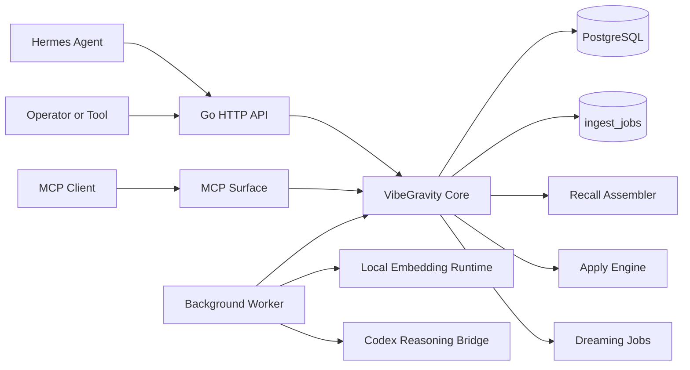
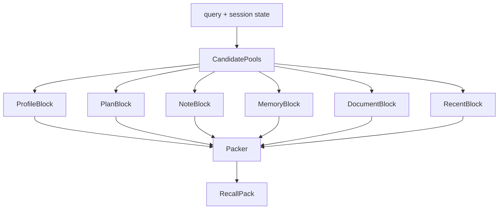
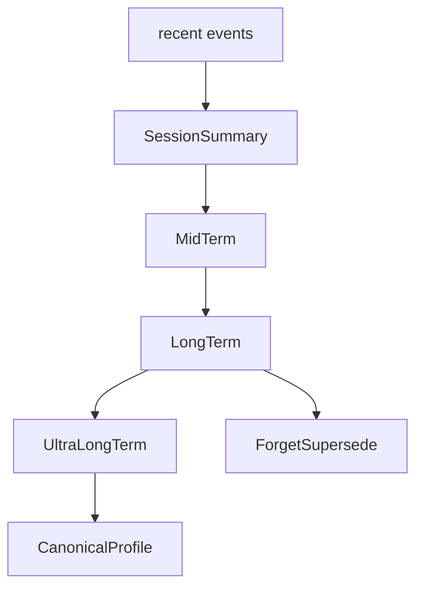

# Target Architecture: Codex-First Shared Memory Kernel

## 1. One-Screen Summary

VibeGravity의 목표 구조는 아래와 같다.



## 2. Architectural Thesis

핫패스는 빠르게 끝나야 한다.  
무거운 정리는 뒤에서 해야 한다.  
로컬은 embedding과 cheap retrieval helper만 맡는다.  
텍스트 의미 해석과 구조화는 Codex가 맡는다.

## 3. Core Services

### VibeGravityService

공용 진입점이다.  
모든 표면은 여기로 들어온다.

### IngestService

raw event를 기록하고 job을 만든다.

### RecallAssembler

다음 turn용 recall pack을 만든다.

### ReasoningOrchestrator

Codex reasoning job을 구성하고 실행한다.

### GraphApplyEngine

reasoning 결과를 검증하고 memory, edge, profile, summary에 반영한다.

### DreamingService

세션 이후 consolidation과 promotion을 담당한다.

## 4. Runtime Surfaces

### HTTP API

앱과 plugin이 붙는 메인 표면이다.

### Hermes provider plugin

가장 중요한 외부 adapter다.  
turn 전 `prefetch()`와 turn 후 `sync_turn()`를 연결한다.

### MCP surface

operator와 coding agent가 memory를 직접 다룰 수 있는 도구 표면이다.

## 5. Process Model

최소 배포는 네 프로세스로 충분하다.

- api server
- worker
- postgres
- local embedding runtime

Codex는 worker가 bridge로 호출한다.  
별도 persistent app-server는 v1.5 이후 옵션이다.

## 6. Codex-first Reasoning Chain

v1 기본 체인은 2단계다.

### Stage 1. Extract

입력은 current event, recent context, existing profile snapshot이다.  
출력은 candidate entities, candidate memories, summary hint, task hint다.

### Stage 2. Resolve

입력은 stage 1 결과, existing graph neighborhood, notes, plans, related documents다.  
출력은 structured operations, profile delta, session summary, plan delta다.

이 구조를 택하는 이유는 세 가지다.

- extraction 오류와 resolution 오류를 분리하기 쉽다
- golden eval 작성이 쉽다
- retry와 fallback 전략이 단순하다

## 7. Why Local Is Embedding-Only in v1

이 구조는 local LLM 의존도를 줄인다.  
운영이 단순해진다.  
Mac Mini 같은 단일 노드 환경에도 맞다.  
Codex OAuth 자산을 최대 활용할 수 있다.

local runtime의 기본 역할은 아래뿐이다.

- query embedding
- memory embedding
- document chunk embedding
- lexical + vector hybrid retrieval helper
- optional reranking helper

## 8. Recall Architecture

Recall은 typed block assembly로 만든다.



마지막 문자열 렌더링보다 typed block 단계가 먼저다.  
그래야 Hermes text context와 MCP JSON 응답이 같은 의미를 공유한다.

## 9. Dreaming Architecture

Dreaming은 별도 maintenance stream이다.



dreaming은 hot path가 아니다.  
백그라운드에서 느리게 돌아도 된다.  
하지만 없어서는 안 된다.

## 10. External Integration Shape

### Hermes

P0 integration.  
가장 먼저 붙는다.

### Claude Code

P2 integration.  
직접 memory backend 소비자라기보다 MCP and docs consumer로 시작한다.

### Codex as client

P2 integration.  
reasoning backend와 별개로, 나중에 VibeGravity MCP를 쓰는 coding client가 될 수 있다.

## 11. Repository Shape

```text
vibegravity/
├─ cmd/
│  ├─ server/          # HTTP API entrypoint
│  ├─ worker/          # background worker
│  └─ cli/             # CLI and doctor command
├─ internal/
│  ├─ core/            # VibeGravityService interface and domain
│  ├─ ingest/          # sync_turn write path
│  ├─ recall/          # prefetch assembler
│  ├─ graph/           # memory graph and apply engine
│  ├─ mcp/             # MCP surface
│  ├─ hermes/          # Hermes provider adapter
│  └─ embed/           # local embedding runtime
├─ pkg/                # reusable library packages
├─ migrations/
├─ tests/
├─ docs/
└─ .agents/
```

`.agents/`에는 Codex skill과 future shared agent assets를 둔다.  
`.claude/`는 필요 시 Claude Code project assets를 둔다.

## 12. Degraded Modes

### Codex unavailable

- new graph updates pause
- recall uses previous profile snapshot
- recent tail + existing memory + notes + plans still work

### local embedding unavailable

- fallback to lexical search
- no embedding-based neighborhood expansion
- service stays up

### worker backlog high

- `sync_turn()` and `prefetch()` remain alive
- freshness drops but availability stays

## 13. Architecture Review Checklist

구조가 맞는지 볼 때 아래를 확인한다.

- API와 worker가 분리됐는가
- raw와 derived가 분리됐는가
- scope-aware retrieval인가
- local extractor가 다시 들어오지 않았는가
- Codex output이 structured contract인가
- human correction path가 있는가
- degraded mode가 있는가
