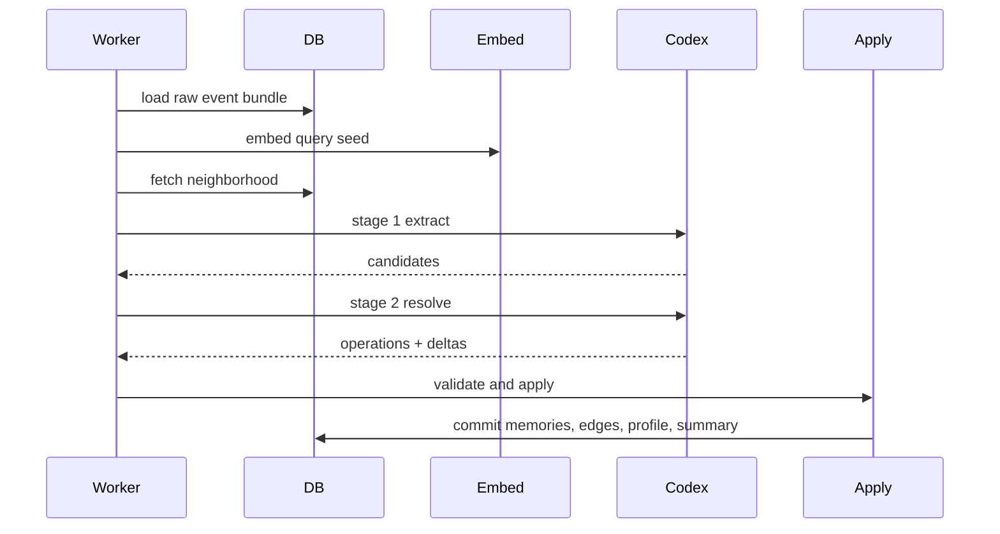

# Runtime Contracts: Ingest, Recall, Apply

## 1. Contract Goal

이 문서는 core runtime 계약을 고정한다.  
핫패스, worker, apply engine이 서로 무엇을 약속하는지 정의한다.

## 2. API Surface

v1 API는 아래로 시작한다.

| method | path | purpose |
|---|---|---|
| `POST` | `/v1/prefetch` | recall pack 생성 |
| `POST` | `/v1/sync-turn` | turn 기록 |
| `POST` | `/v1/documents` | 문서 추가 |
| `POST` | `/v1/search/memories` | memory 검색 |
| `POST` | `/v1/search/documents` | 문서 검색 |
| `POST` | `/v1/notes` | note 생성 |
| `POST` | `/v1/plans` | plan 생성 |
| `PATCH` | `/v1/plans/{id}` | plan 수정 |
| `POST` | `/v1/memory/correct` | memory 교정 |
| `GET` | `/v1/timeline` | timeline 조회 |

## 3. `sync_turn()` Contract

### 3.1 Input

`sync_turn()`은 turn 전체를 한 번에 받는다.  
user message, assistant message, tool call, tool result를 묶을 수 있어야 한다.

### 3.2 Behavior

핫패스는 아래만 책임진다.

1. normalize
2. validate
3. compute idempotency
4. insert raw events
5. enqueue jobs
6. ack

### 3.3 Non-goals

핫패스는 아래를 하지 않는다.

- deep reasoning
- graph updates
- profile recompute
- dreaming

### 3.4 Example response

```json
{
  "status": "accepted",
  "session_id": "ses_123",
  "event_ids": ["evt_1", "evt_2"],
  "job_ids": ["job_1"],
  "duplicate_count": 0
}
```

## 4. `prefetch()` Contract

### 4.1 Input

```json
{
  "tenant_id": "t1",
  "workspace_id": "w1",
  "session_id": "s1",
  "actor_id": "agent:hermes-main",
  "query": "What should I work on next?",
  "budget_tokens": 2200,
  "mode": "default"
}
```

### 4.2 Output

출력은 typed block 기반 recall pack이다.

```json
{
  "blocks": [
    {"kind": "pinned_note", "priority": 100, "text": "..."},
    {"kind": "active_plan", "priority": 95, "text": "..."},
    {"kind": "profile_static", "priority": 90, "text": "..."}
  ],
  "meta": {
    "estimated_tokens": 1780,
    "sources": ["profile", "notes", "plans", "memories"]
  }
}
```

### 4.3 Recall rules

- scope-aware filtering first
- dedup before rendering
- superseded memory suppression
- plan and note priority uplift
- budget-aware truncation
- degraded mode never returns empty if useful context exists

## 5. Worker Job Model

v1 job 종류는 아래로 시작한다.

| job_kind | purpose |
|---|---|
| `process_turn_event` | event 기반 memory pipeline |
| `embed_document_chunks` | 문서 chunk 임베딩 |
| `dream_session` | session consolidation |
| `dream_workspace` | workspace-level consolidation |
| `rebuild_profile` | profile 재계산 |
| `maintenance` | cleanup and backfill |

초기에는 `process_turn_event`가 핵심이다.  
기존 local extractor job은 기본 경로에서 제거한다.

## 6. `process_turn_event` Pipeline



## 7. Reasoning Input Contract

Codex stage 2 입력은 아래 묶음으로 만든다.

- current normalized event
- recent events
- relevant memories
- relevant documents
- existing profile
- active plans
- pinned notes
- stage 1 candidates
- output schema

## 8. Apply Engine Contract

Apply engine은 reasoning 결과를 그대로 믿지 않는다.  
Day 1의 `plans/day-01/codex-reasoning-contract-v0.md`에서는 이를 7개의 validation/apply layer로 잠그고, 여기서는 그 마지막 apply phase를 실행 순서 기준으로 더 잘게 펼친다.  
항상 아래 순서를 탄다.

1. schema validation
2. semantic validation
3. entity ensure
4. fingerprint dedup
5. edge validity check
6. status and latest resolution
7. memory upsert
8. edge upsert
9. profile merge
10. summary upsert
11. trace write
12. commit

## 9. Correction Contract

사람이 correction을 넣으면 다음을 보장해야 한다.

- raw event 남김
- related memory trace 남김
- affected memory status update
- next reasoning input에 strong hint로 사용
- next recall에서 correction 반영

## 10. Mixed Recall Tools

수동 주입 경로는 아래 계약을 가진다.

| tool or api | contract |
|---|---|
| `search_memories` | query + scope로 memory 찾기 |
| `search_documents` | docs chunk 찾기 |
| `add_note` | pinned or operator note 쓰기 |
| `create_plan` | structured plan 생성 |
| `correct_memory` | 특정 memory 정정 |
| `explain_memory` | provenance 조회 |
| `include_memory_ids` | 특정 memory를 recall에 강제 포함 |

## 11. Token Optimization Contract

Recall assembler는 아래를 수행해야 한다.

- typed blocks before final text
- source dedup across memory and document
- summary substitution for long tails
- capped number of blocks per kind
- budget mode support: small / default / rich
- cache with session head version
- strict suppression of superseded noise

## 12. Failure Contracts

### Codex failure

job retry  
fallback summary trace  
service stays available

### Embedding failure

lexical fallback  
reduced relevance  
service stays available

### Worker crash

claim timeout  
requeue  
no duplicate apply

## 13. Done Definition

이 문서가 코드로 지켜졌다면 아래가 가능해야 한다.

- `sync_turn()`는 reasoning 없이 빠르게 응답한다
- `prefetch()`는 Codex가 없어도 빈값이 아니다
- worker retry가 apply 중복을 만들지 않는다
- correction 후 recall이 달라진다
- manual include와 automatic recall이 함께 동작한다
