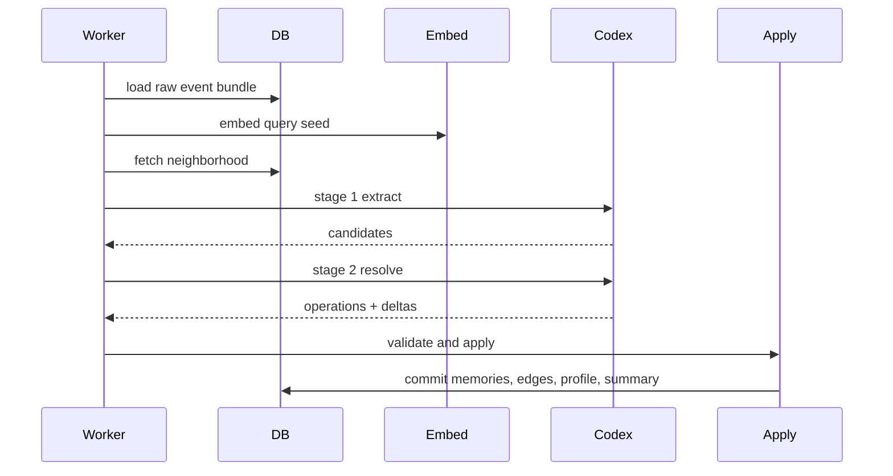

# Runtime Contracts: Ingest, Recall, Apply

## 1. Contract Goal

이 문서는 core runtime 계약을 고정한다.
핫패스, worker, apply engine이 서로 무엇을 약속하는지 정의한다.

For the current V1 direction, these runtime contracts serve Hermes Memory,
powered by VibeGravity. VibeGravity is the agent memory engine behind the
product; it is not a generic chat app, raw transcript archive, or vector
database wrapper. Runtime work should therefore prioritize the trust loop:
recall preview, correction, provenance, supersession, explain/timeline, scope
separation, and honest degraded recall.

## 2. API Surface

v1 API는 아래로 시작한다.

| method | path | purpose |
|---|---|---|
| `POST` | `/v1/prefetch` | recall pack 생성 |
| `POST` | `/v1/sync-turn` | turn 기록 |
| `POST` | `/v1/documents` | 문서 추가 |
| `POST` | `/v1/search/memories` | memory 검색 |
| `POST` | `/v1/search/documents` | 문서 검색 |
| `POST` | `/v1/notes` | note 생성 |
| `POST` | `/v1/plans` | plan 생성 |
| `PATCH` | `/v1/plans/{id}` | plan 수정 |
| `POST` | `/v1/memory/correct` | memory 교정 |
| `GET` | `/v1/memory/{id}/explain` | provenance 조회 |
| `GET` | `/v1/timeline` | timeline 조회 |

## 3. `sync_turn()` Contract

### 3.1 Input

`sync_turn()`은 turn 전체를 한 번에 받는다.
user message, assistant message, tool call, tool result를 묶을 수 있어야 한다.

### 3.2 Behavior

핫패스는 아래만 책임진다.

1. normalize
2. validate
3. compute idempotency
4. insert raw events
5. enqueue jobs
6. ack

### 3.3 Non-goals

핫패스는 아래를 하지 않는다.

- deep reasoning
- graph updates
- profile recompute
- dreaming

### 3.4 Example response

```json
{
  "status": "accepted",
  "session_id": "ses_123",
  "event_ids": ["evt_1", "evt_2"],
  "job_ids": ["job_1"],
  "duplicate_count": 0
}
```

## 4. `prefetch()` Contract

### 4.1 Input

```json
{
  "tenant_id": "t1",
  "workspace_id": "w1",
  "session_id": "s1",
  "actor_id": "agent:hermes-main",
  "query": "What should I work on next?",
  "budget_tokens": 2200,
  "mode": "default"
}
```

### 4.2 Output

출력은 typed block 기반 recall pack이다.

```json
{
  "blocks": [
    {
      "id": "note_1",
      "kind": "pinned_note",
      "priority": 100,
      "text": "...",
      "scope": "workspace_shared",
      "source": "notes",
      "source_id": "note_1",
      "status": "pinned",
      "freshness": "stored"
    },
    {
      "id": "plan_1",
      "kind": "active_plan",
      "priority": 95,
      "text": "...",
      "scope": "agent_private",
      "source": "plans",
      "source_id": "plan_1",
      "status": "active",
      "freshness": "stored"
    }
  ],
  "meta": {
    "estimated_tokens": 1780,
    "sources": ["notes", "plans", "memories"],
    "degraded": false
  }
}
```

### 4.3 Recall rules

- scope-aware filtering first
- recall blocks expose scope and source metadata to operator-visible surfaces
- dedup before rendering
- superseded memory suppression
- plan and note priority uplift
- budget-aware truncation
- degraded mode never returns empty if useful context exists

### 4.4 Hermes Memory trust-loop requirement

For V1, recall is the user's first value moment. Any Hermes-facing recall preview
or rendered context must make the trust loop possible:

- show what Hermes is about to receive;
- keep scope visible for memory-derived blocks;
- preserve source/provenance identifiers where the surface can carry them;
- mark stale or degraded recall rather than presenting it as fresh;
- suppress corrected/superseded memory in normal recall.

`prefetch()` may consume read-only worker/Codex freshness state when the runtime
can provide it. If retryable jobs or delayed ready backlog indicate that derived
memory is behind raw events, response `meta.freshness` is `stale`,
`meta.freshness_lag_seconds` reports the oldest visible lag when known, and
derived recall blocks such as `memories`, `profile`, and `session_summaries`
must downgrade their block-level `freshness`. Manual notes, active plans, and
document retrieval stay labeled by their own stored source state.

## 5. Worker Job Model

v1 job 종류는 아래로 시작한다.

| job_kind | purpose |
|---|---|
| `process_turn_event` | event 기반 memory pipeline |
| `embed_document_chunks` | 문서 chunk 임베딩 |
| `dream_session` | session consolidation |
| `dream_workspace` | workspace-level consolidation |
| `rebuild_profile` | profile 재계산 |
| `correction_apply` | synchronous correction supersession provenance |
| `maintenance` | cleanup and backfill |

초기에는 `process_turn_event`가 핵심이다.
기존 local extractor job은 기본 경로에서 제거한다.

## 6. `process_turn_event` Pipeline



## 7. Reasoning Input Contract

Codex stage 2 입력은 아래 묶음으로 만든다.

- current normalized event
- recent events
- relevant memories
- relevant documents
- existing profile
- active plans
- pinned notes
- stage 1 candidates
- output schema

Stage 2 source retrieval derives its actor from the validated raw event bundle.
`process_turn_event` bundles must contain exactly one non-empty `actor_id`
before Stage 2 source retrieval can run; empty or mixed-actor bundles are
invalid because private source visibility would be ambiguous.
The worker builds the raw-event and Stage 1 envelope first; the reasoning
orchestrator runs Stage 1 extraction, then calls the Stage 2 input preparer with
the resulting structured Stage 1 candidates. Stage 2 source adapters must use
only Stage 1 structured hints/candidates plus stored context for retrieval and
must not parse raw event text locally.
If `agent_private` is included in visible scopes, memory, pinned note, and active
plan retrieval must also carry that actor as `owner_entity_id`; private rows
with a different owner are not valid Stage 2 input. `workspace_shared` and
`session_scratch` remain visible without owner matching. `group_shared` memory
retrieval is allowed only when the actor has an explicit
`memory_group_memberships` row for the memory `group_id`. Group-shared notes and
plans remain excluded until those tables carry a group identifier.

### 7.1 Codex bridge enablement boundary

The worker may only call real Codex through explicit Stage 1 and Stage 2 runner
interfaces. The bridge is disabled by default and must not replace the safe stub
pipeline unless configuration, client construction, and failure behavior are all
made explicit.

Current worker wiring uses the explicit Stage 1 and Stage 2 Codex runner
interfaces with a deterministic mocked `CodexJSONClient`. Runtime composition
logs this as `MockCodexJSONClient` so operators do not confuse the bridge
boundary with a real Codex call. This replaces direct stub runner wiring while
still making no network call and producing no local extraction. The mocked
client exists only to exercise the real bridge request / response boundary.
Future real Codex execution must require explicit configuration:
`VIBEGRAVITY_CODEX_ENABLED=true`, `VIBEGRAVITY_CODEX_CLIENT=real`, endpoint,
model, real client construction, prompt builder, retry policy, and
operator-facing failure mode behind the same `CodexJSONClient` interface.

Codex runner responses must be strict structured JSON. Unknown top-level fields,
trailing JSON, missing schema markers, non-object JSON fields such as
`profile_delta`, `plan_delta`, `metadata_json`, and malformed trace stage output
are invalid before apply. Tests for this boundary must use mocked clients only;
they must not call real Codex.

## 8. Apply Engine Contract

Apply engine은 reasoning 결과를 그대로 믿지 않는다.
Reasoning/apply 경계는 schema validation, semantic validation, storage
transaction, trace write를 분리해서 잠근다. 여기서는 그 마지막 apply phase를
실행 순서 기준으로 더 잘게 펼친다.
항상 아래 순서를 탄다.

1. schema validation
2. semantic validation
3. entity ensure
4. fingerprint dedup
5. edge validity check
6. status and latest resolution
7. memory upsert
8. edge upsert
9. profile merge
10. summary upsert
11. trace write
12. commit

### 8.1 Current skeleton validation floor

쓰기 apply가 완성되기 전에도 `NoopApplyEngine`은 Stage 2 출력을 그냥 통과시키지 않는다.

현재 skeleton apply는 아래를 reject해야 한다.

- 비어 있거나 지원하지 않는 operation kind
- operation id가 없는 operation
- apply raw event bundle 밖의 raw_event_ids를 참조하는 operation
- JSON object가 아닌 profile_delta, plan_delta, trace metadata, operation metadata, memory metadata
- create/update/extend memory operation의 missing kind, artifact_class, scope, owner, text, confidence
- scope가 비어 있거나 `group_shared`인데 group_id가 없는 memory operation
- update/extend operation의 missing target
- `update_memory`인데 `updates` edge가 아닌 operation
- `extend_memory`인데 `extends` edge가 아닌 operation

이 skeleton은 validation만 수행하며 memory, edge, profile, summary, trace row를 쓰지 않는다.

### 8.2 First write-capable apply slice

`StoreBackedApplyEngine`은 `NoopApplyEngine`의 validation floor를 먼저 통과한 뒤,
현재는 `create_memory`, 안전한 `extend_memory`, 그리고 target latest를
supersede하는 `update_memory` operation을 저장한다.

이 slice의 write 범위는 의도적으로 좁다.

- `create_memory` 하나당 `memories` row 하나와 `memory_trace` row 하나를 쓴다.
- `extend_memory` 하나당 새 `memories` row 하나, `memory_trace` row 하나, `extends` edge 하나를 같은 transaction 안에서 쓴다.
- `update_memory` 하나당 새 `memories` row 하나, `memory_trace` row 하나, `updates` edge 하나, prior target supersession 하나를 같은 transaction 안에서 쓴다.
- `update_memory`는 target memory를 lock하고 active/latest인지 확인한 뒤에만 commit한다.
- `update_memory`는 target과 tenant, workspace, scope, group_id, owner_entity_id 경계를 바꾸지 않는다.
- 이미 성공한 deterministic job/operation retry는 새 memory, trace, updates edge가 모두 일치할 때 idempotent success로 처리한다.
- memory와 trace는 같은 storage transaction 안에서 써야 한다.
- `memory_trace`를 쓸 수 없으면 해당 memory apply는 성공으로 보지 않는다.
- written memory는 explicit scope, owner, kind, artifact_class, text, confidence를 가진다.
- create/extend로 written memory는 active/latest로 시작한다. update로 written memory는 active/latest가 되고 prior target은 같은 transaction에서 superseded/latest=false가 된다.
- `profile_delta`, `session_summary`, `plan_delta`가 비어 있지 않으면 아직 reject한다.
- `archive_memory`는 validation floor만 있고 write는 아직 reject한다.
- `group_shared` write는 membership validation이 들어오기 전까지 write하지 않는다.
- profile, session summary, plan delta, archive, dreaming write는 이 slice 밖이다.

따라서 이 단계의 worker는 raw event와 derived memory를 분리한 채,
가장 작은 provenance-safe create/extend/update path만 연다.

### 8.3 Unsupported apply work

`StoreBackedApplyEngine`이 아직 결정되지 않은 deterministic write work를
`core.ErrNotImplemented`로 거부하면 worker는 같은 job을 30초마다 재시도하지
않는다. 이 경우 job은 `blocked` 상태로 기록되고 operator 또는 후속 migration /
code slice가 명시적으로 재처리해야 한다.

Transient Codex bridge failure, transient retrieval failure, transient database
write failure는 계속 retry 가능한 `FailJob` 경로를 탄다.

### 8.4 Current dreaming slice

`dream_session`과 `dream_workspace`는 hot path 밖에서 실행되는 maintenance job이다.
현재 slice는 memory quality를 새로 판단하거나 raw text를 다시 해석하지 않는다.

- `dream_session`은 job payload의 `session_id`로 raw event tail을 찾는다.
- 해당 raw event id가 `memory_trace.raw_event_ids`에 포함된 active/latest memory만 session input으로 사용한다.
- session input은 `session_summaries`에 rebuildable mid-term summary로 저장한다.
- session-linked derived memories는 scope와 owner를 바꾸지 않고 `metadata_json.dreaming.tier = "mid-term"`으로 표시한다.
- `dream_workspace`는 active/latest, stable kind, confidence threshold를 만족하는 기존 memory만 `long-term` 또는 `ultra-long-term`으로 승격 표시한다.
- dreaming promotion은 새 memory를 만들지 않고 `memory_trace`를 덮어쓰지 않는다.
- group membership validation이 없는 상태에서도 dreaming은 기존 row의 scope를 변경하지 않는다.

## 9. Correction Contract

사람이 correction을 넣으면 다음을 보장해야 한다.

- raw event 남김
- append-safe correction artifact 남김
- later reasoning input에 strong hint로 사용 가능
- full supersession slice에서 affected memory status update
- next reasoning input에 strong hint로 사용
- next recall에서 correction 반영

Current correction supersession scope:

- `correct_memory` validates tenant, workspace, memory, operator, idempotency key,
  correction text, and target visibility.
- It first checks whether the same correction idempotency key already exists.
  Exact same-key replays reuse that artifact and may bypass the active/latest
  precheck so the completed supersession can be recognized idempotently.
- New correction attempts confirm the target memory exists in the same
  tenant/workspace and is active/latest before recording side effects.
- Correction target visibility matches the explain/search contract:
  `agent_private` targets require `entity_id == owner_entity_id`, while
  `group_shared` targets require the memory `group_id` to be included in
  `visible_group_ids`. Invisible targets return not-found and do not record
  raw correction or correction-artifact side effects.
- It writes a `memory_correction` raw event idempotently.
- It writes a `memory_corrections` artifact for operator visibility.
- It rejects reused correction idempotency keys whose memory, operator,
  correction text, or evidence differ from the recorded artifact.
- It writes a replacement memory using the correction text, a mandatory
  `memory_trace` with `operator_correction_flag = true`, and an `updates` edge
  from the replacement memory to the corrected target.
- It supersedes the target memory in the same storage transaction used for the
  replacement memory, trace, edge, and correction artifact status update to
  `applied`.
- It does not overwrite existing `memory_trace`.
- Retrying the same correction idempotency key returns the same correction
  artifact and treats the already-applied supersession as success.

This supersession flow is the active V1 contract. Earlier record-only
`CorrectMemory` prep remains useful historical intake material, but it no longer
describes the complete product behavior. If a document, prompt, or review packet
says correction must not supersede or mutate latest state, read that as the old
intake-only slice unless it explicitly opts into the current supersession
contract.

V1 readiness requires this path to be proven through canonical PostgreSQL, not
only mocked or in-memory stores: correction intake, replacement memory creation,
mandatory trace, `updates` edge, target supersession, retry idempotency, and
operator-visible explain/timeline evidence must survive real storage behavior.

Until that live DB/protocol proof exists, new feature breadth is lower priority
than P0 correction provenance, MCP/Hermes schema correctness, evidence-safe
replay idempotency, and stop-line guardrails.

## 9.1 Timeline Contract

`GetTimeline` is a read-only operator visibility path. It does not run Codex,
enqueue jobs, mutate graph state, or create timeline cache rows.

Current narrow timeline scope:

- It validates tenant, workspace, entity, time range, and bounded limit.
- It reads existing `memories`, `memory_trace`, and `memory_corrections`.
- It returns newest-first `TimelineItem` rows.
- It preserves `agent_private` owner filtering through `entity_id`.
- It excludes `group_shared` until membership-aware filtering exists.
- Correction rows use `kind = correction` and `artifact_class = timeline`.

## 10. Mixed Recall Tools

수동 주입 경로는 아래 계약을 가진다.

| tool or api | contract |
|---|---|
| `search_memories` | query + scope로 memory 찾기 |
| `search_documents` | docs chunk 찾기 |
| `add_note` | pinned or operator note 쓰기 |
| `create_plan` | structured plan 생성 |
| `correct_memory` | 특정 memory 정정 |
| `explain_memory` | provenance 조회; `agent_private` requires matching `entity_id`, and `group_shared` requires `visible_group_ids` membership |
| `include_memory_ids` | 특정 memory를 recall에 강제 포함 |

For Hermes Memory V1, `search_memories`, `correct_memory`, `explain_memory`,
and `view_timeline` are trust surfaces, not optional admin conveniences. They
must let the operator see memory scope, source, status, and correction history
well enough to trust or fix what Hermes is about to use.
`explain_memory` must not become a bypass around recall/search visibility:
tenant and workspace are mandatory, private provenance requires the requesting
actor identity, and group-shared provenance requires explicit visible group ids.
MCP and Hermes tool schemas must advertise the same required fields the service
validates. A protocol surface that hides tenant, workspace, actor, target
memory, correction text, idempotency key, evidence, or visible group ids is not
V1-ready even if the core method works in tests.

## 11. Token Optimization Contract

Recall assembler는 아래를 수행해야 한다.

- typed blocks before final text
- source dedup across memory and document
- summary substitution for long tails
- capped number of blocks per kind
- budget mode support: small / default / rich
- cache with session head version
- strict suppression of superseded noise

## 12. Failure Contracts

### Codex failure

job retry
fallback summary trace
service stays available
recall degraded mode is explicit in metadata
freshness loss is observable
worker backlog growth and recovery ETA are measurable

Codex failure must not be treated as invisible success. During an outage,
`sync_turn()` still records raw events and enqueues jobs, but new graph/profile
updates pause until the reasoning stages recover. `prefetch()` must assemble
from stored context only: previous profile snapshots, active plans, pinned
notes, session summaries, existing memories, documents, and recent raw/session
context where supported by the recall assembler. The response metadata must let
operators distinguish fresh recall from degraded recall.

The current implementation uses the read-only worker backlog metrics path as a
narrow signal source for this distinction. It does not change worker claiming,
retry, graph apply, or profile rebuild semantics.

When Codex recovers, retryable jobs may drain automatically. Deterministic
unsupported apply work remains `blocked` and requires explicit operator or code
slice action before replay. Backlog drain must preserve idempotent apply:
duplicate raw event replay or job retry must not create duplicate memories,
edges, or traces.

Current operator visibility:

- `cli jobs metrics [--window D] [--tenant ID] [--workspace ID]` reads
  `ingest_jobs` and reports total queued, ready queued, running, failed,
  blocked, and complete counts without mutating job state.
- `failed` is a durable status bucket for future use; current transient failure
  handling normally requeues jobs and is visible as retryable queued attempts
  through `attempts > 0`.
- Ready queued count and oldest queued age are based on ready queued work only:
  `status = 'queued'` and `available_at <= generated_at`.
- Drain rate is computed from jobs completed in the requested window using
  `updated_at`; recovery ETA is unavailable when no completed jobs exist in the
  window and excludes blocked/manual-action work.
- Metrics are read-only telemetry. They do not claim, requeue, fail, complete,
  unblock, or apply jobs.

### Embedding failure

lexical fallback

Current implementation note: `internal/embed` is reserved for the local
embedding client, but this architecture-cleanup slice does not implement it.
Recall and Stage 2 source preparation currently use store-backed lexical
retrieval. Do not claim semantic/vector retrieval until endpoint/model/dims,
embedding writes, and retrieval proof are wired and verified.
reduced relevance
service stays available

### Worker crash

claim timeout
requeue
no duplicate apply

### Deterministic unsupported apply work

blocked job
no automatic retry loop
last_error preserves unsupported operation detail

## 13. Done Definition

이 문서가 코드로 지켜졌다면 아래가 가능해야 한다.

- `sync_turn()`는 reasoning 없이 빠르게 응답한다
- `prefetch()`는 Codex가 없어도 빈값이 아니다
- worker retry가 apply 중복을 만들지 않는다
- correction 후 recall이 달라진다
- manual include와 automatic recall이 함께 동작한다
